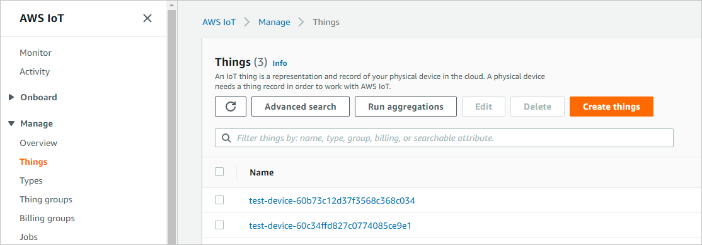
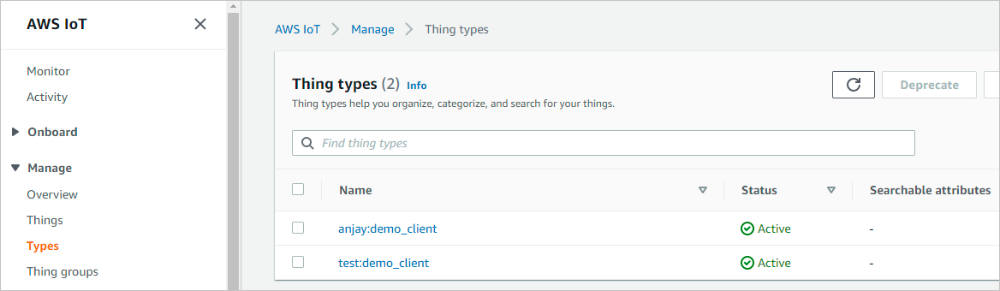
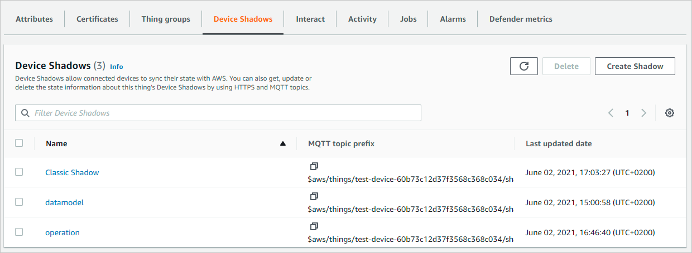
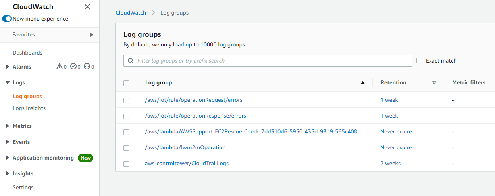

# How AWS integration works

Here's a walkthrough of the main concepts related to the AWS IoT Core - Coiote DM integration that will help you understand the role of each of the integration components and how they are employed for the benefit of LwM2M device management via the AWS services.

## Things

Within the AWS IoT Core - Coiote DM integration, things are the AWS representations of LwM2M device entities managed by the Coiote DM platform. They are used to mirror device state, as well as collect, process and act upon device data on the fly using a connection protocol of your choice.



!!! Note
    Things are automatically added to AWS IoT Core upon completing the integration setup.

### Thing types

Thing types are containers that store configuration and other device-related information shared by all Things of the same type to simplify their bulk management. Within the integration, they are created automatically when a new device is added to AWS from Coiote DM and they are based on device **Manufacturer** and **Model name**. In case a new device with a specific **Manufacturer** and model name pair can be matched with an existing thing type, then it will be associated with it automatically.



!!! note
    Note that you cannot modify a once created thing type, but you can deprecate (allowing no new devices to be associated with it) or delete it when there are no things associated with a given Thing type.

## Device Shadows

A device shadow is a structure that stores the device state and represents it in the form of a JSON file, making the device data available to applications and services regardless of device connection to Coiote DM. To synchronize device state information between the Coiote DM and AWS IoT Core, shadows feature the mechanism of *reported* and *desired* values.

- **Reported values** section - presents the current device state as reported by the device itself (and mediated by Coiote DM) in a JSON file structure within a device shadow.
- **Desired values** section - used for requesting changes in the reported section of the device [Operation shadow](#operation-shadow).



For the purposes of the integration, a default of three different shadows is established for each connected thing: an unnamed shadow, a datamodel shadow and an operation shadow.

### Classic Shadow

The Classic shadow (also unnamed shadow) is used for storing connectivity parameters of a LwM2M device (such as registered lifetime, last lifetime refresh, queue mode, LwM2M URI, device registration status etc.). The `reported` state refreshes upon each change in these parameters that is reported by Coiote DM (**Register** or **Update** message from device).

### Operation Shadow

The Operation Shadow is where you request your LwM2M operations to be executed. To this end, the `desired` values of the device state are used. Thus, you can perform any LwM2M 1.0 operation on the device by defining it inside the `desired` values section. Also, to check if the operation execution was successful, the `reported` values section of the Operation Shadow is used (but only in case of the READ, WRITE and READ COMPOSITE operations).

#### Communication flow

A value change using the `desired` device state is formulated as the one below:

   ```json
   {
     "state": {
         "desired": {
           "operation": "write",
           "keys": [
             "LwM2M Server.1.Lifetime",
             "Device.0.UTC Offset"
           ],
           "values": [
             68,
             "+02:00"
           ]
         }
       }
   }
   ```

Once a value change in the `desired` section of the operation shadow is saved, a chain of events starts:

   1. The *operationRequest* rule is triggered that sends a request to AWS Lambda,
   2. AWS Lambda validates the request and forwards it as an event to Coiote DM, making it schedule a task and initiate a device session,  
   3. Coiote DM communicates with the device and forwards the device response back to the Operation Shadow,
   4. the results of the requested operation are published in the `reported` section of the Operation Shadow,
   5. the results are then republished using the *operationResponse* rule to the [Datamodel shadow](#datamodel-shadow) (but only in case of the READ, WRITE and READ COMPOSITE operations).

### Datamodel Shadow

The Datamodel Shadow is the place where the cashed data model of the LwM2M device is stored. What this means is that it is a "read-only shadow" that keeps the most recent record of the device state as it has been reported by Coiote DM - no device operations can be performed from here.

The Datamodel Shadow is updated in case of the following events:

1. Device **Register** message that comes from Coiote DM,
2. Device **Notify** and **Send** messages,
3. Republishing operation results from the Operation shadow to the Datamodel shadow using the *operationResponse* rule.  

### CloudWatch logs

CloudWatch collects and keeps a record of all the logs generated on the AWS-side of the integration. You can use these data for analysis and troubleshooting in case of all the AWS integration components:



- Device Shadows (the data plane),
- Things and Thing types (the control plane),
- The Rules mechanism,
- AWS Lambda.
