# Configuring the integration

Follow this section to integrate your AWS services with Coiote DM.

## Prerequisites

- An active AWS subscription.
- An AWS S3 bucket.
- A Coiote DM user account with the **Cloud admin** role.
- The Git tool (<https://git-scm.com/book/en/v2/Getting-Started-Installing-Git>). 
- The Python package installer (<https://pypi.org/project/pip/>).
- The AWS CLI (<https://aws.amazon.com/cli/>).

## Create a Coiote DM REST user

To start integrating AWS with Coiote DM, you first need to create a user account that will be used to authorize and authenticate API calls from AWS in Coiote DM. To do that:   

1. Go to your Coiote DM account and from the **Administration** menu, select **Users management**.
2. Select **Add user** and in fill in the form:
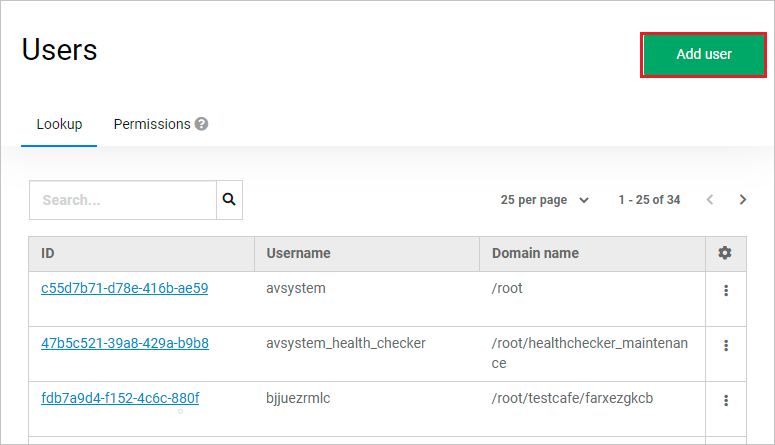
    - Provide **Email** for new user (which will be its username) and select your domain from the **Domain path** drop-down list.
    - Remember to switch on the **User Verified** and **User Enabled** toggle buttons.
    - In the **Client Roles** fields, pick the **CoioteDM** client and **cloudtenant** role.

    - Click **Save**.
    - Go to the **Credentials** tab, type a password for your user (twice), select **Set password**, then confirm by clicking **Set password** in the pop-up.

## Copy tasks and provide credentials for your device group in Coiote DM

The Coiote DM-side configuration of the integration is located in the dedicated `AWSiotCore` device group. To complete this side of the integration, log in as the user with the **Cloud admin** role and follow the steps below:

1. Go to the **Device groups** panel and select a group:
    - For the default setting, select the **AWSiotCore** group which already contains all the necessary tasks and setting values.
    - Alternatively, create a new group and migrate the required tasks and setting values:
        - Select the **Add** button, name your group and click **Add**.
        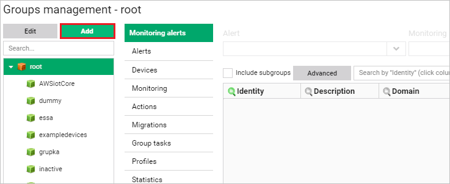
        - Migrate all the six tasks that have the **AWS** prefix in their task name:
            - Select the **AWSiotCore** group and go to **Group tasks**, select the first **AWS** task and click **Copy**.
              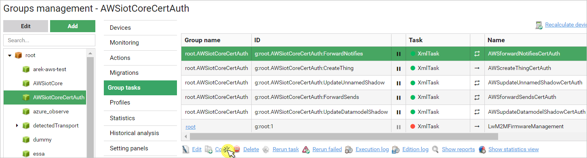
            - In the pop-up window, click **Select group** in the **Task target** field and choose your custom integration group from the list.
            - Remember to select the **Domain** of the user you created earlier.
            - In the **Actions** field, select **Add new task**.
              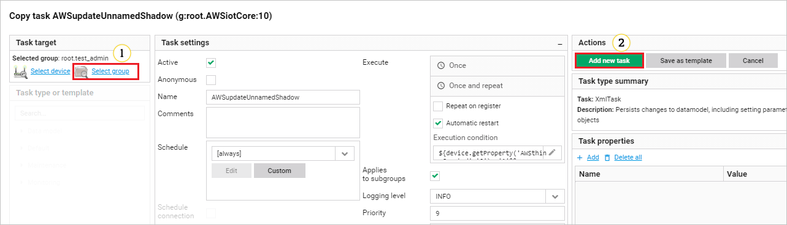
            - Repeat the action for the remaining five tasks.
        - Migrate all the five setting values that have the **AWS** prefix in their task name:
            - Select your custom integration group and go to **Profiles**, then select **Copy from**.
              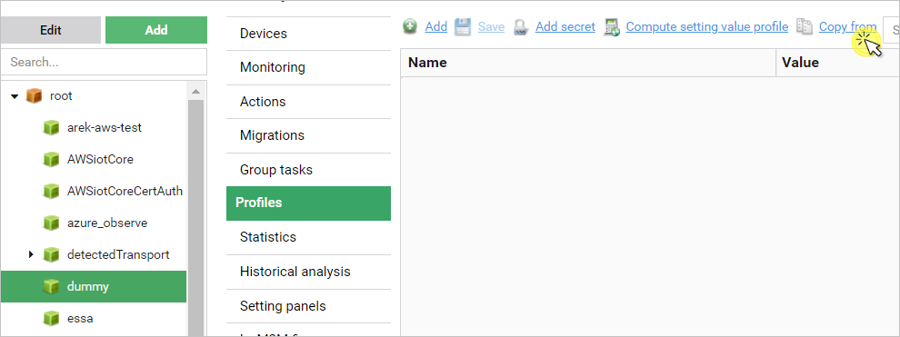
            - In the pop-up window, click **Select group** and select the **AWSiotCore** group.
            - Pick all the five **AWS** setting values from the list by checking them in the **Selected** column, then click **Copy**.
              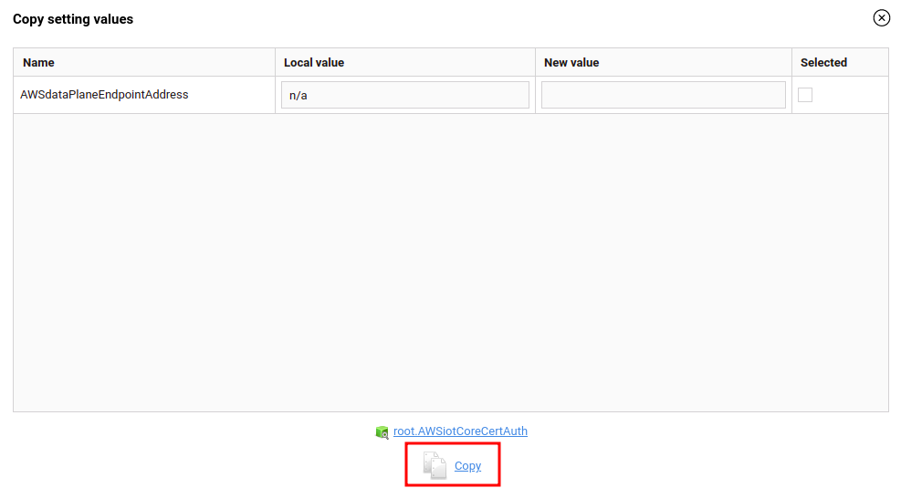

2. Enter your AWS subscription credentials in Coiote DM:
     - Go to **Device groups**, select your custom integration group (or the **AWSiotCore** group, depending on the previous step) and go to **Profiles**. Complete the **AWS** setting values with your **AWS** credentials:
        - For `AWSaccessKeyID` and `AWSsecretAccessKey`:
            - Go to **AWS Identity and Access Management**, click **Users** and select your user name from the list.
            - Select the **Security credentials** tab and, under the **Access keys** section, click **Create access key**.
               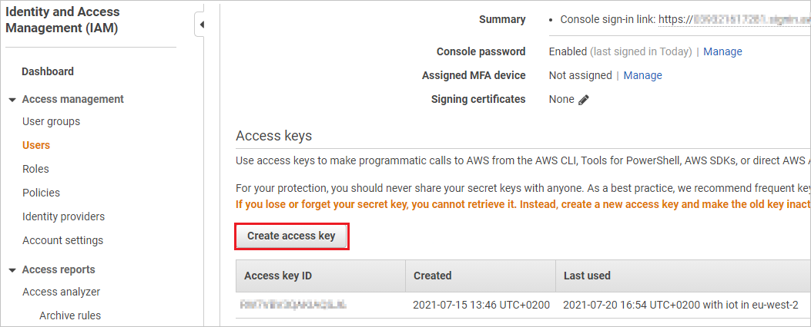
            - Copy the generated **Access key ID** and **Secret access key**.
               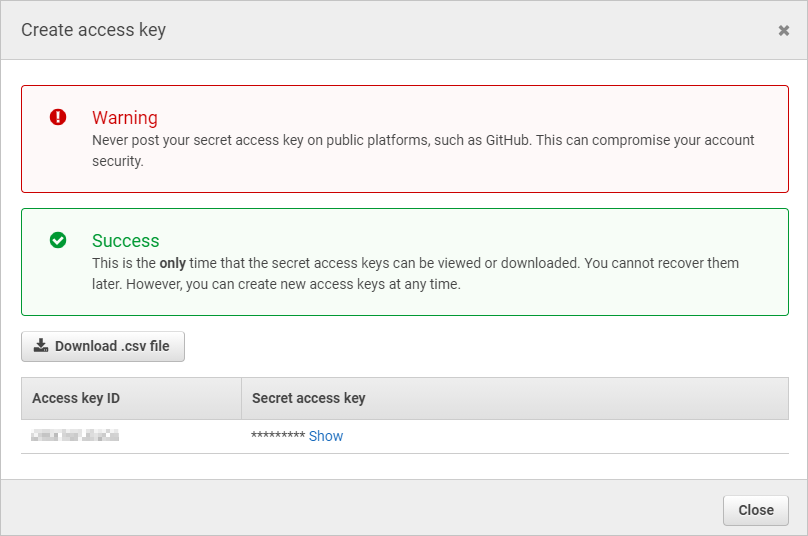
            - In Coiote DM, go to the **Profiles** tab of your integration group and paste the credentials as values for `AWSaccessKeyID` and `AWSsecretAccessKey`.
            - Click **Save**.
        - For `AWSregion`:
            - While in AWS IoT Core, click on your region name in the top navigation bar to expand the list of regions. Then, copy the hyphenated region name (e.g. *us-east-1*).
              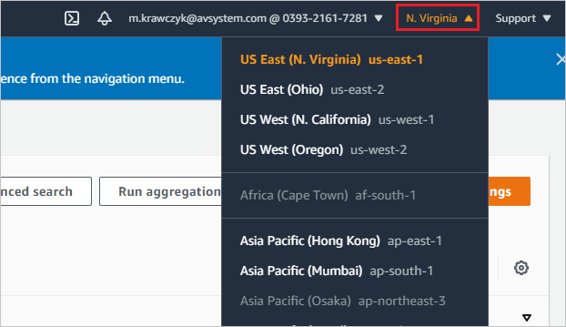
            - In Coiote DM, go to the **Profiles** tab of your integration group and paste the region name as the value for `AWSregion`.
            - Click **Save**.
        - For `AWScontrolPlaneEndpointAddress`:
            - Go to **AWS documentation**: <https://docs.aws.amazon.com/general/latest/gr/iot-core.html>.
            - From the **Control Plane API Endpoints** section, find the endpoint that matches your region (e.g. *iot.us-east-1.amazonaws.com*) and copy it.
            - In Coiote DM, go to the **Profiles** tab of your integration group and paste the credentials as the value for `AWScontrolPlaneEndpointAddress`.
            - Click **Save**.
        - For `AWSdataPlaneEndpointAddress`:
            - Open your command line and run the following command:
              ```
              aws iot describe-endpoint --endpoint-type iot:Data-ATS
              ```
            - Copy the returned result.
              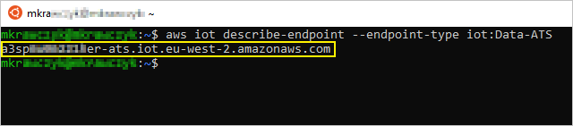
            - In Coiote DM, go to the **Profiles** tab of your integration group and paste the result as the value for `AWSdataPlaneEndpointAddress`.
            - Click **Save**.

3. Optionally, you may now add your LwM2M devices to the integration device group so that they are ready once the integration setup is complete.

## Add AWS resources using the integration repository

All the AWS-side configuration needed for the integration to work is stored in a publicly available git repository (<https://github.com/AVSystem/iot-examples/tree/main/coiote-aws-iot-cloud-formation>).

To add the resources needed for the integration to your AWS services:

1. Clone the repository into your local drive and check out on the `coiote-aws-iot-cloud-formation` branch:
    - Run your command line and paste the following commands:
       ```
       git clone --no-checkout https://github.com/AVSystem/iot-examples.git
       cd iot-examples
       git sparse-checkout set coiote-aws-iot-cloud-formation
       git checkout main
       cd coiote-aws-iot-cloud-formation
       ```
2. Use Python package installer in command line to install all the required dependencies:
    ```
   python3 -m pip install -r lwm2mOperation/requirements.txt --target lwm2mOperation/
    ```
3. If you want to create a new S3 bucket for the lambda code use the following command:
    ```
   aws s3 mb s3://<your-bucket-name> --region <region-name, e.g. us-west-1>
   ```
4. Package the code to your AWS S3 bucket and change the current CloudFormation template using the following command:
    ```
    aws cloudformation package --template-file cloudFormation.json --s3-bucket <your-bucket-name> --output-template-file output.json --use-json
   ```
5. Go to the AWS Console page (<https://console.aws.amazon.com/console/home>) and sign in. Make sure that you are in the right region. Choose **CloudFormation** from the services list.
6. Create a new stack. Use the generated **output.json** file as a template for the stack.
   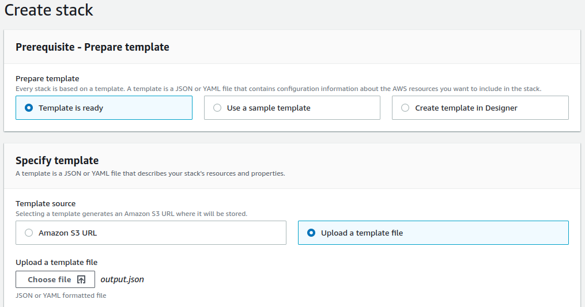
7. Choose a name for the stack and change the default values of the parameters to the credentials of your REST user created in a previous step.
   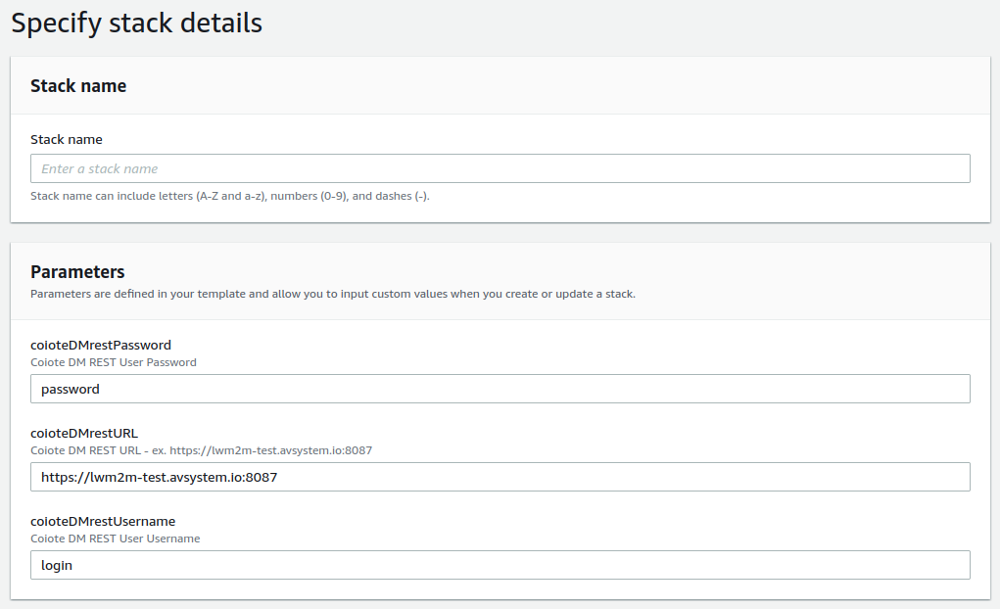
   - For `coioteDMrestURL`, provide the URL address and port of your Coiote DM installation. By default, it's https://lwm2m-test.avsystem.io:8087.
   - For `coioteDMrestPassword`, provide the password set for your Coiote DM REST user.
   - For `coioteDMrestUsername`, provide your Coiote DM REST user login (email address).
8. Finalize configuring the stack and wait for its creation to finish.
9. Once the stack is created successfully, the devices in your integration group will be automatically migrated to the AWS IoT Core.
10. To check if your integration works correctly, go to AWS IoT Core, and from the menu, select **Manage** > **Things**, then see if your devices are listed as in here:
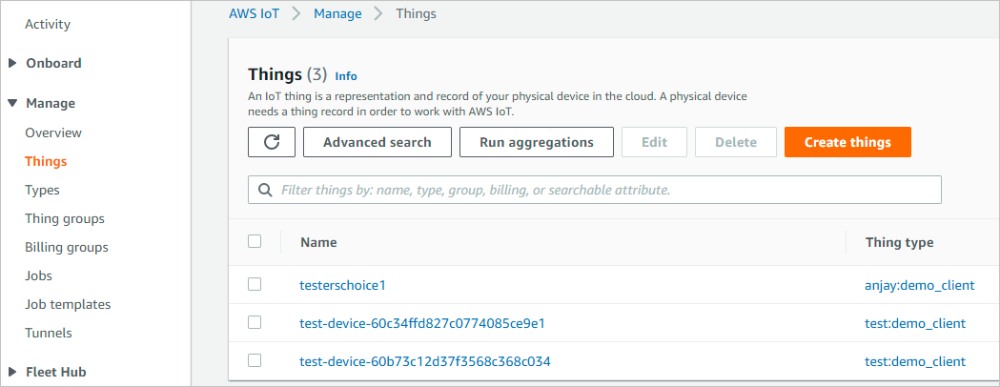

## Next steps

To learn how to perform operations on your devices, please see the [Performing LwM2M operations](../AWS_Integration_Guide/Device_operations/Operation_types.md) chapter.
