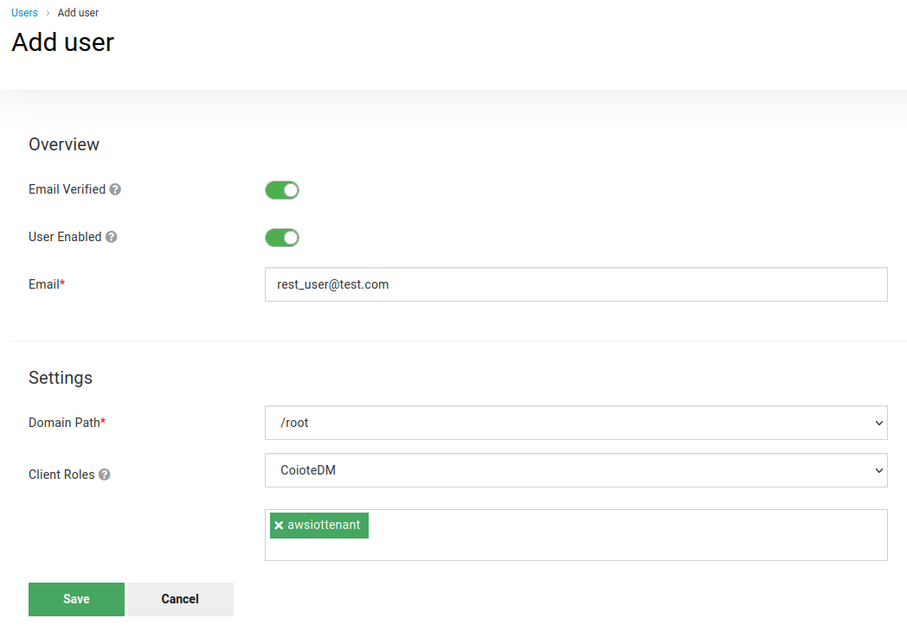
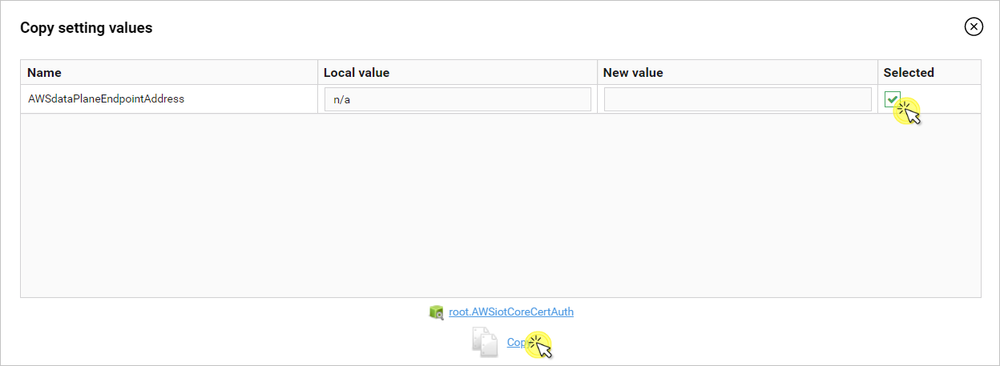

# Configuring the integration

Follow this section to integrate your AWS services with Coiote DM.

## Prerequisites

- An active AWS subscription with access to IoT Core, CloudFormation, CloudWatch, Lambda and Secrets Manager.
- An AWS S3 bucket.
- A Coiote DM user account with the **awsiottenant** role.
- The Git tool (<https://git-scm.com/book/en/v2/Getting-Started-Installing-Git>).
- The Python package installer (<https://pypi.org/project/pip/>).
- The AWS CLI (<https://aws.amazon.com/cli/>).

## Create a Coiote DM REST user

To start integrating AWS with Coiote DM, you first need to create a user account that will be used to authorize and authenticate API calls from AWS in Coiote DM. To do that:   

1. Go to your Coiote DM account and from the **Administration** menu, select **Users management**.
2. Select **Add user** and in fill in the form:

    - Provide **Email** for new user (which will be its username) and select your domain from the **Domain path** drop-down list.
    - Remember to switch on the **User Verified** and **User Enabled** toggle buttons.
    - In the **Client Roles** fields, pick the **CoioteDM** client and **awsiottenant** role.

    - Click **Save**.
    - Go to the **Credentials** tab, type a password for your user (twice), select **Set password**, then confirm by clicking **Set password** in the pop-up.

## Copy tasks and provide credentials for your device group in Coiote DM

The Coiote DM-side configuration of the integration is located in the dedicated `AWSiotCoreCertAuth` device group. To complete this side of the integration, log in as the user with the **awsiottenant** role (only if that user was created in the Root **Domain**. If not, they can not access the root groups and the tasks have to be copied from the **Cloud admin** account.).
Then follow the steps below:

1. Go to the **Device groups** panel and select a group:
    - For the default setting, select the **AWSiotCoreCertAuth** group which already contains all the necessary tasks and setting values.
    - Alternatively, create a new group and migrate the required tasks and setting values:
        - Select the **Add** button, name your group and click **Add**.
        
        - Migrate all the six tasks that have the **AWS** prefix in their task name:
            - Select the **AWSiotCoreCertAuth** group and go to **Group tasks**, select the first **AWS** task and click **Copy**.
              
            - In the pop-up window, click **Select group** in the **Task target** field and choose your custom integration group from the list.
            - Remember to select the **Domain** of the user you created earlier.
            - In the **Actions** field, select **Add new task**.
              
            - Repeat the action for the remaining five tasks.
        - Migrate all the five setting values that have the **AWS** prefix in their task name:
            - Select your custom integration group and go to **Profiles**, then select **Copy from**.
              
            - In the pop-up window, click **Select group** and select the **AWSiotCore** group.
            - Pick all the five **AWS** setting values from the list by checking them in the **Selected** column, then click **Copy**.
              

2. Enter your AWS subscription credentials in Coiote DM:
- Go to **Device groups**, select your custom integration group (or the **AWSiotCoreCertAuth** group, depending on the previous step) and go to **Profiles**. Complete the **AWS** setting value:
  - Open your command line and run the following command:
           ```
           aws iot describe-endpoint --endpoint-type iot:Data-ATS
           ```
  - Copy the returned result.
  
  - In Coiote DM, go to the **Profiles** tab of your integration group and paste the result as the value for `AWSdataPlaneEndpointAddress`.
  - Append `:8443` port to the pasted value.
  - Click **Save**.

3. Optionally, you may now add your LwM2M devices to the integration device group so that they are ready once the integration setup is complete.

## Add AWS resources using the integration repository

All the AWS-side configuration needed for the integration to work is stored in a publicly available git repository (<https://github.com/AVSystem/iot-examples/tree/main/coiote-aws-iot-cloud-formation>).

To add the resources needed for the integration to your AWS services:

1. Go to the AWS Console page (<https://console.aws.amazon.com/console/home>) and sign in. Make sure that you are in the right region. From the list of services, select **CloudFormation** .
2. Create a new stack. Use the Amazon S3 URL from below.

       https://coiote-aws-integration.s3.eu-central-1.amazonaws.com/coiote-aws-integration-cf-template.json

   
4. Choose a name for the stack and provide the parameters:
   - **coioteDMrestUsername** - username of the created CoioteDM account.
   - **coioteDMrestPassword** - password of the created CoioteDM account.
   - **coioteDMrestUri** - URL address and port of your Coiote DM installation.
   
5. Finalize configuring the stack and wait for its creation to finish.
6. Once the stack is created successfully, the devices in your integration group will be automatically migrated to the AWS IoT Core.
7. To check if your integration works correctly, go to AWS IoT Core, and from the menu, select **Manage** > **Things**, then see if your devices are listed as in here:


## Next steps

To learn how to perform operations on your devices, please see the [Performing LwM2M operations](../AWS_Integration_Guide/Device_operations/Operation_types.md) chapter.

## Removing the integration

To remove the integration of AWS and Coiote DM, follow the following steps:

1. In **CoioteDM** remove all the devices from the **AWSiotCoreCertAuth** group.
2. Go to the **CloudFormation** service in **AWS** and select the stack that was created while setting up the integration.
3. Delete the stack.
   
4. Go to the **S3** service in **AWS** and select the bucket with the lambda code files.
5. Delete the files.
   
