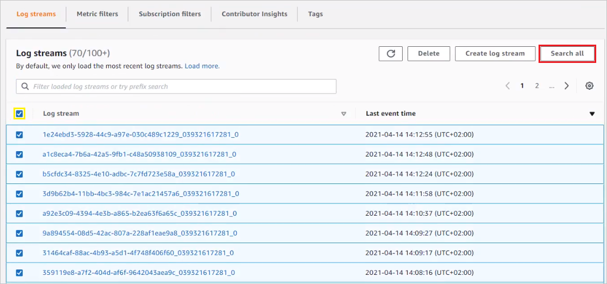
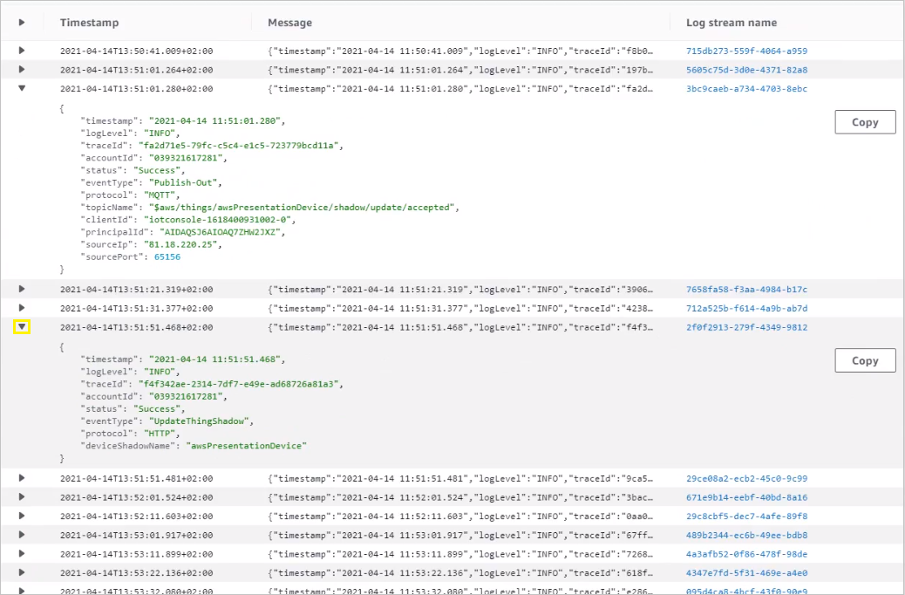

# Performing LwM2M operations

This section will give you an overview of how to perform LwM2M operations on devices in AWS IoT Core and check AWS CloudWatch logs.

## Prerequisites

- A configured AWS integration.
- An active LwM2M device already migrated to AWS IoT Core.

## Execute LwM2M operations on device

Within the AWS - Coiote DM integration, LwM2M operations on devices are triggered by modifying the `desired` section of a device [Operation Shadow](../Concepts/AWS_Integration_concepts.md#operation-shadow). The changes, upon successful execution, are then reported back by Coiote DM and repopulated to the `reported` section of a device [Datamodel Shadow](../Concepts/AWS_Integration_concepts.md#datamodel-shadow).

The integration supports the following LwM2M operations:

### READ

To send a request for a READ operation to a device:

1. Enter AWS IoT Core and go to **Manage** > **Things**.
2. From the list, select your device.
3. Go to the **Device Shadows** section and select the **operation** Shadow.    
4. Click **Edit** and formulate the request inside the **Device Shadow state** field based on the example input given below:
     - In the `operation` section, type the operation name
     - In the `keys` section, type the LwM2M object and resource paths for which you want to execute the operation.
     - In the `values` section, type the values for the specified `keys` (only for some operations).
    ???+ READ_request
        ```
         {
           "state": {
             "desired": {
               "operation": "read",
               "keys": [
                 "LwM2M Server.1.Lifetime",
                 "Portfolio.11.Identity.1",
                 "Portfolio.5.Identity.1",
                 "Device.0.UTC Offset",
                 "Test object.0.Integer array.4"
               ]
             }
           }
         }
        ```

5. Click **Save**.
6. To see the operation results, check the `reported` section of the **operation** Shadow. An example response looks like this:

    ???+ READ_result
        ```
        {
          "reported": {
            "operation": "read",
            "failedKeys": [
              ""
            ],
            "result": {
              "Device": {
                "0": {
                  "UTC Offset": "+02:00"
                }
              },
              "LwM2M Server": {
                "1": {
                  "Lifetime": "68"
                }
              },
              "Portfolio": {
                "5": {
                  "Identity": {
                    "1": "AVS"
                  }
                },
                "11": {
                  "Identity": {
                    "1": "your_ID"
                  }
                }
              },
              "Test object": {
                "0": {
                  "Integer array": {
                    "4": "256"
                  }
                }
              }
            }
          }
        }

        ```

!!! note
    To execute a READ operation on all the readable resources, enter `""/""` or `""all""` as the value in the `keys` section of the request.

### WRITE

To request a WRITE operation for a device, follow the steps 1-5 from the [READ](#read) subsection, but using the following example:

???+ WRITE_request
    ```
     {
       "state": {
           "desired": {
             "operation": "write",
             "keys": [
               "LwM2M Server.1.Lifetime",
               "Portfolio.11.Identity.1",
               "Portfolio.5.Identity.1",
               "Device.0.UTC Offset",
               "Test object.0.Integer array.4"
             ],
             "values": [
               68,
               "your_ID",
               "random_value",
               "+02:00",
               256
             ]
           }
         }
     }
    ```


### OBSERVE

To request a OBSERVE operation for a device, follow the steps 1-5 from the [READ](#read) subsection, but using the following example:

???+ OBSERVE_request
    ```
     {
       "state": {
           "desired": {
             "operation": "observe",
             "keys": [
               "Connectivity Monitoring.0.Radio Signal Strength",
               "LwM2M Server.1.Lifetime",
               "Portfolio.11.Identity.1",
               "Portfolio.5.Identity.1",
               "Device.0.UTC Offset",
               "Test object.0.Integer array"
             ],
             "attributes": [
               {"epmin":5,"gt":-65.5,"lt":-105.5,"st":4.0},
               {"pmin":30,"pmax":35},
               {},
               {"epmax":40},
               {},
               {"pmax":20}
             ]
           }
         }
     }
    ```

!!! note
    In the `attributes` section, you need to specify the full attribute list with their corresponding values for a given key, as the attributes that are left out will be overwritten with `null` (except for the `con` attribute). Alternatively, you can provide an empty value `{}` so that no attribute values are changed. On the other hand, if you only specify the `con` attribute for a given key, it will not affect any other attributes and their existing values won't be changed also.

To check the results of the OBSERVE operation, go to the `datamodel` Shadow of your device and see the `reported` section.

### EXECUTE

To request an EXECUTE operation for a device, follow the steps 1-5 from the [READ](#read) subsection, but using the following example:

???+ EXECUTE_request
    ```
     {
       "state": {
           "desired": {
             "operation": "execute",
             "keys": [
               "Device.0.Reboot"
             ]
           }
         }
     }
    ```

!!! note
    With the EXECUTE operation, you can specify only one key for each request.

### Other operations

Here are example inputs for other operations supported by the integration: READ COMPOSITE, OBSERVE COMPOSITE, WRITE ATTRIBUTES, CANCEL OBSERVE, CANCEL OBSERVE COMPOSITE.

#### Cancel Observe

??? Cancel_observe
    ```
     {
       "state": {
           "desired": {
             "operation": "cancelObserve",
             "keys": [
               "Connectivity Monitoring.0.Radio Signal Strength",
               "LwM2M Server.1.Lifetime",
               "Portfolio.11.Identity.1",
               "Portfolio.5.Identity.1",
               "Device.0.UTC Offset",
               "Test object.0.Integer array"
             ],
           }
         }
     }
    ```

    !!! Note
         To cancel all the current OBSERVE requests, type `"all"` in the `keys` section.

#### Write Attributes

??? Write_attributes
    ```
     {
       "state": {
           "desired": {
             "operation": "writeAttributes",
             "keys": [
               "Connectivity Monitoring.0.Radio Signal Strength",
               "LwM2M Server.1.Lifetime",
               "Portfolio.11.Identity.1",
               "Portfolio.5.Identity.1",
               "Device.0.UTC Offset",
               "Test object.0.Integer array"
             ],
             "attributes": [
               {
                 "epmin": 5,
                 "gt": -65.5,
                 "lt": -105.5,
                 "st": 4,
                 "con": 1
               },
               {
                 "pmin": 30,
                 "pmax": 35,
                 "con": ""
               },
               {},
               {
                 "epmax": 40
               },
               {
                 "con": null
               },
               {
                 "pmax": 20
               }
             ]
           }
         }
     }
    ```

#### Observe-Composite

??? Observe_composite
      ```
       {
         "state": {
             "desired": {
               "operation": "observeComposite",
               "keys": [
                 "Connectivity Monitoring.0.Radio Signal Strength",
                 "LwM2M Server.1.Lifetime",
                 "Portfolio.11.Identity.1",
                 "Portfolio.5.Identity.1",
                 "Device.0.UTC Offset",
                 "Test object.0.Integer array"
               ],
               "attributes": [
                 {
                   "epmin": 5,
                   "gt": -65.5,
                   "lt": -105.5,
                   "st": 4,
                   "con": 1
                 },
                 {
                   "pmin": 30,
                   "pmax": 35,
                   "con": ""
                 },
                 {},
                 {
                   "epmax": 40
                 },
                 {
                   "con": null
                 },
                 {
                   "pmax": 20
                 }
               ]
             }
           }
       }
      ```

#### Read-Composite

??? Read_composite
      ```
       {
         "state": {
             "desired": {
               "operation": "readComposite",
               "keys": [
                 "Connectivity Monitoring.0.Radio Signal Strength",
                 "LwM2M Server.1.Lifetime",
                 "Portfolio.11.Identity.1",
                 "Portfolio.5.Identity.1",
                 "Device.0.UTC Offset",
                 "Test object.0.Integer array"
               ],
             }
           }
       }
      ```

#### Cancel Observe-Composite

??? cancelObserve_composite
      ```
       {
         "state": {
             "desired": {
               "operation": "cancelObserveComposite",
               "keys": [
                 "Connectivity Monitoring.0.Radio Signal Strength",
                 "LwM2M Server.1.Lifetime",
                 "Portfolio.11.Identity.1",
                 "Portfolio.5.Identity.1",
                 "Device.0.UTC Offset",
                 "Test object.0.Integer array"
               ],
             }
           }
       }
      ```

## Check logs in CloudWatch

If you encounter difficulties when forwarding your requests to Coiote DM, it may be helpful to check the logs collected by AWS CloudWatch for all the components of the integration.

1. To check logs for AWS Lambda:
    - Go to AWS CloudWatch and select **Logs** > **Log groups**.
    - From the **Log groups** list, select the `/aws/lambda/lwm2mOperation` group.

2. To check error logs for all integration components in one place:
    - Go to AWS CloudWatch and select **Logs** > **Log groups**.
    - From the **Log groups** list, select the `AWSIotLogsV2` group.
    - Select all the logs from the list by checking the box next to **Log stream** and click **Search all**.
      
    - Expand a log stream to see its details by clicking the arrow icon **`>`**.
      
