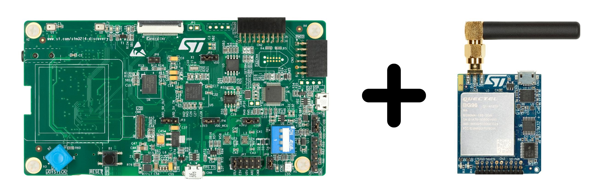

# Getting started

Start developing LwM2M applications on your ST devices in just a few clicks using our freeRTOS LwM2M Client based on the open-source Anjay SDK library.   

## STM32L496G-DISCO/BG96

Integrate your P-L496G-CELL02 Discovery kit board along with the default-provided Quectel BG96 modem.

[Start integration](./STM32L496G-DISCOBG96.md){: .md-button .md-button--big }

## STM32L496G-DISCO/MONARCH

Integrate your P-L496G-CELL02 Discovery kit along with the Sequans' Monarch GM01Q-STMOD expansion board.

[Start integration](./STM32L496G-DISCO-MONARCH.md){: .md-button .md-button--big }

## B-L462E-CELL1/TYPE1SC

Integrate your B-L462E-CELL1 Discovery kit board along with the TYPE 1SE module with built-in eSIM (ST4SIM-200M).

[Start integration](./B-L462E-CELL1-TYPE1SC.md){: .md-button .md-button--big }
