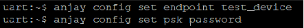

# Thingy:91

Integrate your Nordic Thingy:91 board.

## Prerequisites

- The Thingy:91 board with a USB cable.
- Installed **minicom** (for Linux) or RealTerm or PuTTy (for Windows) or other serial communication program.
- A user with access to the Coiote IoT Device Management platform and appropriate permissions.

## Prepare binaries
### Use an already built binary

To get the latest binary file and flash the board:

0. Go to [Anjay-zephyr-client](https://github.com/AVSystem/Anjay-zephyr-client/releases).
0. Download the `demo_thingy91_app_signed.hex` file.
0. Jump to the [flashing part](#flash-the-binaries) of the tutorial.

### Start development using samples
!!! Note
    This step is optional. If you've gone through the [Use an already built binary](#use-an-already-built-binary) step, you can jump to [Connecting to the LwM2M Server](#connecting-to-the-lwm2m-server).

#### Part 1: Get Zephyr and Python dependencies

To get the Zephyr SDK and dependencies follow the first 4 steps of the instruction provided by [the Zephyr Project](https://docs.zephyrproject.org/latest/getting_started/index.html).

#### Part 2: Clone the Anjay Zephyr repository

Enter the command line interface on your machine, then paste and run the following command:

   ```
   git clone https://github.com/AVSystem/Anjay-zephyr-client
   ```

#### Part 3: Compile the example

0. Connect the Thingy:91 board to a USB port of your machine.
0. Set West manifest path to `Anjay-zephyr-client/demo`, manifest file to `west-nrf.yml`, and do `west update`:

    ```
    west config manifest.path Anjay-zephyr-client/demo
    west config manifest.file west-nrf.yml
    west update
    ```

0. Compile the project for **Thingy:91** using `west build -b thingy91_nrf9160ns` in the demo directory.
0. Find the `app_signed.hex` file under the `build/zephyr` directory in the project folder.

## Flash the binaries
To program the board, go through the process of **flashing Thingy:91**. Use the nRF Connect Programmer with the downloaded `.hex` file and follow the [program the nRF9160 SiP application](https://developer.nordicsemi.com/nRF_Connect_SDK/doc/latest/nrf/ug_thingy91_gsg.html#program-the-nrf9160-sip-application) section.

After successful flashing, reset the board and go to the next step.

## Connect to the LwM2M Server

To connect to Coiote IoT Device Management LwM2M Server, please register at [https://eu.iot.avsystem.cloud](https://eu.iot.avsystem.cloud/).

To connect the board:

0. Log in to Coiote DM and from the left side menu, select **Device Inventory**.
0. In **Device Inventory**, click **Add device**.
0. Select the **Connect your LwM2M device directly via the Management server** tile.
    
0. In the **Device credentials** step:
     - In the **Endpoint name** field, enter your board endpoint name e.g. `test_device` (remember to set the same name in the [next section](#configure-the-client)).
         
     - In the **Security mode** section, select the **Pre-Shared Key** mode:
         - In the **Key identity** field, type the same name as in the `Endpoint name` field.
         - In the **Key** field, type a shared secret used for the device-server authentication.

        !!! Note
            This is your password which you create yourself, you will need it in the next steps.

0. Click the **Add device** button and **Confirm** in the confirmation pop-up.
0. While in the **Connect your device** step, follow the [next section](#configure-the-client) to run the client and connect it to the server.

## Configure the Client

0. With the board still connected to a serial port interface, open a serial communication program.
0. Use the `anjay` command to list possible options:

    ```
    uart:~$ anjay
    anjay - Anjay commands
    Subcommands:
    start   :Save config and start Anjay
    stop    :Stop Anjay
    config  :Configure Anjay params
    ```

    !!! tip
        To show available subcommands, use the **Tab** key.

0. Check your default credentials by following the instructions in the program:
    {:style="float: left;margin-right: 1177px; margin-top: 7px; margin-bottom: 17px;"}


    !!! note
        If your default credentials are different from device credentials provided in Coiote DM, change them using the `anjay config set <possible_option> <value>` command.
        <br/>
        {:style="float: left;margin-right: 1177px;margin-top: 7px; margin-bottom: 17px;"}


0. Use the `anjay start` command to run the Client.
0. Go to Coiote DM to check if your device connected. Click **Next**, then **Go to Summary**, then **Finish**. You will see your Device Center view:
    
