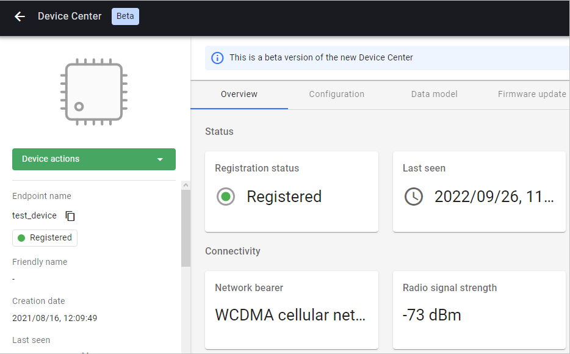

# Thingy:91

Integrate your Nordic Thingy:91 board.

## Prerequisites

- The Thingy:91 board with a USB cable.
- Installed **minicom** (for Linux) or RealTerm (for Windows) or other serial communication program.
- A user with access to the Coiote IoT Device Management platform and appropriate permissions.

## Prepare binaries
### Use an already built binary

To get the latest binaries, navigate to [Anjay-zephyr-client releases](https://github.com/AVSystem/Anjay-zephyr-client/releases)
and download one of the attached .hex files.

In this case we are going to use the `demo` application, so find the `demo_thingy91_app_signed.hex` file and go to the [flashing part](#flash-the-binaries) of the tutorial.

### Start developement using samples
#### Step 1: Get Zephyr and Python dependencies

To get the Zephyr SDK and dependencies follow the first 4 steps of the instruction provided by [the Zephyr Project](https://docs.zephyrproject.org/latest/getting_started/index.html).

#### Step 2: Clone the Anjay Zephyr repository

Enter the command line interface on your machine, then paste and run the following command:

   ```
   git clone https://github.com/AVSystem/Anjay-zephyr-client
   ```

#### Step 3: Compile the example

0. Connect the Thingy:91 board to a USB port of your machine.
0. Set West manifest path to `Anjay-zephyr-client/demo`, manifest file to `west-nrf.yml`, and do `west update`:

    ```
    west config manifest.path Anjay-zephyr-client/demo
    west config manifest.file west-nrf.yml
    west update
    ```

0. Compile the project for **Thingy:91** using `west build -b thingy91_nrf9160ns` in the demo directory.
0. Find the `app_signed.hex` file under the `build/zephyr` directory in the project folder.

## Flash the binaries
To program the board, use the nRF Connect Programmer with the `.hex` file generated or downloaded in a previous step.
The whole process of [flashing Thingy:91 is described here.](https://developer.nordicsemi.com/nRF_Connect_SDK/doc/latest/nrf/ug_thingy91_gsg.html#update-nrf9160-application)

After you have programmed and reset the board, go to the next step.

## Configure the Client

1. With the board still connected to a serial port interface, open a serial communication program.
2. Use the `anjay` command to list possible options:

    ```
    uart:~$ anjay
    anjay - Anjay commands
    Subcommands:
    start   :Save config and start Anjay
    stop    :Stop Anjay
    config  :Configure Anjay params
    ```

3. Change the default credentials to your custom data by following the instructions presented in the program and save it.

## Connect to the LwM2M Server

To connect to Coiote IoT Device Management LwM2M Server, please register at https://eu.iot.avsystem.cloud/.

To connect the board:

1. Log in to Coiote DM and from the left side menu, select **Device Inventory**.
2. In **Device Inventory**, click **Add device**.
3. Select the **Connect your LwM2M device directly via the Management server** tile.
    
4. In the **Device credentials** step:
     - In the **Device ID** enter your board endpoint name, e.g. `test_device`.
         
     - In the **Security mode** section, select the **PSK** mode:
         - In the **Key identity** field, type `test_device`
         - In the **Key** field, type the shared secret used in the device-server authentication.
5. Click the **Add device** button and **Confirm** in the confirmation pop-up.
6. In the **Connect your device** step, wait for the board to connect.
7. Click **Go to device** to see your added device dashboard.
    
