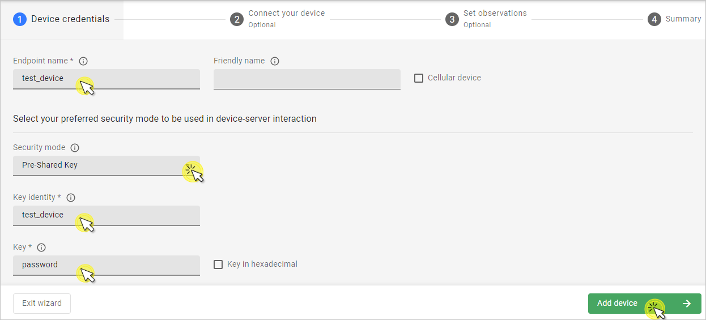

# nRF9160

Integrate your Nordic nRF9160 board.

## Prerequisites

- The nRF9160 board with a USB cable.
- Installed **minicom** (for Linux) or RealTerm or PuTTy (for Windows) or other serial communication program.
- Installed **nrfjprog** from [Nordic Semiconductor page](https://www.nordicsemi.com/Products/Development-tools/nrf-command-line-tools/download)
- A user with access to the Coiote IoT Device Management platform and appropriate permissions.


## Prepare binaries
### Use an already built binary

To get the latest binaries, navigate to [Anjay-zephyr-client](https://github.com/AVSystem/Anjay-zephyr-client/releases) and download one of the attached .hex files. In this case we are going to use the `demo` application, so find the `demo_nrf9160dk_merged.hex` file.

To program the board, go through the process of **flashing nRF**. Use the nRF Connect Programmer with the downloaded `.hex` file and make [updating the application firmware](https://developer.nordicsemi.com/nRF_Connect_SDK/doc/latest/nrf/ug_nrf9160_gs.html#updating-the-application-firmware) section.

Reset the board and go to the [Connecting to the LwM2M Server](#connecting-to-the-lwm2m-server).

### Start developement using samples
!!! Note
    This steps are optional, if you go through the [Use an already built binary](#use-an-already-built-binary) part you can go to the [Connecting to the LwM2M Server](#connecting-to-the-lwm2m-server).


#### Step 1: Getting Zephyr and Python dependencies

To get the Zephyr SDK and dependencies follow the first 4 steps of the instruction provided by [the Zephyr Project](https://docs.zephyrproject.org/latest/getting_started/index.html) (from the set up the OS to installing the Zephyr SDK).

#### Step 2: Cloning the Anjay zephyr repository

Enter the command line interface on your machine and change the directory to the one where you set up the Zephyr project (usually, it's `~/zephyrproject`), then paste and run the following command:

   ```
   git clone https://github.com/AVSystem/Anjay-zephyr-client
   ```

#### Step 3: Compiling the example

0. Connect the nRF9160 board to a USB port of your machine.
0. Set West manifest path to `Anjay-zephyr-client/demo`, manifest file to `west-nrf.yml`, and do `west update`:

    ```
    west config manifest.path Anjay-zephyr-client/demo
    west config manifest.file west-nrf.yml
    west update
    ```

0. Compile the project for **nRF9160**:

    ```
    cd Anjay-zephyr-client/demo
    west build -b nrf9160dk_nrf9160ns
    ```

0. Find the `app_signed.hex` file under the `build/zephyr` directory in the project folder.

## Connecting to the LwM2M Server

To connect to Coiote IoT Device Management LwM2M Server, please register [here](https://eu.iot.avsystem.cloud).

To connect the board:

1. Log in to Coiote DM and from the left side menu, select **Device Inventory**.
2. In **Device Inventory**, click **Add device**.
3. Select the **Connect your LwM2M device directly via the Management server** tile.
       
    3. In the **Device credentials** step:
         - In the **Device ID** enter your board endpoint name, e.g. `test_device`.
             
         - In the **Security mode** section, select the **PSK (Pre-Shared Key)** mode:
              - In the **Key identity** field, type the same name as in the `Endpoint name` field
              - In the **Key** field, type the shared secret used in the device-server authentication.
    4. Click the **Add device** button and **Confirm** in the confirmation pop-up.
    5. In the **Connect your device** step, wait for the board to connect.
    6. Click **Go to device** to see your added device dashboard.

## Configuring the Client

0. With the board still connected to a serial port interface, open a serial communication program.
0. Use the `anjay` command to list possible options:

    ```
    uart:~$ anjay
    anjay - Anjay commands
    Subcommands:
    start   :Save config and start Anjay
    stop    :Stop Anjay
    config  :Configure Anjay params
    ```

    !!! tip
        To show available subcommands, use the **Tab** key.

0. Optionally, change the default credentials by following the instructions in the program.
    

0. Use the `anjay start` command to run the Client.
0. After changing credentials go to Coiote DM and refresh data:
    
