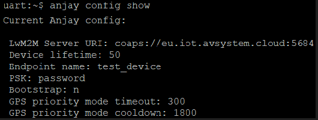

# B-L475E-IOT01A

Integrate your B-L475E-IOT01A Discovery kit board.

## Prerequisites

- The B-L475E-IOT01A board with a USB cable.
- Installed **minicom** (for Linux) or RealTerm or PuTTy (for Windows) or other serial communication program.
- Installed **ST-Link** or **OpenOCD** debugger.
- A user with access to the Coiote IoT Device Management platform and appropriate permissions.

## Prepare binaries
### Use an already built binary

To get the latest binary file and flash the board:

0. Go to [Anjay-freertos-client](https://github.com/AVSystem/Anjay-freertos-client/releases/).
0. Download the `demo_B-L475E-IOT01A1_merged.bin` file.
0. To flash the board, open your **File manager** and drag the downloaded `.bin` file to your **DIS_L4IOT** external device.
0. You will see a blinking diode on your board. The diode will stop blinking as soon as the flashing is finished.

The board is now flashed: you can jump to the [Connecting to the LwM2M Server](#connecting-to-the-lwm2m-server) section.

### Start development using samples
!!! Note
    This step is optional. If you've gone through the [Use an already built binary](#use-an-already-built-binary) step, you can jump to [Connecting to the LwM2M Server](#connecting-to-the-lwm2m-server).

#### Part 1: Getting Zephyr and Python dependencies

To get the Zephyr SDK and dependencies follow the first 4 steps of the instruction provided by [the Zephyr Project](https://docs.zephyrproject.org/latest/getting_started/index.html).

#### Part 2: Cloning the Anjay zephyr repository

Enter the command line interface on your machine, then paste and run the following command:

   ```
   git clone https://github.com/AVSystem/Anjay-zephyr-client
   ```

#### Part 3: Compiling the board

0. Connect the B-L475E-IOT01A board to a USB port of your machine.
0. Set West manifest path to `Anjay-zephyr-client/demo`, and manifest file to `west.yml` and do `west update`:

    ```
    west config manifest.path Anjay-zephyr-client/demo
    west config manifest.file west.yml
    west update
    ```

0. Compile the project for **B-L475E-IOT01A** using `west build -b disco_l475_iot1` in the demo directory.
0. Flash the board using `west flash`.

## Connecting to the LwM2M Server

To connect to Coiote IoT Device Management LwM2M Server, please register at [https://eu.iot.avsystem.cloud](https://eu.iot.avsystem.cloud).

To connect the board:

1. Log in to Coiote DM and from the left side menu, select **Device Inventory**.
2. In **Device Inventory**, click **Add device**.
3. Select the **Connect your LwM2M device directly via the Management server** tile.
       
    3. In the **Device credentials** step:
         - In the **Device ID** enter your board endpoint name, e.g. `test_device`.
             
         - In the **Security mode** section, select the **PSK (Pre-Shared Key)** mode:
              - In the **Key identity** field, type the same name as in the `Endpoint name` field.
              - In the **Key** field, type the shared secret used in the device-server authentication.
    4. Click the **Add device** button and **Confirm** in the confirmation pop-up.
    5. In the **Connect your device** step, follow the next [section](#configuring-the-client) to run the client and connect it to the server.

## Configuring the Client

0. With the board still connected to a serial port interface, open a serial communication program.
0. Use the `anjay` command to list possible options:

    ```
    uart:~$ anjay
    anjay - Anjay commands
    Subcommands:
    start   :Save config and start Anjay
    stop    :Stop Anjay
    config  :Configure Anjay params
    ```

    !!! tip
        To show available subcommands, use the **Tab** key.

0. Optionally, change the default credentials by following the instructions in the program.
    


0. Use the `anjay start` command to run the Client.
0. Go to Coiote DM to check if your device connected. Click **Next**, then **Go to Summary**, then **Finish**. You will see your Device Center view:


!!! tip
    LwM2M Server URI, endpoint name and other information can be found in the **Configuration** tab.
