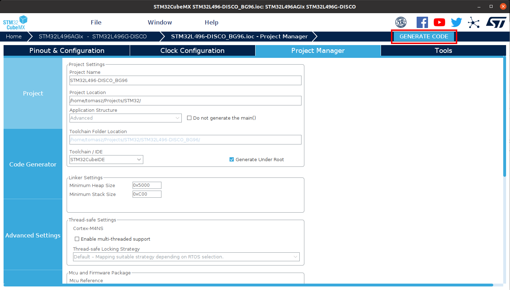

# Building LwM2M applications for STM boards with I-CUBE-Anjay

Start prototyping custom LwM2M applications on your STMicroelectronics board with I-CUBE-Anjay using STM32CubeMX.

## Prerequisites

- An STM board with a USB cable.
- Installed **STM32CubeMX**.
- Downloaded **Anjay I-CUBE** pack file.

## Step 1: Installing the **Anjay I-CUBE** software pack

0. Open STM32CUBEMX and in the New project section, select **ACCESS TO BOARD SELECTOR**.

0. From the list of STM boards, select your board, click **Start project** and click **Yes** in the **Initialize all peripherals with their default mode** pop-up that appears.  

0. In the **Pinout & Configuration** tab, click **Software Packs** and select **Manage Software Packs**.

    - Click **From local** and select your Anjay I-Cube pack from your local disk.
    
    - After reading the license agreement, check the license agreement checkbox and click **Finish**. The pack will be installed in a few seconds.
0. Back in the **Pinout & Configuration** tab, click **Software Packs** and select **Select Components**.

0. From the list of packs, click **AVSystem.I-CUBE-Anjay** to expand a list of boards.
    - From the list, find your board and check it in the **Selection** column.
    - From the list, find the **LwM2M Anjay** component and check it in the **Selection** column.
    - In the **Device Application** component, select **anjay** in the **Selection** column to enable your demo application.

## Step 2: Configuring the **Anjay I-CUBE** application

Before you generate code for your application, you need to configure it as per the specific requirements for your board:

0. Back in the **Pinout & Configuration** tab, expand the **Software Packs** tab that has appeared in the side menu and click **AVSystem.I-CUBE-Anjay.x.xx.x**:
     - In the **Mode** window that appears, check all three boxes next to the LwM2M Anjay, Device Application and Board Support <your_board_name> options.
     
     - In the **Configuration** window:
         - Go to the **Parameter Settings** tab and configure your Anjay Library. For a detailed description of all Anjay library configuration options, see [here](https://avsystem.github.io/Anjay-doc/api/anjay__config_8h.html).
         
         - Go to the **Client Settings** tab and configure your LwM2M Client parameters like Endpoint name, PSK, PSK identity, server URI and others.
         
0. In the **Pinout & Configuration** tab:
     - Expand the **Connectivity** tab:
         - Configure connectivity options (like *USART*) according to the specific instruction for your board in the [Specific CubeMX settings](#specific-cubemx-settings).
         
     - Expand the **Middleware** tab:
         - Configure middleware options according to the specific instruction for your board in the [Specific CubeMX settings](#specific-cubemx-settings).
         
     - Expand the **Security** tab:
         - Configure security options according to the specific instruction for your board in the [Specific CubeMX settings](#specific-cubemx-settings).

## Step 3: Generating application code

0. Back in your project overview, select the **Project Manager** tab:
     - In the **Project** tab:
        - In the **Project Name** field, provide a name for your project.
        - From the Toolchain/IDE expandable list, select **STM32CubeIDE**.
     - In the **Code Generator** tab:
        - Check the **Generate peripheral initialization as a pair of '.c/.h' files per peripheral**.
0. Click **GENERATE CODE** and confirm by clicking **Yes** in the pop-up.

0. After the project is generated, you can use it further in the CubeIDE as per the specific instructions for your board in the [Anjay ST integration guide](/Anjay_integrations/Getting_started/#stmicroelectronics-boards).

## Specific CubeMX settings

### B-L462E-CELL1

- Connectivity tab:
    - USART1 - Enable DMA for RX/TX, enable global interrupts
    - USART2 - Enable DMA for RX/TX, enable global interrupts
    - USART3 - Enable DMA for RX/TX, enable global interrupts
    - USB - Disable
- Middleware tab:
    - FreeRTOS
       - Interface - CMSIS_V1
       - TOTAL_HEAP_SIZE - 18432 Bytes (Required by X-CUBE-CELLULAR)
       - USE_COUNTING_SEMAPHORES - Enabled
- Project Manager:
    - Code Generator - Enable Generate peripheral initialization as a pair of '.c/.h' files per peripheral.

### P-L496G-CELL02

- Connectivity tab:
    - SDMMC1 - Disable
    - USART1 - Enable DMA for RX/TX, enable global interrupts
    - USART2 - Enable DMA for RX/TX, enable global interrupts
    - USB_OTG_FS - Disable
- Security tab:
    - RNG - Enable
- Middleware tab:
    - FreeRTOS
       - Interface - CMSIS_V1
       - TOTAL_HEAP_SIZE - 18432 Bytes (Required by X-CUBE-CELLULAR)
       - USE_COUNTING_SEMAPHORES - Enabled
- Project Manager:
    - Code Generator - Enable Generate peripheral initialization as a pair of '.c/.h' files per peripheral.
