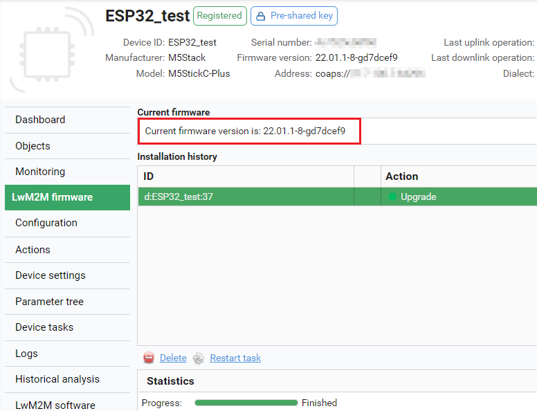

# M5StickC

Integrate your ESP32-based device to manage it via Coiote DM.

## Prerequisites

- An M5StickC device.
- Installed ESP-IDF and dependencies (installation steps 1-4 from [ESP32 official documentation](https://docs.espressif.com/projects/esp-idf/en/v4.4/esp32/get-started/index.html)). Supported ESP-IDF version is v4.4.
- A user with access to the Coiote IoT Device Management platform.

## Step 1: Download the Anjay ESP32 client files

0. Create a project directory for the integration.
0. Go to [https://github.com/AVSystem/Anjay-esp32-client/releases](https://github.com/AVSystem/Anjay-esp32-client/releases) and download `m5stickc-plus.bin` and `nvs_partition_gen.py` to your project directory.

## Step 2: Configure the client using an NVS partition

0. Create a `nvs_config.csv` file and save it in your project directory. In the file, provide your credentials in [wifi_ssid], [wifi_password], [identity], [psk], [lwm2m_server_uri] (without the `[]` brackets). Use the following snippet as a template:

    !!! important
        The **Identity** parameter stands for both the device endpoint name and its PSK identity, therefore these two must be identical in Coiote DM.  

    ```
    key,type,encoding,value
    config,namespace,,
    wifi_ssid,data,string,[wifi_ssid]
    wifi_pswd,data,string,[wifi_password]
    wifi_inter_en,data,u8,1
    identity,data,string,[identity]
    psk,data,string,[psk]
    uri,data,string,[lwm2m_server_uri]
    writable_wifi,namespace,,
    wifi_ssid,data,string,[wifi_ssid]
    wifi_pswd,data,string,[wifi_password]
    wifi_inter_en,data,u8,0
    ```

    !!! Note
        The additional parameters under the **writable_wifi** namespace are used to provide a secondary Wi-Fi configuration (it is not obligatory). This allows for switching between Wi-Fi configurations while the device is running.

0. Open a command line interface, go to your project directory, and generate the NVS partition:

```
python3 nvs_partition_gen.py generate nvs_config.csv nvs_config.bin 0x4000
```

{: style="float: left;margin-right: 1177px;margin-top: 17px;"}

## Step 3: Add device to Coiote DM

To connect your M5StickC to the Coiote IoT Device Management LwM2M Server, use your access to a Coiote DM installation, or register at https://www.avsystem.com/try-anjay/ to get access.

To connect the board:

0. Log in to Coiote DM and from the left side menu, select **Device Inventory**.
0. In **Device Inventory**, click **Add device**.
0. Select the **Connect your LwM2M device directly via the Management server** tile.

0. In the **Device credentials** step:
    - In the **Device ID** field, type the name provided in the `nvs_config.csv`, e.g. `ESP32_test`.
    - In the **Security mode** section, select the **PSK** mode.
    - In the **Key identity** field, type the name provided in the `nvs_config.csv`, e.g. `ESP32_test`.
    - In the **Key** field, type the `psk` key provided in the `nvs_config.csv`.  
    
0. Click the **Add device** button and **Confirm** in the confirmation pop-up.
0. In the **Connect your device** step, the server is waiting for the board to connect. You can now start connecting the device.  

## Step 4: Flash the board and run device

Use pre-built binaries to flash the board and provide credentials by flashing the NVS partition binary.

0. Install the `esptool.py`:
```
pip install esptool
```

0. Flash the board:
```
esptool.py -b 750000 --chip esp32 write_flash 0x0000 m5stickc-plus.bin
```

0. Flash the NVS partition binary:
```
esptool.py -b 750000 --chip esp32 write_flash 0x9000 nvs_config.bin
```

Once executed, the device will be reset and run with the configuration you provided.

   

## M5StickC LwM2M objects

After successful connection to Coiote DM, you can explore the available device objects.

| Target         | Objects
|----------------|---------------------------------------------
| ESP32 common   | Security (/0)<br>Server (/1)<br>Device (/3)<br>Firmware Update (/5)<br>WLAN connectivity (/12)
| M5StickC-Plus  | Push button (/3347)<br>Light control (/3311)<br>Temperature sensor (/3303)<br>Accelerometer (/3313)<br>Gyroscope (/3343)


## Upgrade device firmware over the air

To perform a FOTA upgrade, you need an established connection between the M5StickC and Coiote DM (see instructions above).

### Build new firmware version

0. Open a command line interface and run `git clone https://github.com/AVSystem/Anjay-esp32-client`.
0. Go to the directory of the cloned repository and run `idf.py set-target esp32`.
0. Run `git submodule update --recursive --init`.
0. Run `idf.py menuconfig`, navigate to `Component config/anjay-esp32-client`, and from the supported boards, select **M5StickC**. Press `s` and `enter` to save.
0. Run `idf.py build`.
0. Once executed, check if the binary file has been built in the following path `$PROJECT_DIR/build/anjay-esp32-client/build`.

### Schedule upgrade in Coiote DM

0. In your Coiote DM account, select your device in **Device inventory** and click the **LwM2M Firmware** tab.

    

0. Click **Schedule new firmware upgrade**.
0. Click **Upload** to select the binary file from your local drive, select **COAP** in the **Image delivery protocol**, and click **Upgrade**.

    !!! tip
        The **COAPS** option is also supported. To use it, you may need to additionally provide the **Base URI** parameter (depending on your server settings).  

    

0. The FOTA upgrade is now scheduled. Note that it might take a few minutes to complete.

0. Once the upgrade is finished, you can check the new version of the firmware under **Current firmware**.
    
