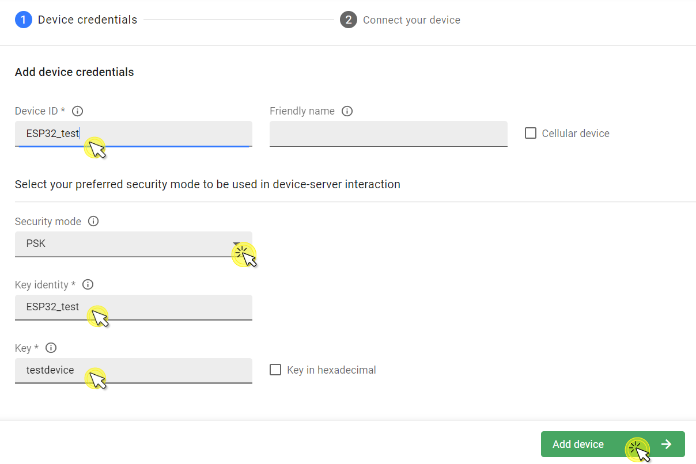

# M5StickC with BG96

Integrate your ESP32-based device with Quectel BG96 module to manage it via Coiote DM.

## Prerequisites
- An M5StickC device.
- A BG96 module with internet connection (it is strongly recommended to have a BG96 with firmware version BG96MAR03A06M1G).
- Installed ESP-IDF and dependencies (installation steps 1-4 from [ESP32 official documentation](https://docs.espressif.com/projects/esp-idf/en/v4.4/esp32/get-started/index.html)). Supported ESP-IDF version is v4.4.
- A user with access to the Coiote IoT Device Management platform.

## Step 1: Prepare project
0. Create a project directory for the integration.
0. Open a command line interface and run `git clone https://github.com/AVSystem/Anjay-esp32-client --recursive`.
0. Open the `nvs_config.csv` file. Provide your credentials in [endpoint_name], [identity], [psk], [lwm2m_server_uri] (without the `[]` brackets). The other fields can remain unchanged.
0. Run `. $HOME/esp/esp-idf/export.sh` and `idf.py set-target esp32`.
0. Open menuconfig with the `idf.py menuconfig` command, navigate to the `Component config/anjay-esp32-client`, and from the supported boards, select **M5StickC**.
0. Go to the `Choose an interface`, and select `External BG96 module`.
0. Configure UART port for the BG96 module in the `BG96 module configuration`.
    
0. Configure PDN in the `Connection configuration`.

## Step 2: Connect BG96 module to a M5StickC
0. Connect the Tx, Rx and GND pins, respectively, to the M5StickC pins selected in the previous step.

## Step 3: Add device to Coiote DM
To connect your M5StickC to the Coiote IoT Device Management LwM2M Server, use your access to a Coiote DM installation, or register at https://eu.iot.avsystem.cloud/ to get access.

To connect the board:

0. Log in to Coiote DM and from the left side menu, select **Device Inventory**.
0. In **Device Inventory**, click **Add device**.
0. Select the **Connect your LwM2M device directly via the Management server** tile.

0. In the **Device credentials** step:
    - In the **Device ID** field, type the endpoint name provided in the `nvs_config.csv`, e.g. `ESP32_test`.
    - In the **Security mode** section, select the **PSK** mode.
    - In the **Key identity** field, type the identity provided in the `nvs_config.csv`, e.g. `ESP32_test`.
    - In the **Key** field, type the `psk` key provided in the `nvs_config.csv`.
    
0. Click the **Add device** button and **Confirm** in the confirmation pop-up.
0. In the **Connect your device** step, the server is waiting for the board to connect. You can now start connecting the device.

## Step 4: Flash M5StickC
0. Open a command line interface and run `idf.py -b 750000 flash monitor`.
