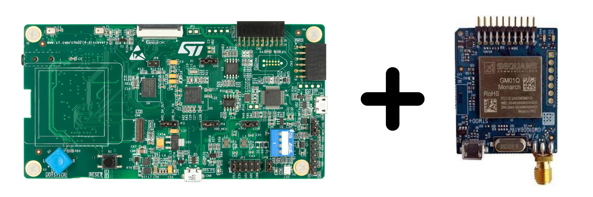

# Getting started

Start developing LwM2M applications on your ST devices in just a few clicks using our Anjay LwM2M Client based on freeRTOS or Zephyr OS.   

## STMicroelectronics boards

Build a LwM2M application for your ST board using I-Cube Anjay from scratch by following our [I-CUBE-Anjay guide](../Anjay_ST_integration/Building_LwM2M_applications/Building_LwM2M_applications_with_I-CUBE-Anjay/).

### STM32L496G-DISCO/BG96

Integrate your P-L496G-CELL02 Discovery kit board along with the default-provided Quectel BG96 modem using our Anjay LwM2M Client based on freeRTOS.

[Start integration](./Anjay_ST_integration/STM32L496G-DISCOBG96.md){: .md-button .md-button--big }

### STM32L496G-DISCO/MONARCH

Integrate your P-L496G-CELL02 Discovery kit along with the Sequans' Monarch GM01Q-STMOD expansion board using our Anjay LwM2M Client based on freeRTOS.

[Start integration](./Anjay_ST_integration/STM32L496G-DISCO-MONARCH.md){: .md-button .md-button--big }

### B-L462E-CELL1/TYPE1SC

Integrate your B-L462E-CELL1 Discovery kit board along with the TYPE 1SE module with built-in eSIM (ST4SIM-200M) using our Anjay LwM2M Client based on freeRTOS.

[Start integration](./Anjay_ST_integration/B-L462E-CELL1-TYPE1SC.md){: .md-button .md-button--big }

###  B-L475E-IOT01A

Integrate your B-L475E-IOT01A Discovery kit board using our Anjay LwM2M Client based on Zephyr OS.

{ width=60% }

[Start integration](./Anjay_ST_integration/B-L475E-IOT01A.md){: .md-button .md-button--big }

## Nordic Semiconductor boards

### Thingy:91

Integrate your Thingy:91 board using our Anjay LwM2M Client based on Zephyr OS.

{ width=50% }

[Start integration](./Anjay_Nordic_integration/Thingy91.md){: .md-button .md-button--big }

### nRF9160

Integrate your nRF9160 board using our Anjay LwM2M Client based on Zephyr OS.

{ width=70% }

[Start integration](./Anjay_Nordic_integration/nRF9160.md){: .md-button .md-button--big }
