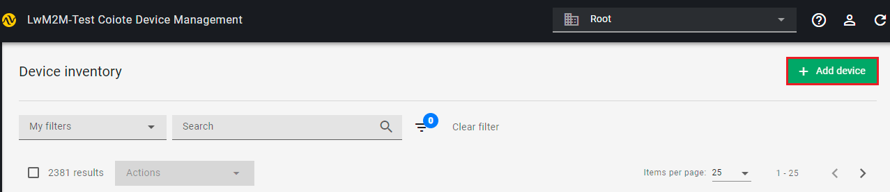
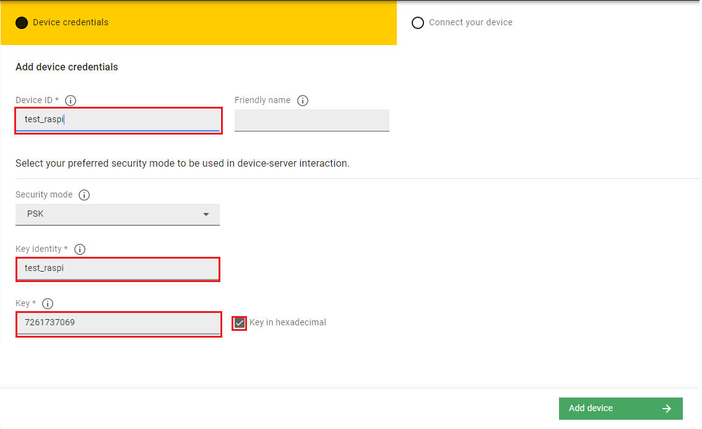
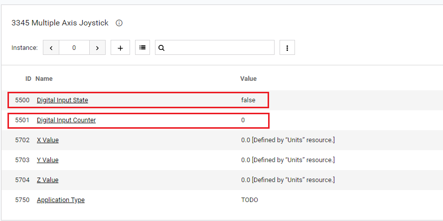

# Tutorial: Implementing LwM2M objects on RaspberryPi

## Introduction

Svetovid is a LwM2M client that gives you tools to implement selected LwM2M objects for [RaspberryPi-based](https://www.raspberrypi.org/) IoT devices. The Python programming language is used to implement LwM2M objects. Svetovid is based on a state-of-the-art LwM2M client Anjay developed by AVSystem.
It features the FSDM (File System Data Model) in which LwM2M objects are mapped to folders that follow a particular schema, and executables behave as expected by the LwM2M client that loads and manages them.

This tutorial will show you how to implement a temperature LwM2M object on your device and a push button using Svetovid. This will enable live readings of their resources (temperature, push button state and counter) in Coiote DM.  

## Prerequisites

- Raspberry Pi 3 or 4 with a configured [operating system](https://downloads.raspberrypi.org/raspios_armhf/images/raspios_armhf-2021-05-28/2021-05-07-raspios-buster-armhf.zip) and a set-up WiFi connection.
- A [Sense HAT](https://www.raspberrypi.org/products/sense-hat/) or a [GrovePi](https://www.seeedstudio.com/GrovePi.html) with a temperature sensor ([DHT11](https://wiki.seeedstudio.com/Grove-TemperatureAndHumidity_Sensor/) or similar) and a push button ([Grove-button](https://wiki.seeedstudio.com/Grove-Button/) or similar).
- An active Coiote IoT Device Management user account with Cloud admin permissions.

## Step 1: Prepare your Sense HAT/GrovePi

### Sense HAT

1. Install the Sense HAT packages:
`sudo apt-get install sense-hat`

2. Check if Sense HAT is working correctly:
   - Create a `hello_world.py` file:
				```
				from sense_hat import SenseHat
				sense = SenseHat()
				sense.show_message("Hello World!")
				```
3. Run the program:
`python hello_world.py`

If a *Hello World!* message is displayed, you're good to proceed.

!!! note
    If you're new to Sense HAT, follow the [getting started tutorial](https://projects.raspberrypi.org/en/projects/getting-started-with-the-sense-hat).

### GrovePi

1. To install the GrovePi repository, paste and execute the following commands:

```
    mkdir ~/Dexter
    cd /home/pi/Dexter
    git clone https://github.com/DexterInd/GrovePi
    cd /home/pi/Dexter/GrovePi/Script
    bash ./update_grovepi.sh
```
2. Check if the GrovePi libraries are working correctly:

   - Connect a LED module to GrovePi port D4.
   - In the terminal, type: `cd /home/pi/Dexter/GrovePi/Software/Python python grove_led_blink.py`
   - The LED should start blinking.

## Step 2: Install Svetovid

0. To install Svetovid, paste and execute the following commands into your command-line terminal:

    ```
mkdir ~/AVSystem
cd /home/pi/AVSystem
git clone https://github.com/AVSystem/Svetovid-raspberry-client.git
cd /home/pi/AVsystem/Svetovid-raspberry-client
sudo dpkg -i svetovid_20.11-raspberry_armhf.deb
sudo dpkg -i svetovid-plugin-fsdm_20.11-raspberry_armhf.deb
sudo dpkg -i avsystem_svetovid-20.11-raspberry-Linux-fsdmtool-runtime-python.deb
    ```

0. In file `/usr/local/share/svetovid/bin/fsdm/lwm2m_object_registry.py`, find the `https://raw.githubusercontent.com/OpenMobileAlliance/lwm2m-registry/test` entry and replace it with `https://raw.githubusercontent.com/OpenMobileAlliance/lwm2m-registry/prod`.

## Step 3: Register your device in Coiote DM

0. Disable the Svetovid service:

    `sudo systemctl disable svetovid.service --now`

0. Set the server connection details:

	 - in `/etc/svetovid/config/security.json`:
			```
				{
					"1":
					{
				    	"ssid": "1",
				    	"server_uri": "coaps://lwm2m-test.avsystem.io:5684",
				    	"is_bootstrap": "0",
				    	"security_mode": "psk",
				    	"pubkey_or_identity_hex": "XXXX",
				    	"privkey_or_psk_hex": "XXXX",
				    	"server_pubkey_hex": "",
				    	"holdoff_s": "0",
				    	"bs_timeout_s": "0"
					}
				}
			```

		- in `/etc/svetovid/config/svd.json`:
			```
				{
					"device": {
				    	"endpoint_name": "YYYY",
				    	"udp_listen_port": 1234
					},
					"logging": {
				    	"default_log_level": "trace",
				    	"log_level": {
				        	"svd": "trace"
				    	}
					},
					"lwm2m_version_config": {
				    	"min": "1.0",
				    	"max": "1.1"
					},
					"in_buffer_size_b": 1024,
					"out_buffer_size_b": 1024,
					"msg_cache_size_b": 65536
				}
			```

    !!! note
        XXXX and YYYY should be replaced by the chosen values of endpoint name, PSK identity and PSK key.

    !!! tip
        XXXX values are in hex. To convert your plain text, use the following:
    `echo -n 'text-value' | xxd -p`

0. Restart the Svetovid service:

    `sudo systemctl start svetovid.service --now`

0. Create a device instance in Coiote DM:
    - When logged into your Coiote DM user account, go to Device Inventory and click **Add device**.
      
    - Provide Device ID, Key Identity and Key values as in the Svetovid config files from the earlier step.
      
    - Wait for the connection.

0. Analyze the objects exposed by the device.
    

!!! note
    Your RaspberryPi-based device will feature a number of default LwM2M objects provided by Svetovid, for instance the temperature object - `3303`.  

## Step 4: Implement the LwM2M temperature object `3303` (only for GrovePi)

0. Disable the Svetovid service:

    `sudo systemctl disable svetovid.service --now`

0. Generate a stub object in your `dm` (data model) Svetovid folder by pasting and executing the following command in the terminal: `$ sudo svetovid-fsdmtool generate --object 3303 --output-dir /etc/svetovid/dm --generator python`

    !!! tip
        You can analyze the resource implementation in the `/etc/svetovid/dm/3303 folder`. For more details, see the [Svetovid page on GitHub](https://github.com/AVSystem/Svetovid-raspberry-client).

0. Modify the python script in the `/etc/svetovid/dm/3303/Sensor_Value.py` file. Open the file, replace the contents with the following script and click **Save**:
      ```
      #!/usr/bin/env python
      # -*- encoding: utf-8 -*-

      from fsdm import ResourceHandler, CoapError, DataType, KvStore

      import grovepi
      import math
      # Connect the Grove Temperature & Humidity Sensor Pro to digital port D4
      # This example uses the blue colored sensor.
      # SIG,NC,VCC,GND
      sensor = 4  # The Sensor goes on digital port 4.

      # temp_humidity_sensor_type
      # Grove Base Kit comes with the blue sensor.
      blue = 0    # The Blue colored sensor.
      white = 1   # The White colored sensor.

      class ResourceHandler_3303_5700(ResourceHandler):
          NAME = "Sensor Value"
          DESCRIPTION = '''\
      Last or Current Measured Value from the Sensor.'''
          DATATYPE = DataType.FLOAT
          EXTERNAL_NOTIFY = False

          def read(self,
                   instance_id,            # int
                   resource_instance_id):  # int for multiple resources, None otherwise
              # TODO: print value to stdout
              # print(0.0)
              [temp,humidity] = grovepi.dht(sensor,blue)  
              print("%.02f"%(temp))

      if __name__ == '__main__':
          ResourceHandler_3303_5700().main()
      ```

0. Modify the python script in the ``/etc/svetovid/dm/3303/resources/5700.py`` file. Open the file, replace the contents with the following script and click **Save**:

      ```
      #!/usr/bin/env python
      # -*- encoding: utf-8 -*-

      from fsdm import ResourceHandler, CoapError, DataType, KvStore

      import grovepi
      import math
      # Connect the Grove Temperature & Humidity Sensor Pro to digital port D4
      # This example uses the blue colored sensor.
      # SIG,NC,VCC,GND
      sensor = 4  # The Sensor goes on digital port 4.

      # temp_humidity_sensor_type
      # Grove Base Kit comes with the blue sensor.
      blue = 0    # The Blue colored sensor.
      white = 1   # The White colored sensor.

      class ResourceHandler_3303_5700(ResourceHandler):
          NAME = "Sensor Value"
          DESCRIPTION = '''\
      Last or Current Measured Value from the Sensor.'''
          DATATYPE = DataType.FLOAT
          EXTERNAL_NOTIFY = False

          def read(self,
                   instance_id,            # int
                   resource_instance_id):  # int for multiple resources, None otherwise
              # TODO: print value to stdout
              # print(0.0)
              [temp,humidity] = grovepi.dht(sensor,blue)  
              print("%.02f"%(temp))

      if __name__ == '__main__':
          ResourceHandler_3303_5700().main()
      ```

0. Plug in the temperature sensor to digital port D4 of the GrovePi.

0. Restart the Svetovid service:

    `sudo systemctl restart svetovid.service --now`

0. Refresh device state in Coiote and see if the Temperature object `3303` has appeared in the Objects tab and values are reported for  for the Sensor Value `5700` resource:

   

## Step 5: Implement the LwM2M push button based on the Multiple Axis Joystick object `3345`

Now you can implement the Push Button module based on the OMA DM Multiple Axis Joystick object (3345).

0. Type in the terminal:
      ```
      $ sudo svetovid-fsdmtool generate --object 3345 --output-dir /etc/svetovid/dm --generator python`
      ```

    !!! tip
        You can analyze the resource implementation in the `/etc/svetovid/dm/3345` folder. For more details, see the [Svetovid page on GitHub](https://github.com/AVSystem/Svetovid-raspberry-client).

0. Type in the terminal: `cd /etc/svetovid/dm/3345/resources ./5550 read`.
You should be able to see a default value reported in the command-line terminal.
0. In home directory, create the file `~/button_object_forwarder.py` and paste the following into it:

    === "SenseHat"
        ```
          from sense_hat import SenseHat
          from time import sleep
          from fsdm import KvStore
          sense = SenseHat()

          sense.clear()

          #KvStore(namespace=3345).set('counter', 0)
          #KvStore(namespace=3345).set('state', False)

          released_before = False
          counter = 0

          while True:
            for event in sense.stick.get_events():
          	if event.action == "pressed":
            	if event.direction == "middle":
              	sense.show_letter("M")
              	KvStore(namespace=3345).set('state', True)

              	if released_before:
                  	counter = counter + 1
                  	KvStore(namespace=3345).set('counter', counter)

              	released_before = False

          	elif event.action == "released":
            	if event.direction == "middle":
              	sense.show_letter("m")
              	KvStore(namespace=3345).set('state', False)
              	released_before = True
          	else:
              	sense.clear()

          	# Wait and clear the screen
          	sleep(0.5)
          	sense.clear()
        ```
    === "GrovePi"
        ```
          from time import sleep
          import grovepi
          from fsdm import KvStore

          button = 3

          KvStore(namespace=3345).set('counter', 0)
          KvStore(namespace=3345).set('state', False)

          released_before = False
          counter = 0

          grovepi.pinMode(button, "INPUT")

          while True:
              try:
                  state = grovepi.digitalRead(button)
                  KvStore(namespace=3345).set('state', True)

                  print("State:{}".format(state))

                  if state == 1:

                      if released_before:
                          counter = counter + 1
                          print("Counter:{}".format(counter))
                          KvStore(namespace=3345).set('counter', counter+1)
                          released_before = False    
                      KvStore(namespace=3345).set('state', True)
                  else:
                      released_before = True
                      KvStore(namespace=3345).set('state', False)

                  sleep(.2)

              except IOError:
                  print("Error")
        ```

0. Modify the python script in the ``/etc/svetovid/dm/3345/Digital_Input_Counter.py`` file. Open the file, replace the contents with the following script and click **Save**:
      ```
      #!/usr/bin/env python
      # -*- encoding: utf-8 -*-

      from fsdm import ResourceHandler, CoapError, DataType, KvStore


      class ResourceHandler_3345_5501(ResourceHandler):
          NAME = "Digital Input Counter"
          DESCRIPTION = '''\
      The cumulative value of active state detected.'''
          DATATYPE = DataType.INTEGER
          EXTERNAL_NOTIFY = False

          def read(self,
                   instance_id,            # int
                   resource_instance_id):  # int for multiple resources, None otherwise
              value = KvStore(namespace=3345).get('counter')
              if value is None:
                  # The value was not set, so it's not found.
                  # raise CoapError.NOT_FOUND
                  value = 0

              print(value)
      	# TODO: print value to stdout
              # print(0)


      if __name__ == '__main__':
          ResourceHandler_3345_5501().main()
      ```
0. Modify the python script in the ``/etc/svetovid/dm/3345/Digital_Input_State.py`` file. Open the file, replace the contents with the following script and click **Save**:
      ```
      #!/usr/bin/env python
      # -*- encoding: utf-8 -*-

      from fsdm import ResourceHandler, CoapError, DataType, KvStore


      class ResourceHandler_3345_5500(ResourceHandler):
          NAME = "Digital Input State"
          DESCRIPTION = '''\
      The current state of a digital input.'''
          DATATYPE = DataType.BOOLEAN
          EXTERNAL_NOTIFY = False

          def read(self,
                   instance_id,            # int
                   resource_instance_id):  # int for multiple resources, None otherwise
      	state = KvStore(namespace=3345).get('state')
              if state is None:
                  # The value was not set, so it's not found.
                  raise CoapError.NOT_FOUND
                  #state = False
              print(state)

              # TODO: print value to stdout
              #print(0)


      if __name__ == '__main__':
          ResourceHandler_3345_5500().main()
      ```
0. Modify the ``/etc/svetovid/dm/3345/resources/5500`` file:
      ```
      #!/usr/bin/env python
      # -*- encoding: utf-8 -*-

      from fsdm import ResourceHandler, CoapError, DataType, KvStore


      class ResourceHandler_3345_5500(ResourceHandler):
          NAME = "Digital Input State"
          DESCRIPTION = '''\
      The current state of a digital input.'''
          DATATYPE = DataType.BOOLEAN
          EXTERNAL_NOTIFY = False

          def read(self,
                   instance_id,            # int
                   resource_instance_id):  # int for multiple resources, None otherwise
      	state = KvStore(namespace=3345).get('state')
              if state is None:
                  # The value was not set, so it's not found.
                  raise CoapError.NOT_FOUND
                  #state = False
              print(state)

              # TODO: print value to stdout
              #print(0)

      if __name__ == '__main__':
          ResourceHandler_3345_5500().main()

      ```
0. Modify the ``/etc/svetovid/dm/3345/resources/5501`` file:
      ```
      #!/usr/bin/env python
      # -*- encoding: utf-8 -*-

      from fsdm import ResourceHandler, CoapError, DataType, KvStore

      class ResourceHandler_3345_5501(ResourceHandler):
          NAME = "Digital Input Counter"
          DESCRIPTION = '''\
      The cumulative value of active state detected.'''
          DATATYPE = DataType.INTEGER
          EXTERNAL_NOTIFY = False

          def read(self,
                   instance_id,            # int
                   resource_instance_id):  # int for multiple resources, None otherwise
              value = KvStore(namespace=3345).get('counter')
              if value is None:
                  # The value was not set, so it's not found.
                  # raise CoapError.NOT_FOUND
                  value = 0

              print(value)
      	# TODO: print value to stdout
              # print(0)

      if __name__ == '__main__':
          ResourceHandler_3345_5501().main()
      ```
0. Plug in the push button to digital port D3 of the GrovePi/Sense HAT.
0. Restart Svetovid:
    `sudo systemctl restart svetovid.service --now`
0. Refresh device state in Coiote and see if the Multiple Axis Joystick object `3345` has appeared in the Objects tab and values are reported for the Digital Input State `5500` and Digital Input Counter `5501` resources:

       
