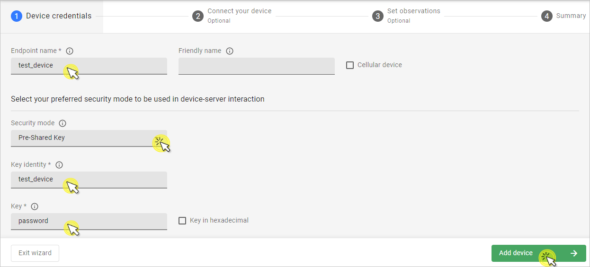
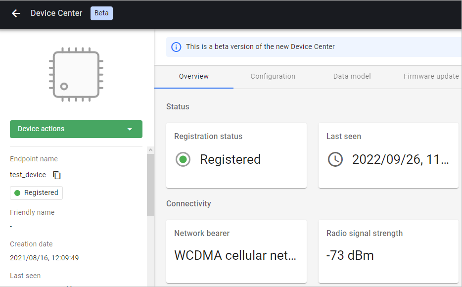

# Raspberry Pi Pico W

Integrate your Raspberry Pi Pico W board.

## Prerequisites

- A Raspberry Pi Pico W board with a USB cable.
- A user with access to the Coiote IoT Device Management platform and appropriate permissions.

## Prepare binaries
### Step 1: Create a workspace

0. Create a project directory for the integration.
0. Clone the **Raspberry Pi Pico SDK** and the **FreeRTOS kernel** into a base directory, parallel to the `Anjay-pico-client` Github repository:

    ```
    git clone -b 1.4.0 https://github.com/raspberrypi/pico-sdk.git
    cd pico-sdk/ && git submodule update --init && cd ..
    git clone -b V10.5.0 https://github.com/FreeRTOS/FreeRTOS-Kernel.git
    git clone https://github.com/AVSystem/Anjay-pico-client.git
    ```

0. Install the required libraries:
    ```
    sudo apt install cmake gcc-arm-none-eabi libnewlib-arm-none-eabi libstdc++-arm-none-eabi-newlib
    ```
!!! note
    If you're using **Windows**, follow the [Installing the ARM Toolchain for Windows](https://mynewt.apache.org/latest/get_started/native_install/cross_tools.html#installing-the-arm-toolchain-for-windows) instruction on how to install these libraries.

    If you're using **MacOS**, run the following command:

    ```
    brew install armmbed/formulae/arm-none-eabi-gcc
    ```

### Compile the application
0. Go to the `Anjay-pico-client` repository and update submodules:
    ```
    cd Anjay-pico-client
    git submodule update --init --recursive
    mkdir build && cd build
    ```

0. Build the project with `<ssid>` and `<pass>` replaced with your WIFI name and password respectively. LwM2M Client Endpoint Name is also configured by `<endpoint_name>` parameter. If you want to use the Pre-Shared Key option, you need to provide `<identity>` and `<psk>`:

    === "Pre-Shared Key"
        ``` psk
        cmake -DCMAKE_BUILD_TYPE=Debug -DWIFI_SSID="<ssid>" -DWIFI_PASSWORD="<pass>" -DENDPOINT_NAME="<endpoint_name>" -DPSK_IDENTITY="<identity>" -DPSK_KEY="<psk>" ..
        ```
    === "NoSec"
        ``` nosec
        cmake -DCMAKE_BUILD_TYPE=Debug -DWIFI_SSID="<ssid>" -DWIFI_PASSWORD="<pass>" -DENDPOINT_NAME="<endpoint_name>" ..
        ```

0. Run the following command to generate the directories named after the examples that contain files with `.uf2` and `.hex` extensions:
    ```
    make -j
    ```

!!! note
    If you're using Windows, you need to add `-G "MinGW Makefiles"` at the end of the `cmake` command. It will help generate the proper files.

## Flash the board using bootloader

0. To program using the bootloader, press and hold the **BOOTSEL** button while connecting Raspberry Pi Pico W through a USB cable - it should be recognized as a Mass Storage device.
0. Copy the `.uf2` file to the open Mass Storage device folder. Depending on the application you want to program, copy the `.uf2` file from available directories, e.g. `mandatory_objects`.
0. Once the Pico has been programmed, disconnect the board and connect it again to make it execute the code.

## Connecting to the LwM2M Server

To connect to Coiote IoT Device Management LwM2M Server, please register at [https://eu.iot.avsystem.cloud](https://eu.iot.avsystem.cloud).

To connect the board:

1. Log in to Coiote DM and from the left side menu, select **Device Inventory**.
2. In **Device Inventory**, click **Add device**.
3. Select the **Connect your LwM2M device directly via the Management server** tile.
       
    3. In the **Device credentials** step:
         - In the **Device ID** enter your board endpoint name, e.g. `test_device`.
             
         - In the **Security mode** section, select the security mode you've choosen in [Compile the application](#compile-the-application) step:

            !!! note
                If you choose the **Pre-Shared Key** security mode:

                - In the **Key identity** field, provide the same name as in the **Endpoint name** field.
                - In the **Key** field, provide the shared secret used in the device-server authentication.

    4. Click the **Add device** button and **Confirm** in the confirmation pop-up.
    5. Click **Next**, then **Go to Summary**, then **Finish**. You will see your Device Center view:  
