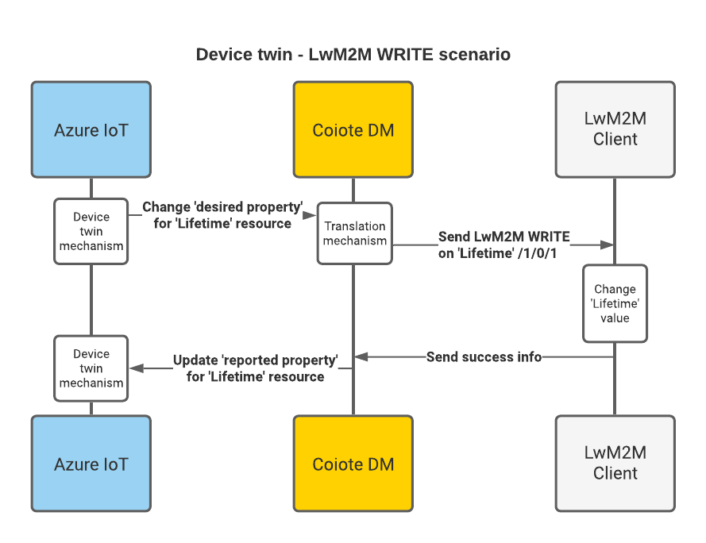
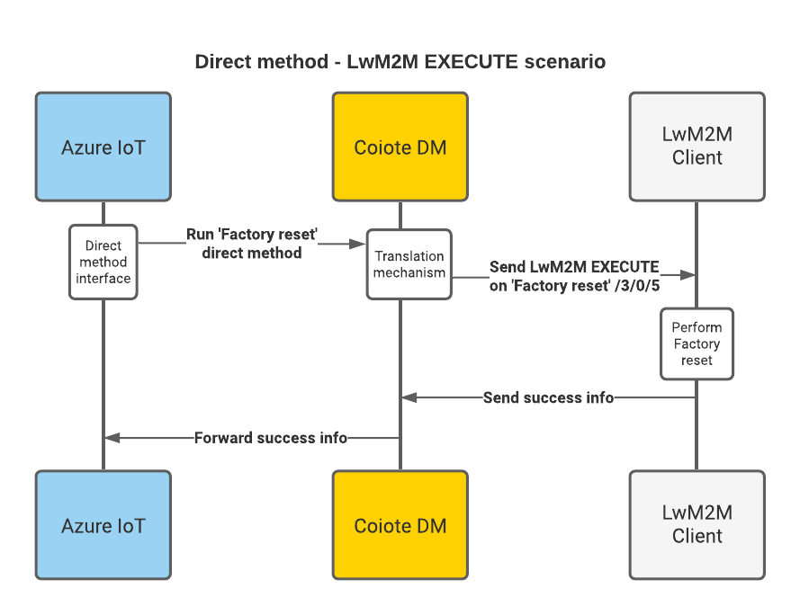
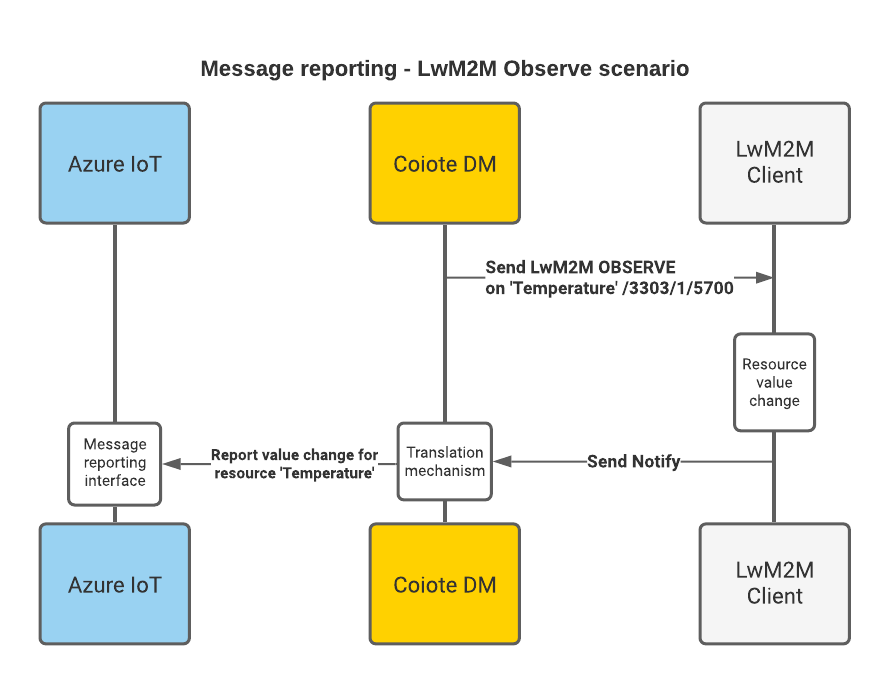

# LwM2M mappings

In this section you'll get to know how the mappings are arranged between the LwM2M protocol as used in Coiote DM and the data retrieval and processing mechanisms of the Azure IoT Central, such as Properties, Commands and Telemetry.

## Introduction

The LwM2M protocol data model is organized as a three-level tree that has the following structure:

 - **object** (e.g. a 'temperature sensor')
    - **object instance** (e.g. 'temperature sensor #1', 'temperature sensor #2' etc.)
        - **resource** (e.g. 'current temperature value')

In terms of operations that can be performed on an LwM2M Client, an LwM2M Server can READ all of the data model entities, and, depending on their characteristics, may also WRITE to some of them, and EXECUTE some of them. Additionally, an LwM2M Server can also OBSERVE selected resources.

This division into readable, writable, executable and observable data model entities is the basis for the mapping of LwM2M resources (as interpreted by Coiote DM) into Azure IoT Hub data processing mechanisms.        

## LwM2M readable and writable resources

Within the Coiote DM - Azure IoT Hub integration, readable and writable resources are usually interpreted as part of Azure Device twin data structure.

!!! note
    To learn more about Device twins, go to [Understand and use Device twins](https://docs.microsoft.com/en-us/azure/iot-hub/iot-hub-devguide-device-twins) section of the Azure IoT Hub documentation.

### READ and WRITE - Communication flow

This means that standard data model resources, such as `Manufacturer` (with ID **3/0/0**) will be mapped into the Device twin as a reported property.

On the other hand, a writable resource, such as `Lifetime` (with ID **1/0/1**) will be also mapped as a desired property, enabling you to synchronize the device data model and configuration between Azure and Coiote DM.

## LwM2M executable resources

As a rule, LwM2M resources that can be executable translate into Direct methods in Azure IoT Hub. This means that by sending a Direct Method from Azure, you can trigger an EXECUTE operation on a chosen resource available for your device and the request will be transferred immediately by the LwM2M Server to the device.

!!! note
    To learn more about Direct Methods, go to [Understand Direct Methods](https://docs.microsoft.com/en-us/azure/iot-hub/iot-hub-devguide-direct-methods) section of the Azure IoT Hub documentation.

### EXECUTE - Communication flow

For example, you can execute a factory reset on a device by sending a Direct Method from Azure to Coiote DM which then translates it to an EXECUTE operation on the `Factory Reset` resource (ID **/3/0/5**) and sends the request to the device.

## LwM2M observable resources

In Coiote DM, some of resources within the device data model can be observed for changes in value. These are generally resources related to telemetry data or other measurements. Their value changes can be monitored by Coiote DM and reported to the Azure IoT Hub message routing interface.

!!! note
    To learn more about message routing, go to [Use message routing](https://docs.microsoft.com/en-us/azure/iot-hub/iot-hub-devguide-messages-d2c) section of the Azure IoT Hub documentation.

### Observe - Communication flow

Setting an Observe operation on a resource in Coiote DM, for instance a temperature reading, will result in a Notify message sent by the device upon value change that Coiote DM will transfer to the message routing interface of Azure IoT Hub.

## Next steps
