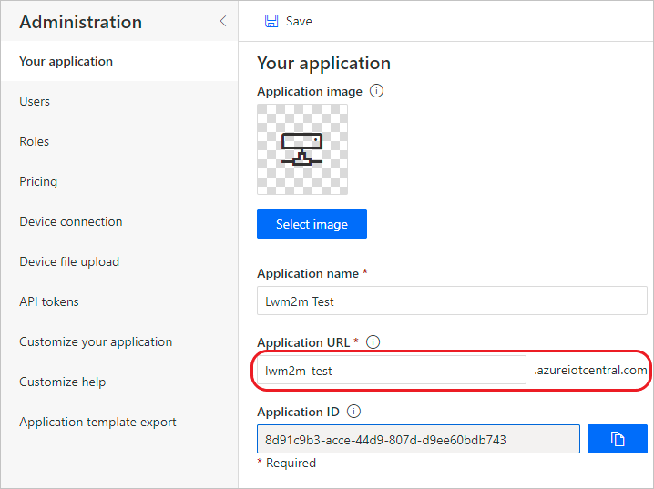
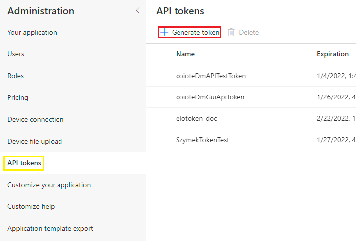
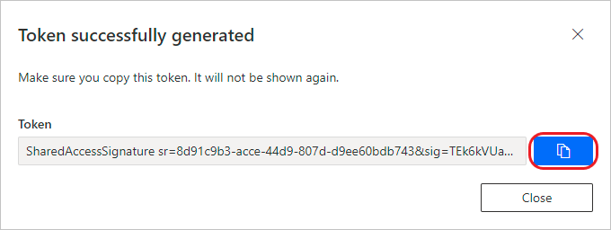
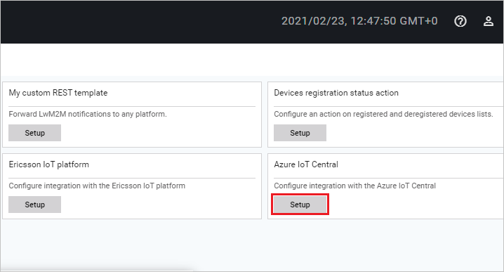

# Configuring integration extension

To enable communication and data flow between the Azure IoT Central and Coiote DM platforms, you first need to integrate them using the dedicated extension module in Coiote DM. Follow the instruction below to learn how to do it.

## Prerequisites:

   - An active IoT Central with hub owner access permissions.
   - A Coiote DM user account with permissions to use the integration extension.
_______________
## Get the Azure IoT Central integration credentials

   1. In your Azure IoT Central account view, go to **Administration**:
   2. Under **Your application**, copy the full *Application URL* (along with '.azureiotcentral.com') into Notepad or other place to keep it for later.

      

   3. From the **Administration** menu, select **API tokens** and click *generate token*.

      

    4. In the pop-up window that appears, click the copy icon for the newly generated token.

       

  Now you need to use the obtained credentials in the Coiote DM platform.

## Set up the **Azure IoT Hub Extension** using credentials.  

   1. In your Coiote DM user account, go to **Administration --> Extensions**.
   2. Find the **Azure IoT Central** tab and click `Setup`.

      

   3. Inside the tab:
      - paste the previously copied Azure IoT Central *Application URL*,
      - provide the API token and,
      - if needed, enter your *Device Provisioning Service hostname* (however, the default address provided is  sufficient in most cases).

      

       - use `Test connection` to see if the connection can be established correctly.

       - click `Save` to keep the setting.

## Next steps
 - [Syncing devices with Coiote DM](Device_operations/Syncing_devices_with_Coiote_DM.md)
 - [Importing devices to Azure IoT Central](Device_operations/Importing_devices_to_Azure_IoT_Central.md)
