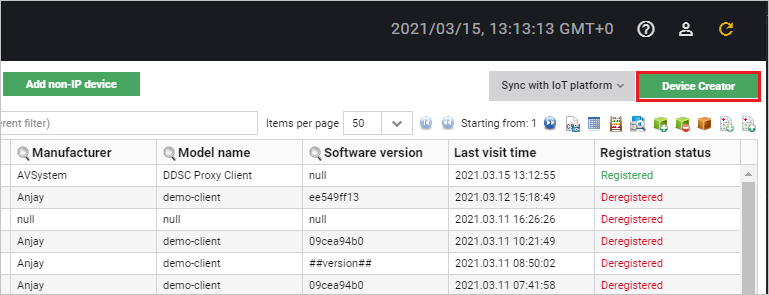
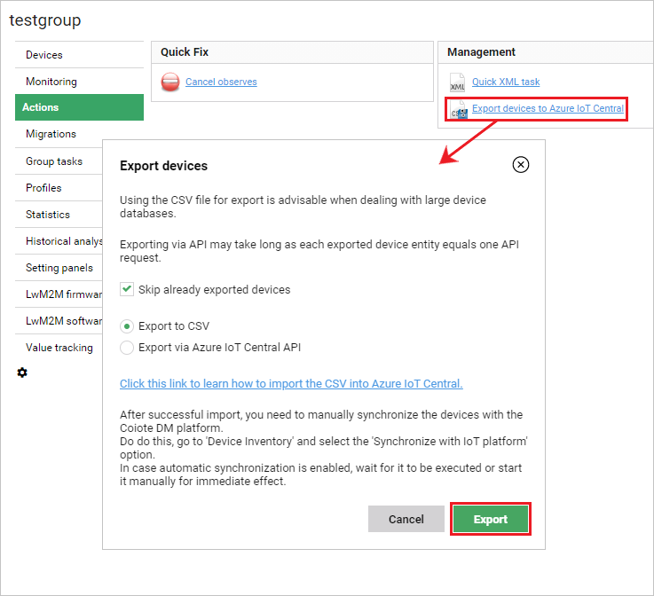
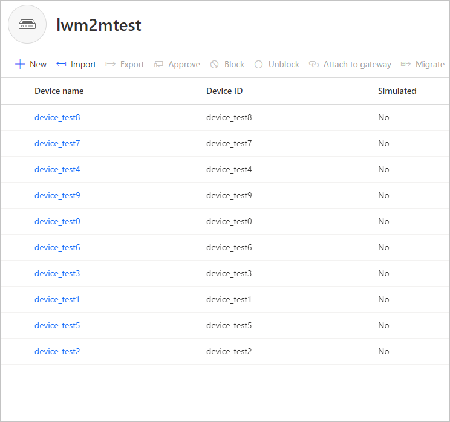

# Exporting devices to Azure IoT Central

If you have device entities in Coiote DM that you would like to manage via the Azure IoT Central, you may use the export functionality. Follow the instruction below to learn how to do it in four basic steps:

1. [Create a device](#create-a-device-entity-in-coiote-dm)
2. [Create a group of devices for export](#create-a-group-of-devices-for-export)
3. [Export your Coiote DM devices to CSV](#export-your-devices-to-csv)
4. [Import the CSV file to Azure IoT Central](#import-the-csv-file-to-azure-iot-central)

## Create a device entity in Coiote DM

If you don't have any devices in your Coiote DM **Device Inventory**, follow these instructions to add one or more devices.

1. In the Coiote DM **Device Inventory**, select **Device Creator**.
   
2. In the next screen, choose the **Connect your LwM2M device directly via the Management server**.
3. In the **Device credentials** step, provide a name for your device, then select `NoSec` from the **Security mode** list and click **Add device**.
4. In the pop-up window, click **Confirm** to add your device entity. Now it should be listed in **Device Inventory**.

## Create a group of devices for export

Now that you have some devices added, you need to insert all the devices to be exported into a common group for ease of configuration.

1. In Coiote DM, go to **Device Inventory**, filter the devices you would like to export and use the **Add to group** action.
   
2. In the pop-up window that appears, select **Add to new group**, provide a name for the group and click **Confirm**.

## Export your devices to CSV

You are now ready to export your devices.

1. In the **Device groups** panel, select your group of devices for export and click the **Actions** tab.
2. Under **Management**, select the **Export devices to Azure IoT Central**.
3. In the pop-up window:
   
    - mark **Skip already exported devices** optionally if you have already exported some of the devices belonging to this group.
    - select **Export to CSV**.

4. After a moment, the export operation should finish and a CSV file should start downloading.

## Import the CSV file to Azure IoT Central

Once you have the CSV file downloaded, you can use it to import the devices into Azure IoT Central.

1. From the left pane of your Azure IoT Central account, choose **Devices** and select a device template into which you want to import the devices.
2. Select **Import**.
3. In the pop-up that appears, select the previously downloaded CSV file.
4. The import process should start. Its status can be tracked in the **Device Operations** panel in the top right-hand corner.
5. Once the import process is complete, a success message should appear. If there are any errors, a log file will be generated in **Device Operations** that you can download.
   

!!! note
    To learn more about importing device entities to Azure IoT Central, [click here](https://docs.microsoft.com/en-us/azure/iot-central/core/howto-manage-devices#import-devices).

## Next steps
