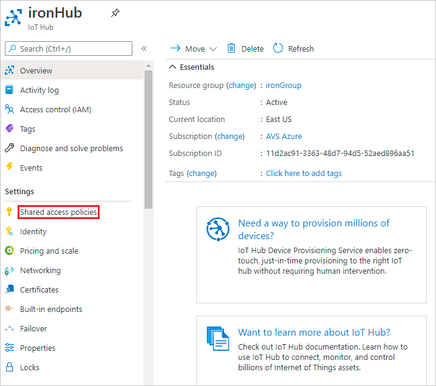
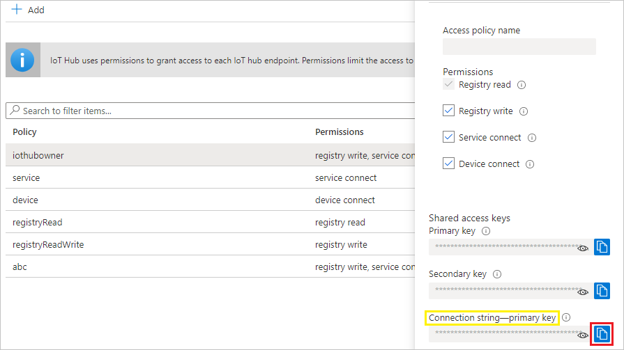
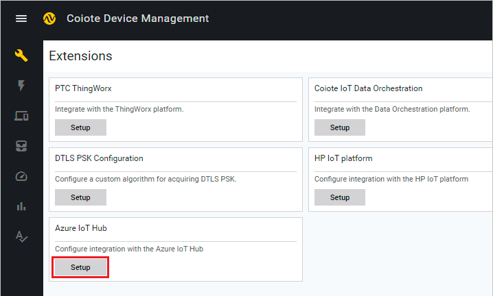

# Configuring integration extension

To enable communication and data flow between the Azure IoT Hub and Coiote DM platforms, you first need to integrate them using the dedicated extension module in Coiote DM. Follow the instruction below to learn how to do it.

## Prerequisites

  - An active IoT Hub with hub owner access permissions. [Check here](https://docs.microsoft.com/en-us/azure/iot-hub/iot-hub-create-through-portal) how to create a hub.
  - A Coiote DM user account with permissions to use the integration extension.
  - Optionally, an active Azure Blob Storage account.
__________________
## Get the IoT Hub connection string

  1. In your IoT Hub general view, go to **Shared access policies**:

     

  2. From the list of policies, select the `iothubowner` policy.
  3. Under **Shared access keys**, click the copy icon for the *Connection string -- primary key* to save the value.

     

    !!! info
        For detailed information about the IoT Hub permissions, please visit the [Control access to IoT Hub](https://docs.microsoft.com/en-us/azure/iot-hub/iot-hub-devguide-security#access-control-and-permissions) section of the Azure IoT Hub documentation.

  Now you need to use the credential in the Coiote DM platform.

## Set up the **Azure IoT Hub Extension** using credentials.  

   1. In your Coiote DM user account, go to **Administration --> Extensions**.
   2. Find the **Azure IoT Hub** tab and click `Setup`.
      
   3. In the tab, paste the previously copied IoT Hub connection string.
      
      - check `Enable automatic synchronization` to periodically synchronize any new devices that appear in the Azure IoT Hub.
      - use `Test connection` to see if the connection can be established correctly.
      - click `Save` to keep the setting.
   4. Optionally, you can also provide the Azure Blob Storage connection string that will be required in case you would like to export devices from Coiote DM to Azure IoT Hub. [Click here](../Device_operations/Exporting_devices_to_Azure_IoT_Hub/#get-the-azure-blob-storage-connection-string) to learn how to obtain and apply it.

## Next steps
 - [Importing Azure IoT Hub devices to Coiote DM](Device_operations/Importing_devices_to_Coiote_DM.md)
 - [Exporting devices to Azure IoT Hub](Device_operations/Exporting_devices_to_Azure_IoT_Hub.md)
