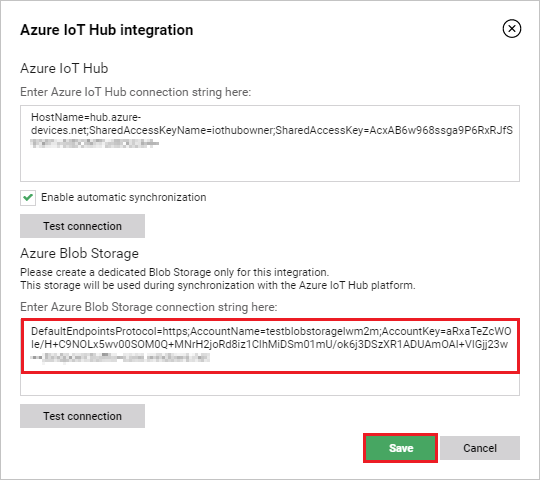
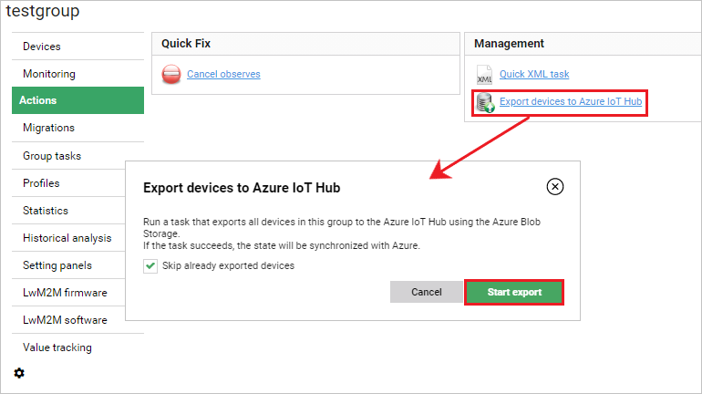
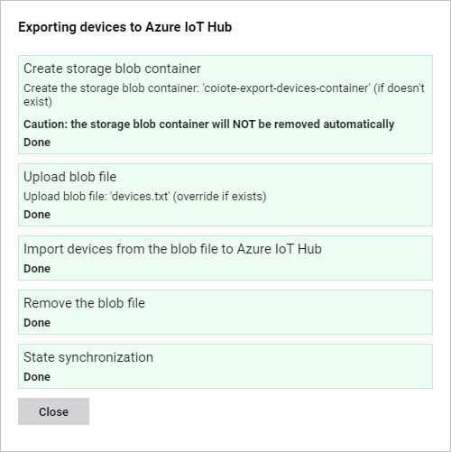

# Exporting devices to Azure IoT Hub

If you have device entities in Coiote DM that you would like to manage via the Azure IoT Hub, you may use the export functionality. Follow the instruction below to learn how to do it in four easy steps:

1. [Create a device](#create-a-device-entity)
2. [Create a group of devices for export](#create-a-group-of-devices-for-export)
3. [Get the Azure Blob storage connection string](#get-the-azure-blob-storage-connection-string)
4. [Export your devices](#export-your-devices)

## Prerequisites

 - An active Azure Blob Storage account. [Click here](https://docs.microsoft.com/en-us/azure/storage/blobs/storage-blobs-introduction) to learn more.
____________________

## Create a device entity in Coiote DM

If you don't have any devices in your Coiote DM **Device Inventory**, follow these instructions to add one or more devices.

1. In the Coiote DM **Device Inventory**, select **Device Creator**.
2. In the next screen, choose the **Connect your LwM2M device directly via the Management server**.
3. In the **Device credentials** step, provide a name for your device, then select `NoSec` from the **Security mode** list and click **Add device**.
4. In the pop-up window, click **Confirm** to add your device entity. Now it should be listed in **Device Inventory**.

## Create a group of devices for export

Now that you have some devices added, you need to insert all the devices to be exported into a common group for ease of configuration.

1. In Coiote DM, go to **Device Inventory**, select the devices you would like to export and use the **Add to group** action.
2. In the pop-up window that appears, select a group

## Get the Azure Blob storage connection string

An Azure Blob storage connection string is required in the export process. Here is how to obtain it:

1. In your Azure Blob storage account, go to **Access keys**.
 
2. Click **Show keys** and copy the *connection string* to your clipboard.
3. In your Coiote DM user account, go to **Administration --> Extensions**
4. Find the **Azure IoT Hub** tab and click `Setup`.
5. In the tab, paste the previously copied Azure Blob storage connection string.

    - use **Test connection** to see if the connection can be established correctly.
    - click **Save** to keep the setting.

## Export your devices

Now you are ready to export your devices.

1. In the **Device groups** panel, select your group of devices ready for export and click **Actions**.
2. Under **Management**, select the **Export devices to Azure IoT**.
3. In the pop-up window:
   
    - mark **Skip already exported devices** optionally if you have already exported some of the devices belonging to this group.
    - select **Start export**.

4. After a moment, the export operation should finish successfully. If there are any errors, you can check the credentials that you provided in the **Azure IoT Hub** extension setup.
  
## Next steps
