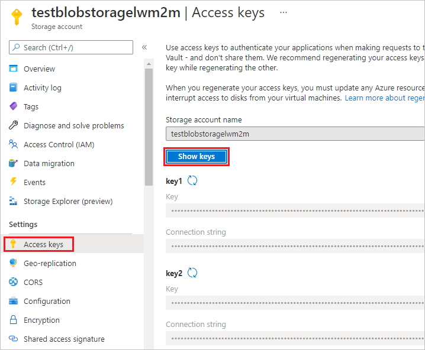

# Exporting devices to Azure IoT Hub

If you have device entities in Coiote DM that you would like to manage via the Azure IoT Hub, you may use the export functionality. Follow the instruction below to learn how to do it in four easy steps:

1. [Create a device](#create-a-device-entity)
2. [Create a group of devices for export](#create-a-group-of-devices-for-export)
3. [Get the Azure Blob storage connection string](#get-the-azure-blob-storage-connection-string)
4. [Export your devices](#export-your-devices)

## Prerequisites

 - An active Azure Blob Storage account. [Click here](https://docs.microsoft.com/en-us/azure/storage/blobs/storage-blobs-introduction) to learn more.
____________________

## Create a device entity

If you don't have any devices in your Coiote DM **Device Inventory**, follow these instructions to add one or more devices.

1.

## Create a group of devices for export

First, you need to insert all the devices to be imported into a common group for ease of configuration.

1. In Coiote DM, go to **Device inventory**, select the devices you would like to import and use the **Add to group** action.
2. In the pop-up window that appears, select a group

## Get the Azure Blob storage connection string

Azure Blob storage connection string will be important in the last step of the import operation. Here is how to obtain it:

1. In your Azure Blob Storage account, go to **Access keys**.
 
2. Click **Show keys** and copy the *connection string* to your clipboard.

## Export your devices

Now you are ready to export your devices.

1. In the **Device groups** panel, select your group of devices ready for import and click **Actions**.
2. Under **Management**, select the **Export devices to Azure IoT**.
3. In the pop-up window, select the following options:

    

    - **Add all devices to the Azure IoT Hub group** - select it to add your devices to a group dedicated for devices integrated with the Azure IoT Hub. Note that this group has the 'Azure dialect' set as the default.
    - **Add the Azure dialect to this group** - select it if you want to set the 'Azure dialect' to your current group. This setting is useful in case you deselect the first option.

## Next steps
