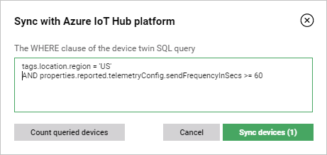

# Syncing devices with Coiote DM

If you have any device entities in your Azure IoT Hub and would like to migrate them to the Coiote DM platform for full management possibilities, follow the instruction below.

## Prerequisites

 - Configured and working Azure IoT Hub integration extension (see [Configuring the Azure IoT Hub integration](../Configuring_Azure_IoT_Hub_integration_extension.md) extension for details).
_______________
## Sync your devices

In order to establish communication and data flow between device entities in Azure IoT Hub and their Coiote DM counterparts, you need to sync them.

1. Go to **Device inventory**, click the **Sync with IoT platform** button and select **Azure IoT Hub**.
2. In the pop-up window:
   - provide the *WHERE clause* of the device twin SQL query to filter your devices using chosen tags and properties (to read more about SQL query, check the [IoT Hub query language](https://docs.microsoft.com/en-us/azure/iot-hub/iot-hub-devguide-query-language) section of Azure IoT Hub documentation. For instance, you can filter by device location region and device status with the following clause:

     ``tags.location.region = 'US' AND status = 'enabled'``

   - click **Count queried devices** to check the number of devices that meet the specified conditions (the number is shown inside the **Sync devices** button)
   - to skip filtering and sync all the available devices, leave the *WHERE clause* input field empty.
   - click **Sync devices** to start the synchronization.

     

Now that your devices are synchronized, after their successful connection to the Coiote DM platform, you should be able to see the updated device twin properties in Azure IoT Hub.

!!! tip
    If the device twin parameters are not up-to-date after syncing, try the refresh data model action on the device.
