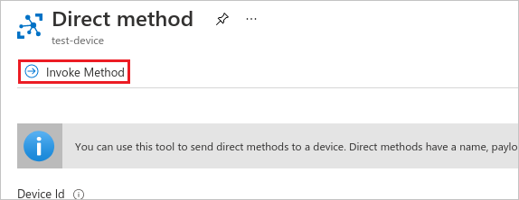
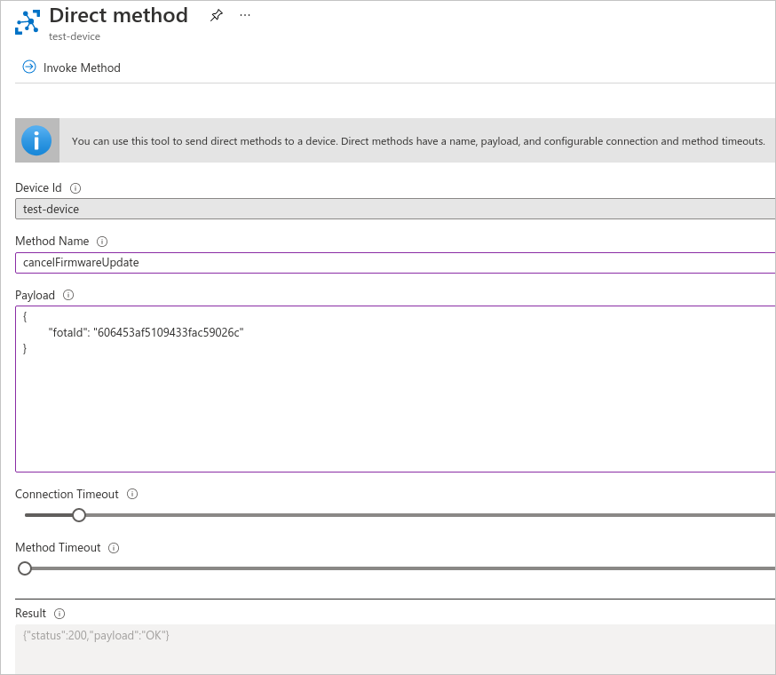

# Upgrading device firmware

If you would like to upgrade the firmware of devices using the Azure IoT Hub, follow the instruction below.

## Prerequisites

 - At least one device with active Coiote DM - Azure IoT Hub [synchronization](../Importing_devices_to_Coiote_DM).
 - A firmware file hosted on an HTTP server that is reachable by the Coiote DM server. 

!!! note 
     In this stage of integration, no authentication method is suported for this endpoint - it is required that the firmware is publicly available (or hosted in a private network but with access granted for the Coiote DM server).

## Invoking the *scheduleFirmwareUpdate* direct method

To initiate the firmware upgrade procedure for your device:

1. Go to your Azure hub account and under **Explorers**, select **IoT devices**.
2. From the list, choose the device for which you want to upgrade the firmware.
3. In the device view, select the **Direct Method** tab.

    

4. Provide data for the following fields:

     

    - **Method Name** - paste the `scheduleFirmwareUpdate` direct method name here.
    - **Payload** - use the following payload with firmware upgrade parameters (remember to replace the example values where needed):
          ```
          {
          	"name": "anjay-firmware",
          	"firmwareUrl": "https://example.repository.com/artifactory/gitlfs/demo.fw-pkg",
          	// optional - default="1200s", any valid duration in format "<length><unit>"
          	"timeout": "1200s",
          	// optional - default="COAP"
          	"protocolType": "COAP",
          	// optional - default=null <-> keep firmware file forever, any valid duration in format "<length><unit>" or null
            "retentionPeriod": "300s",
          	// optional - default=""
            "description": "This is anjay demo firmware",
          	// optional - default=false
          	"useQuota": false,
          	// optional - default=false
          	"useCachedData": false,
          	// optional - default=false
          	"resumeAfterDownlinkFailure": false,
          	// optional - default="pull", possible values = ["pull", "push"]
          	"imageDeliveryMethod": "pull",
          	// optional - default="WithoutObservations", possible values = ["ObservationTrigger", "WithoutObservations", "ObservationBased", "SendBased"]
          	"upgradeStrategy": "WithoutObservations",
          	// optional - default="always", possible values = ["always", "weekends", "nights-home", "nights-enterprise-weekends", "nights-enterprise", user-defined schedules]
          	"schedule": "always"							
          }
          ```
    - **Connection timeout** - specify a timeout for the Azure - Coiote DM connection (the recommended value is not less than 5 seconds).
    - **Method timeout** - specify a timeout for direct method result notification.

5. Once you have provided the required data, click **Invoke method**.

    

6. After a short moment, you should be able to see the direct method result in the **Result** field.     

    

    - The `200` as the "status" parameter value means that the firmware upgrade task was completed successfully.
    - Importantly, the result "payload" value will be needed for other FOTA actions like status check or cancellation, so be sure to copy it to your clipboard if needed.

!!! tip
    Out of all the parameters provided in Firmware upgrade direct method payload, only two are mandatory:

      - **name** - the unique file name used for firmware identification.
      - **firmwareUrl** - the URL used by Coiote DM to download the firmware file and include it as a resource.   

    Therefore it is correct to include only those two in the payload, as in here:
      ```
      {
      "name": "anjay-firmware",
      "firmwareUrl": "https://example.repository.com/artifactory/gitlfs/demo.fw-pkg",
      }
      ```

## Checking Firmware upgrade status

To check the status of a scheduled firmware upgrade, follow these steps:

1. In the **Direct Method** tab of your device, provide data for the following fields:
    - **Method Name** - paste the `checkFirmwareUpdateStatus` direct method name here.
    - **Payload** - use the payload displayed in the Firmware upgrade result field (remember to replace the placeholder value with your copied value):
    ```
    {
    "fotaId": "fotaIdReturnedByScheduleOperation"
    }
    ```
2. Click **Invoke method**.

    

3. Check the direct method status in the Result field:

    

## Cancelling the Firmware upgrade procedure

To cancel the firmware upgrade procedure, follow these steps:

1. In the **Direct Method** tab of your device, provide data for the following fields:
    - **Method Name** - paste the `cancelFirmwareUpdate` direct method name here.
    - **Payload** - use the payload displayed in the Firmware upgrade result field (remember to replace the placeholder value with your copied value):
      ```
      {
      "fotaId": "fotaIdReturnedByScheduleOperation"
      }
      ```
2. Click **Invoke method**.

    

3. Check the direct method status in the Result field:

    
