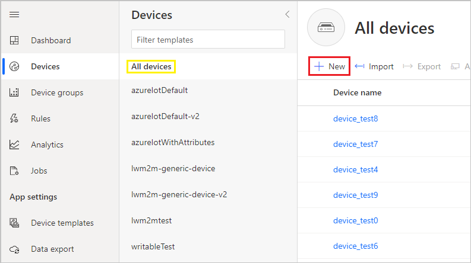
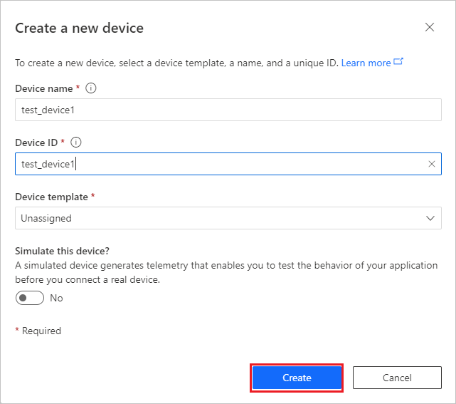
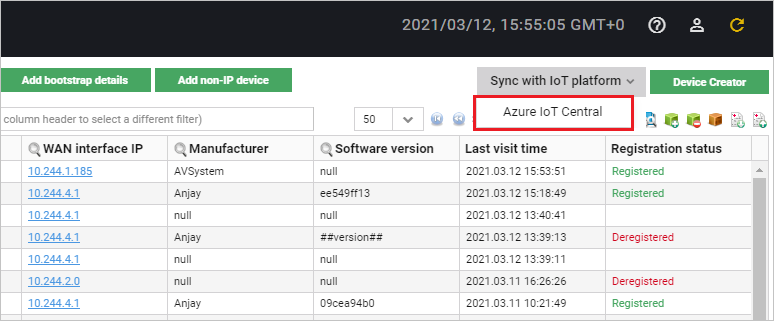
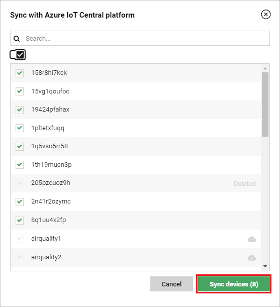

# Importing devices to Coiote DM

If you would like to migrate any device entities from your Azure IoT Central to the Coiote DM platform for full management possibilities, follow the instruction below.

## Prerequisites

 - Configured and working Azure IoT Hub integration extension (see [Configuring the Azure IoT Central integration](../Configuring_Azure_IoT_Central_integration_extension.md) extension for details).
_______________

## Add devices to Azure IoT Central

If you don't have any device entities added in your Azure IoT Central, follow these steps to learn how to do it:

1. In your Azure IoT Central account, go to **Devices**, select **All Devices** and click **+New**.
2. In the panel, click **+New**.
   
3. Provide your device name and ID in the relevant field and click **Create**.
   

## Sync your devices

In order to establish communication and data flow between device entities in Azure IoT Central and their Coiote DM counterparts, you need to sync them.

1. Go to **Device inventory**, click the **Sync with IoT platform** button and select **Azure IoT Central**.
    
2. In the pop-up window:

    

    - from the list, select the devices for synchronization.
    - click **Sync devices** to start the synchronization.

After a successful sync, the devices should be listed in **Device inventory**.

## Next steps
