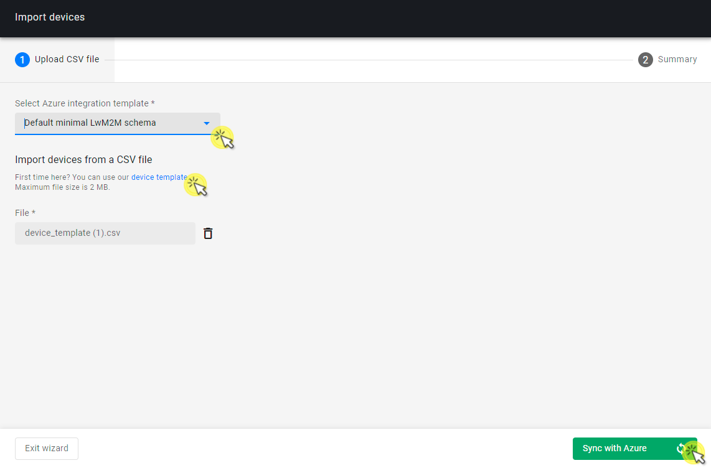
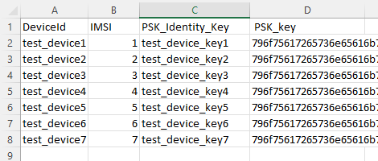

# Synchronize devices with Azure IoT Central

Importing devices to Coiote DM and synchronizing them with Azure IoT Central is a quick way to start using your Coiote DM - Azure IoT Central integration. The import operation will do two basic operations automatically:

- Create device entities in Coiote DM with the credentials that you specified,
- create the devices' "counterparts" within Azure IoT Central and synchronize them with Coiote DM.     

## Prerequisites

 - A [connected Azure IoT Central integration](/Azure_IoT_Integration_Guide/Azure_IoT_Central_integration/Configure_Azure_IoT_Central_integration/) in the Hyperscaler Integration Center.
 ____________________

## Import devices from CSV using a default integration template

In the import process, you will need a list of devices that you want to import along with an integration template to be used by the Azure IoT Central. To learn more about Azure integration templates, see the [Configure integration templates](/Azure_IoT_Integration_Guide/Configure_integration_templates/Azure_integration_templates/) section.

0. In Coiote DM, go to **Administration** -> **Hyperscaler Integration Center**.
0. Make sure you have an integration connected in the **Integration** tab.
0. Go to the **Device list** tab and click **Import devices**.
0. In the **Import devices** wizard:
    - From the **Select template** field, select one of two default integration templates:
        - Default minimal LwM2M schema - a pre-defined template implementing a basic device data model.     
        - Default rich LwM2M schema - a pre-defined template implementing an extended device data model.
    !!! note
        Integration templates are crucial in the device import process. Optionally, you can create your custom device template and use it in importing. Check the instructions in the [Configure integration templates](/Azure_IoT_Integration_Guide/Configure_integration_templates/Azure_integration_templates/) section.  
    - In the **Import devices from a CSV file** section:
        
        - If you already have a CSV file with devices for import, click **Browse** and select the file.
        - If you don't have a CSV with devices for import yet, click the **device template** link to download an empty template that you can fill in with your data:
            - **DeviceId**	- provide your device ID. For LwM2M-enabled devices, device ID usually equals the endpoint name.
            - **IMSI** - provide a random but unique number for each entry (or provide IMSI number if your device has one).
              
            - **PSK_Identity_Key** - provide a unique plain-text PSK identity key used for secure communication between the device and Coiote DM.
            - **PSK_Key** -  provide a unique HEX-encoded PSK key used for secure communication between the device and Coiote DM.
            - Save the template and upload it using the **Browse** button and dialog window.
    -  Click **Sync with Azure**.
0. After a moment, the import operation should finish successfully.  
0. Now you can connect your physical devices to Coiote DM using their credentials and the URL displayed in the screen.

### What the import operation does

Once the devices from the CSV template are imported into Coiote DM, the following actions are performed:

- In Coiote DM, device entities are created based on the credentials provided in the template. All such entities are visible in the **Device list** tab:
- In Coiote DM, a dedicated integration group is automatically created (with name built up by the `hyperscalercenter` prefix and the template ID, e.g. `618238c8bcafcb43b2911261`).  
- In your Azure IoT Central, devices are created and ready for operation.

### Check device error logs

Logs may come helpful for diagnosing and troubleshooting issues with the communication between the three actors in the integration: the device, Coiote DM, and Azure IoT Central.   

To see logs for your integrated devices:

0. Go to the single device view and from the left menu, select the **Logs** tile.
0. In the **Logs** panel, expand the view by clicking on **More** and configure the following:
    - **Store from level** - select **Use custom** and set log level to **DEBUG** for 1 hour.
    - **Tags** - select **HYPERSCALERS**
0. The communication logs will be displayed, allowing you to check, diagnose, or debug any issues.
