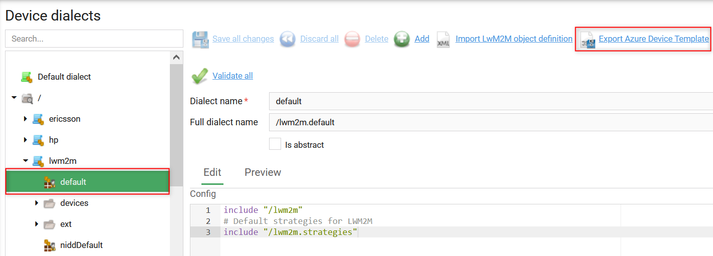
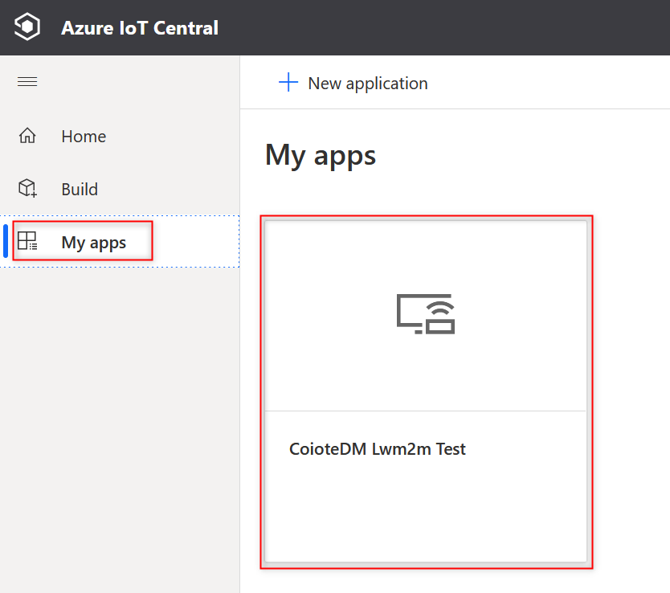
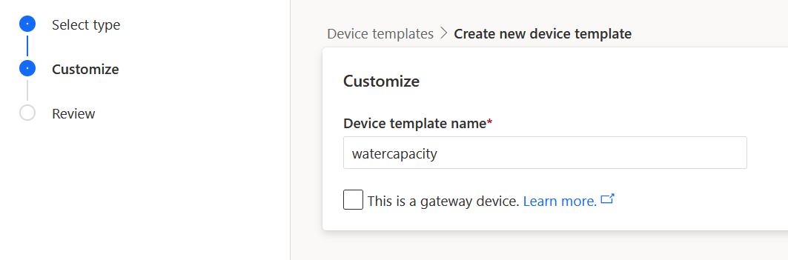
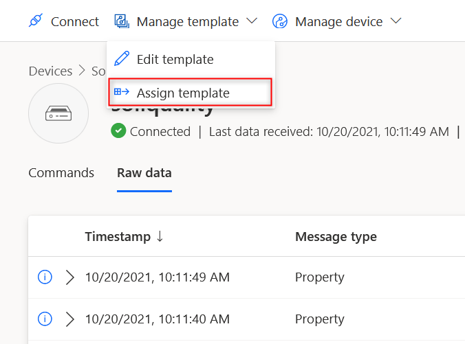
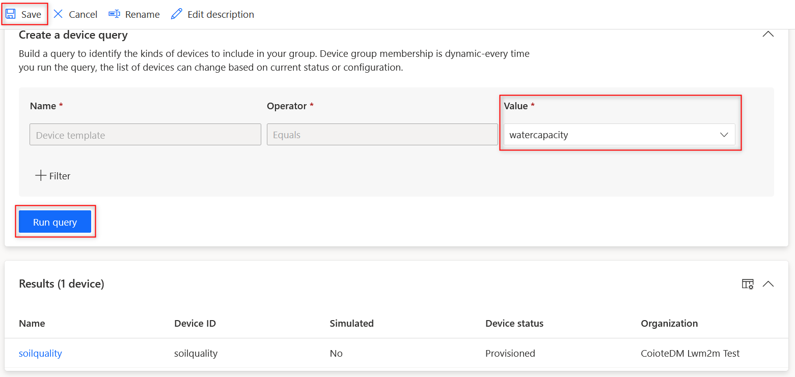
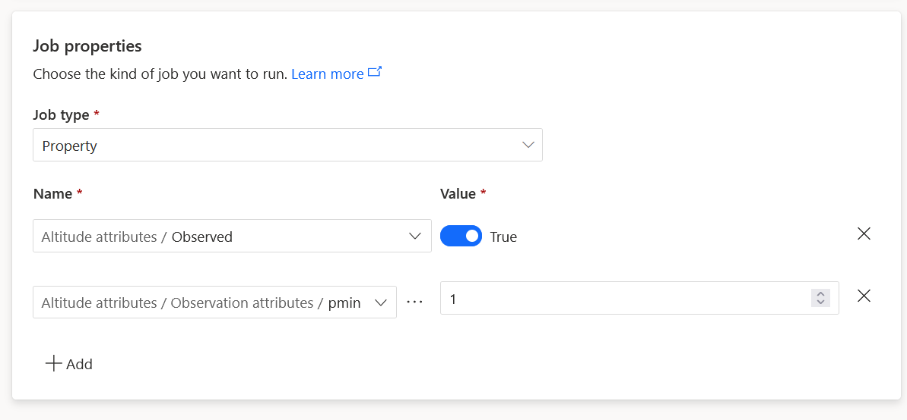
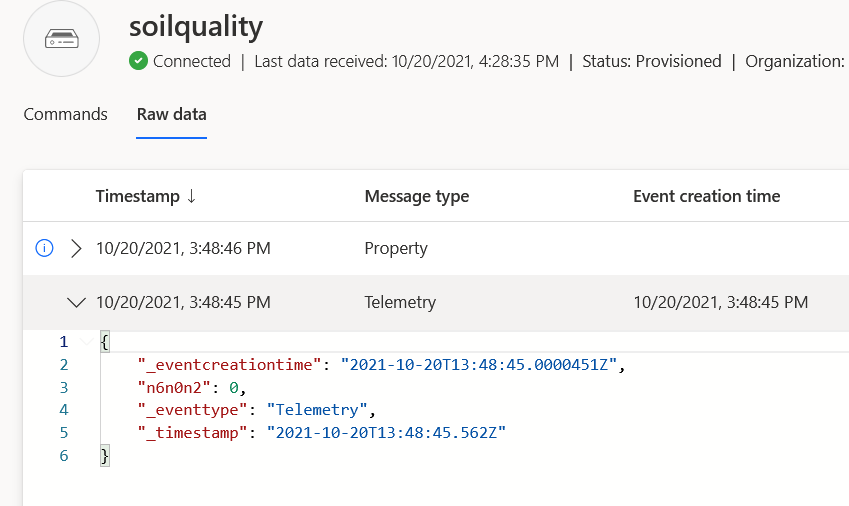
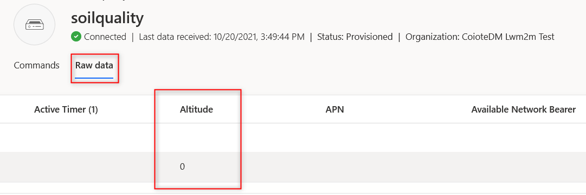
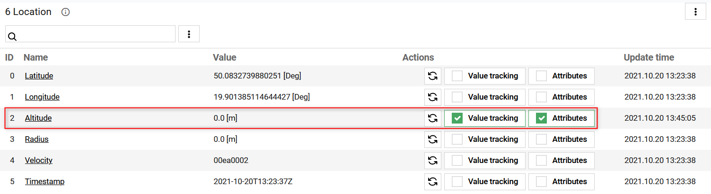
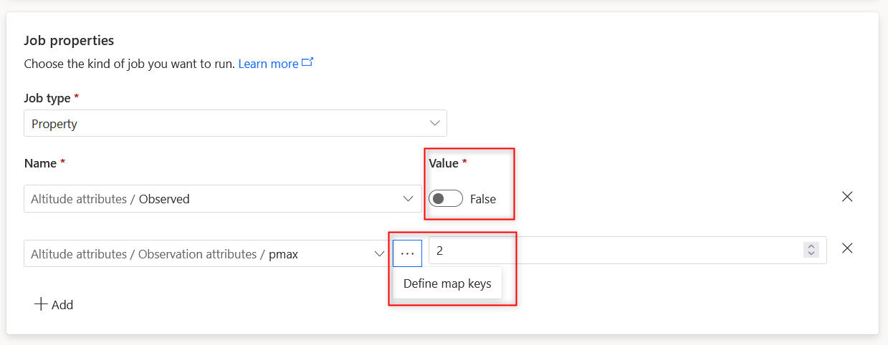

# Set an Observation

This section describes how to set an Observation in your Azure IoT Central application.

Setting an Observation lets your devices know what value changes and for what particular resources they need to notify you about. An Observation can be set for any or all the components of the [data model](https://iotdevzone.avsystem.com/docs/Azure_IoT_Integration_Guide/Concepts/LwM2M_mappings/): objects, objects instances, and resources. Whenever there is a change in values, a device will send a Notify message to Coiote DM, which in turn will transfer it to Azure IoT Central.

In this section, you learn how to:
* Assign a device template that acts as a translator between Coiote DM and Azure IoT Central
* Create a device group, because an Observation is set at the group level
* Run Jobs to add, edit or delete Observations
* See value changes for the observed resources

## Prerequisites

1. An active Azure IoT Central with hub owner access permissions.
2. A Coiote DM user account with permissions to use the integration extension.
3. A device group created in Coiote DM.
4. [A configured extension between Coiote DM and Azure Iot Central](https://iotdevzone.avsystem.com/docs/Azure_IoT_Integration_Guide/Azure_IoT_Central_integration/Configuring_Azure_IoT_Central_integration_extension/).
5. [A configured integration template in Coiote DM](https://iotdevzone.avsystem.com/docs/Azure_IoT_Integration_Guide/Configure_integration_templates/Azure_integration_templates/).
5. [A connected device](https://iotdevzone.avsystem.com/docs/Azure_IoT_Integration_Guide/Azure_IoT_Central_integration/Device_operations/Overview/).

## Assign a device template

To enable correct communication between Coiote DM and Azure IoT Central, you need two templates. The first template configures Coiote DM integration with Azure. (Follow [this instruction](https://iotdevzone.avsystem.com/docs/Azure_IoT_Integration_Guide/Configure_integration_templates/Azure_integration_templates/) to learn how to configure it.) The second template builds on the first one and allows to provide information that is used only in Azure IoT Central, e.g., that a given resource is temperature and is measured in Celsius.

### Download LwM2M template in Coiote DM (UPDATE!!!)

1. In Coiote DM, go to **Administration → Azure integration**.
2. In the list of templates, find the one from which you want to generate the IoT Central template.
3. Click **Generate IoT Central template** (??) to download the template as a JSON file.

 - UPDATE!!!!!!

!!! info
    Two templates -- **Default rich LwM2M schema** and **Default minimal LwM2M schema** are the default Azure integration templates that you can use to generate the template for IoT Central. As any other template, they need to be assigned to a group before you generate the Central template.

### Create a device template in Azure IoT Central
1. In your Azure IoT Central account, go to **My apps** from the left pane and click the **CoioteDM Lwm2m Test** tile.

    

2. To add a new device template, go to **Device templates** from the left pane and then click **+ New**.

3. On the **Select type** page, select the **IoT device** tile and click **Next: Customize**.

4. Enter a name for your device template and click **Next: Review**. In this example, our device template is called `watercapacity`.

    

5. On the **Review** page, click **Create**.

6. On the **Create a model** page, select the **Import a model** tile. This is where you need to import the .csv file you exported from Coiote DM.

7. On the **Model** page, click **Publish** to publish this device template to the application. In the pop-up window that appears, click **Publish**.

### Assign a device template in Azure IoT Central
1. To assign the published template to a device, go to **Devices** from the left pane and click on the device you want to observe. In our case, the device is called `soilquality`.

2. Click **Manage templates** and choose **Assign template**.

    

3. In the pop-up window that appears, find the template you have previously created in Azure (in our case, this is `watercapacity`) and click **Assign template**.

## Create a group

Now that you have a device with a template assigned to it, you need to add this device to a group. To create a group:

1. In Azure IoT Central, go to **Device groups** from the left pane and click **+ New**.

    !!! note
        A device group can only contain devices from a single device template.

2. Fill in the following information:
    * **Group name** and an optional description. In our case, the group is called `soil`.
    * **Device group access**: skip, because Lwm2m test application doesn’t use organizations.
    * **Create a device query**: from the **Value** drop-down menu, select the name of the device template you created in the previous step (`watercapacity` in our case). Click **Run query**.

After running a query, you will see the list of devices that are associated with this template. In our case it’s a device called `soilquality`. Click **Save**.

## Set up an Observation

Let’s set an Observation operation on resource ID **6/0/2**. This is Altitude, and the data is sent as Telemetry.

To add an Observation, you need to use the **Jobs** tab.

1. In Azure IoT Central, go to **Jobs** from the left pane and click **+ New job**.

2. Configure your job:
   * **Name ***: Provide a name and an optional description of the job.
   * **Access**: skip, because Lwm2m test application doesn’t use organizations.
   * **Target devices**: choose which devices this job will run on.
   * **Job properties**:
       * Set **Job type** as `Property`.
       * Under the **Name** field, select the resource you want to put the observation for and turn the toggle to **True**.
       * To add parameters to this observation, click **+ Add** and select the respective parameters in the drop-down menu. Specify the attribute in the pop-up window that appears, e.g., `pmin`.
       * Click **Next**.

    

    !!! info
        * **pmin** - the minimum time in seconds between two notifications.
        * **pmax** - the maximum time in seconds between two notifications. The notification is sent even if the value didn't change.

        Read more about other attributes in our [Brief description of OMA LwM2M](https://avsystem.github.io/Anjay-doc/LwM2M.html#attributes).

3. In **Delivery options**, click **Next**.
4. In **Schedule**, click **Next**.
5. Review and click **Run**.

## See value changes

1. In Azure IoT Central, go to **Devices** from the left pane and click on the device you observe. You will see the list of messages that notify about any changes in the desired and reported properties for this device.

2. In the **Raw data** tab, unfold one of the recent messages. In the JSON snippet, you can see that an Observation has been set for a **Telemetry resource ID n6n0n2** (objects, object instances, and resources are separated by `n` in Azure IoT Central).

    

To see the data received about the value changes, scroll right until you find the **Altitude** column. As this is a test example, the value is 0, but in real life, you will see the actual numbers.

!!! Tip
    If you don’t see any value in the necessary column (e.g., Altitude), scroll all the way right to the very last column **Unmodeled data**. If it contains an entry similar to ``{"n6n0n2":"1634741504000"}``, it means there is a mismatch between Coiote DM and Azure IoT Central templates. Altitude is a Telemetry resource, but apparently it is set as Property in Azure. To fix this error, go to **Device templates** in Azure IoT Central, select the necessary template and find the resource you want to edit. In the **Capability type** column, select `Telemetry` from the drop-down menu, so that it’s consistent with what you have in Coiote DM. Click **Save**. Go back to **Devices** and refresh the page to see the changes.

## Check an Observation in Coiote
This step is optional. If you want to make sure the Observation has been set in Coiote DM as well, do the following:

1. Go to **Device inventory → Objects**.
2. Find the resource you want to check. In our example, this is `2 Altitude` resource in the `6 Location` object.
3. Click the refresh button to the left from the **Value tracking**.
You will see that checkboxes next to **Value tracking** and **Attributes** are now filled in green.

## Edit or delete an Observation
To edit or delete an Observation, you need to create a new job.

* In Azure IoT Central, go to **Jobs** from the left pane and click **+ New job**.
* Alternatively, you can copy an existing job:
    1. Select the job and then click **Copy job**.
    2. To edit the **Observation attributes**, change the value in the text box. To change the **map keys** (e.g., pmax to pmin), click on the Ellipse button.
    3. To delete an Observation, turn off the toggle to **False**.

## Next steps
[Air quality monitoring - tutorial](https://iotdevzone.avsystem.com/docs/Azure_IoT_Integration_Guide/Tutorials/Air_quality_monitoring_tutorial/)
