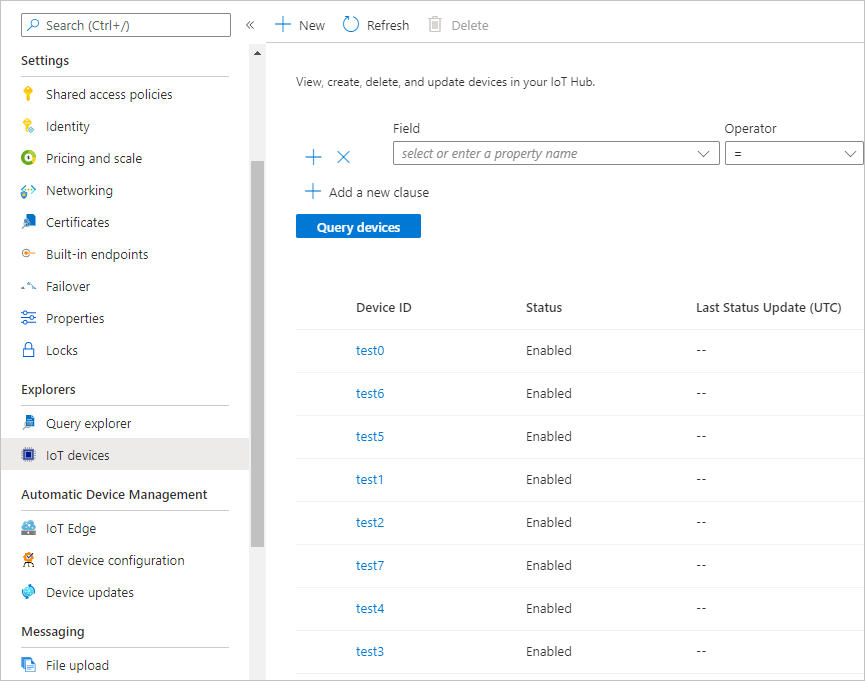
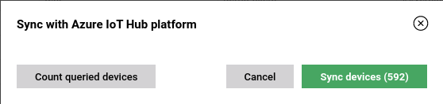

# Importing devices to Coiote DM

If you would like to migrate any device entities from your Azure IoT to the Coiote DM platform for full management possibilities, follow the instruction below.

## Prerequisites

- Configured and working Azure IoT Hub integration extension (see [Configuring the Azure IoT Hub integration](../Configuring_Azure_IoT_Hub_integration_extension.md) extension for details).
_______________

## Add devices to Azure IoT Hub

If you don't have any device entities added in your Azure IoT Hub, follow these steps to learn how to do it:

1. In your Azure IoT Hub account, under **Explorers**, select **IoT devices**.
2. In the panel, click **+New**.
   
3. Provide device ID in the relevant field and click **Save**.
   
4. Your added devices should be visible in **IoT devices** under **Explorers**:
   

## Sync your devices

In order to establish communication and data flow between device entities in Azure IoT Hub and their Coiote DM counterparts, you need to sync them.

1. Go to **Device inventory**, click the **Sync with IoT platform** button and select **Azure IoT Hub**.
   
2. In the pop-up window:

   

   - click **Count queried devices** to check the number of devices (the number is shown inside the **Sync devices** button)
   - click **Sync devices** to start the synchronization.

After successful import, the devices should be listed in **Device inventory**.

Now that your devices are synchronized, after their successful connection to the Coiote DM platform, you should be able to see the updated device twin properties in Azure IoT Hub.

!!! tip
If the device twin parameters are not up-to-date after syncing, try the refresh data model action on the device.

## Next steps
