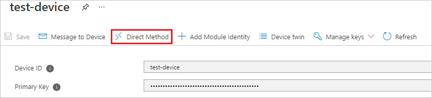
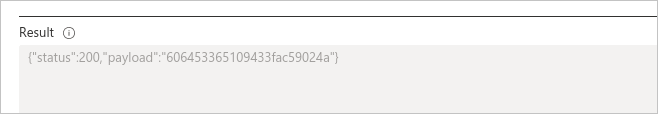
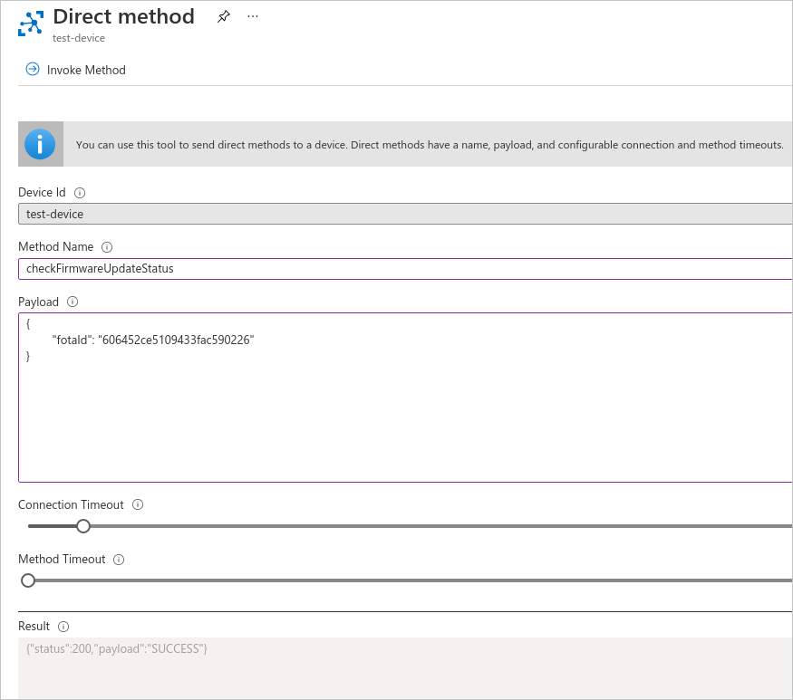
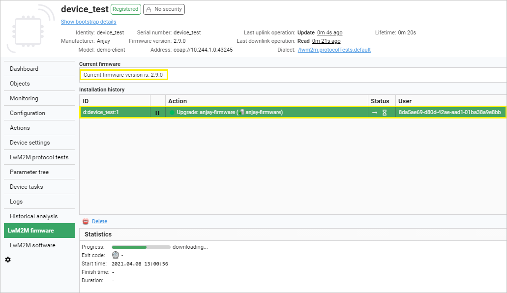

# Upgrade device firmware

If you would like to upgrade the firmware of devices using the Azure IoT Hub, follow the instruction below.

## Prerequisites

 - At least one [synchronized](../Synchronize_devices_with_Azure_IoT_Hub) Coiote DM - Azure IoT Hub device.
 - A firmware file hosted on an HTTP server that is reachable by the Coiote DM server.

!!! note
     In this stage of integration, no authentication method is supported for this endpoint - it is required that the firmware is publicly available (or hosted in a private network but with access granted for the Coiote DM server).

## Scheduling a firmware upgrade

### Introduction

The process of upgrading device firmware for Azure IoT Hub devices synchronized with Coiote DM is based on two main elements: the Azure Direct Method mechanism and the Coiote DM Firmware Upgrade task.
In the process, the Azure *scheduleFirmwareUpdate* direct method is invoked, enabling the Coiote DM to download the specified firmware file and add it to its resources. Then, an XML task is scheduled in Coiote DM and the upgrade is performed on the device.  

!!! info
    For firmware file recognition in Coiote, global identifiers are used. This means that it is recommended to name your firmware files using the format: yourdomainName + randomized value. If the same firmware file name is used again, then Coiote DM will be able to utilize the once downloaded resource without the need to download it again.

### Step 1: Invoking the Azure *scheduleFirmwareUpdate* direct method

To initiate the firmware upgrade procedure for your device:

1. Go to your Azure hub account and under **Explorers**, select **IoT devices**.
2. From the list, choose the device for which you want to upgrade the firmware.
3. In the device view, select the **Direct Method** tab.

    

4. Provide data for the following fields:

     

    - **Method Name** - paste the `scheduleFirmwareUpdate` direct method name here.
    - **Payload** - use the following payload with firmware upgrade parameters (remember to replace the example values where needed):
          ```
          {
          	"name": "anjay-firmware",
          	"firmwareUrl": "https://example.repository.com/artifactory/gitlfs/demo.fw-pkg",
          	// optional - default="1200s", any valid duration in format "<length><unit>"
          	"timeout": "1200s",
          	// optional - default="COAP"
          	"protocolType": "COAP",
          	// optional - default=null <-> keep firmware file forever, any valid duration in format "<length><unit>" or null
            "retentionPeriod": "300s",
          	// optional - default=""
            "description": "This is anjay demo firmware",
          	// optional - default=false
          	"useQuota": false,
          	// optional - default=false
          	"useCachedData": false,
          	// optional - default=false
          	"resumeAfterDownlinkFailure": false,
          	// optional - default="pull", possible values = ["pull", "push"]
          	"imageDeliveryMethod": "pull",
          	// optional - default="WithoutObservations", possible values = ["ObservationTrigger", "WithoutObservations", "ObservationBased", "SendBased"]
          	"upgradeStrategy": "WithoutObservations",
          	// optional - default="always", possible values = ["always", "weekends", "nights-home", "nights-enterprise-weekends", "nights-enterprise", user-defined schedules]
          	"schedule": "always"							
          }
          ```
    - **Connection timeout** - specify a timeout for the Azure - Coiote DM connection (the recommended value is not less than 5 seconds).
    - **Method timeout** - specify a timeout for direct method result notification.

5. Once you have provided the required data, click **Invoke method**.

    

6. After a short moment, you should be able to see the direct method result in the **Result** field.     

    

    - The `200` as the "status" parameter value means that the firmware upgrade task was completed successfully.
    - Importantly, the result "payload" value will be needed for other FOTA actions like status check or cancellation, so be sure to copy it to your clipboard if needed.

!!! tip
    Out of all the parameters provided in Firmware upgrade direct method payload, only two are mandatory:

      - **name** - the unique file name used for firmware identification.
      - **firmwareUrl** - the URL used by Coiote DM to download the firmware file and include it as a resource.   

    Therefore it is correct to include only those two in the payload, as in here:
      ```
      {
      "name": "anjay-firmware",
      "firmwareUrl": "https://example.repository.com/artifactory/gitlfs/demo.fw-pkg",
      }
      ```

### Step 2: Checking the firmware upgrade result

To check the status of a scheduled firmware upgrade, follow these steps:

1. In the **Direct Method** tab of your device, provide data for the following fields:
    - **Method Name** - paste the `checkFirmwareUpdateStatus` direct method name here.
    - **Payload** - use the payload displayed in the Firmware upgrade result field (remember to replace the placeholder value with your copied value):
    ```
    {
    "fotaId": "fotaIdReturnedByScheduleOperation"
    }
    ```
2. Click **Invoke method**.

    

3. Check the direct method status in the Result field:

    

### Step 3: Checking Coiote DM FOTA task execution

Once you have executed the Azure-side steps of the procedure, you can check its status from the side of Coiote DM.

1. Go to your Coiote DM account and in the **Device Inventory**, select your device.

    

2. In the Device Management Center, enter the **LwM2M firmware** tab.  
3. Check the status of the FOTA task execution for your device:

    - In the **Current firmware** section, check if the device firmware is updated to the newest version.
    - In the **Installation history** section, check if the *lwm2mFirmwareUpdate* task invoked earlier by the Azure *scheduleFirmwareUpdate* direct method has been completed with success.

    

## Cancelling the firmware upgrade procedure

To cancel the firmware upgrade procedure, follow these steps:

1. In the **Direct Method** tab of your device, provide data for the following fields:
    - **Method Name** - paste the `cancelFirmwareUpdate` direct method name here.
    - **Payload** - use the payload displayed in the Firmware upgrade result field (remember to replace the placeholder value with your copied value):
      ```
      {
      "fotaId": "fotaIdReturnedByScheduleOperation"
      }
      ```
2. Click **Invoke method**.

    

3. Check the direct method status in the Result field:

    

## See also

See the relevant section of [LwM2M mappings](/Azure_IoT_Integration_Guide/Concepts/LwM2M_mappings_Hub/#lwm2m-executable-resources) to learn the details of how Azure IoT Hub Direct Methods are mapped in Coiote DM.  
