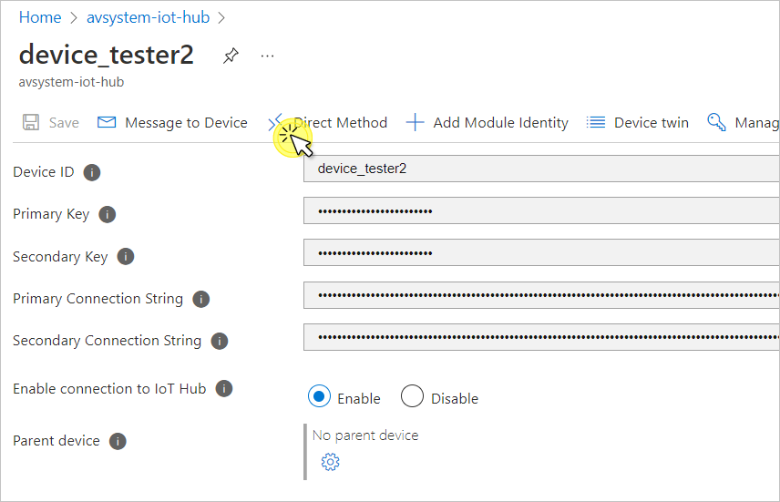
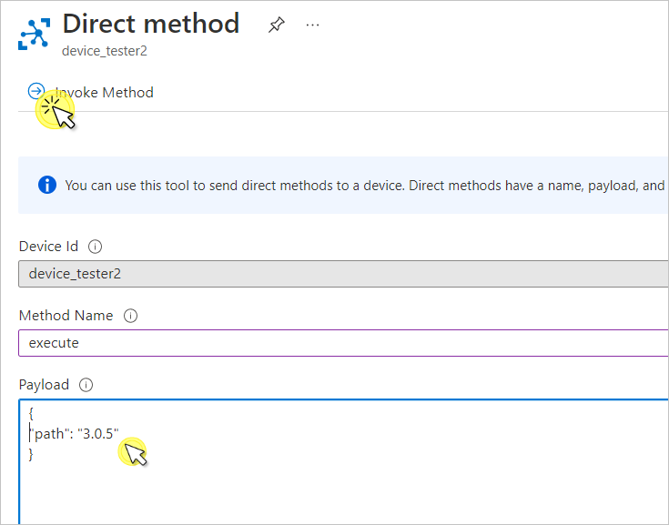

# Perform LwM2M EXECUTE

This section describes how to perform a LwM2M EXECUTE operation in your Azure IoT Hub.

An EXECUTE operation lets you perform operations on IoT devices such as a reboot or a firmware upgrade, only on individual resources.

In this section, you learn how to:

  * Perform EXECUTE

## Prerequisites

1. An active Azure IoT Hub with hub owner access permissions.
2. A Coiote DM user account with permissions to use the integration extension.
3. A device group created in Coiote DM.
4. [A configured extension between Coiote DM and Azure Iot Hub](https://https://iotdevzone.avsystem.com/docs/Azure_IoT_Integration_Guide/Azure_IoT_Hub_integration/Configure_Azure_IoT_Hub_integration/).
5. [A configured integration template in Coiote DM, assigned to the device group](https://iotdevzone.avsystem.com/docs/Azure_IoT_Integration_Guide/Configure_integration_templates/Azure_integration_templates/).
5. [A connected device](https://iotdevzone.avsystem.com/docs/Coiote_DM_Device_Onboarding/Quick_start/).

## Perform EXECUTE

Let’s perform an EXECUTE operation on the **Factory Reset** resource with ID **3/0/5**.

!!! note
    From the Azure IoT integration standpoint, **Factory Reset** is interpreted as a *Command*. Read more about how LwM2M data model is mapped to Azure IoT Hub mechanisms in [Concepts](https://iotdevzone.avsystem.com/docs/Azure_IoT_Integration_Guide/Concepts/LwM2M_mappings_Hub/)

1. In your Azure IoT Hub account, go to **Devices** from the left pane.

2. Click on the device and then go to **Direct method**.

    

3. As **Method name**, type `execute`.

4. In **Payload**, paste the following snipped and click **Invoke method**:

      ```
      {
         path: "3.0.5"
      }
      ```

    !!! note
        The exact LwM2M path of the **Factory reset** resource depends on the LwM2M client used and may vary slightly, e.g. in the object instance number: **3/1/5**. For the purpose of this tutorial, the Anjay LwM2M Client is used. If needed, modify the snippet according to your case.  

    

## See value changes in Azure IoT Hub

The result of the EXECUTE operation is displayed in the same **Direct method** tab. Scroll down to the **Result** field and check the HTTP code.

```
{"status":200,"payload":"Executed `3.0.5` successfully"}
```


