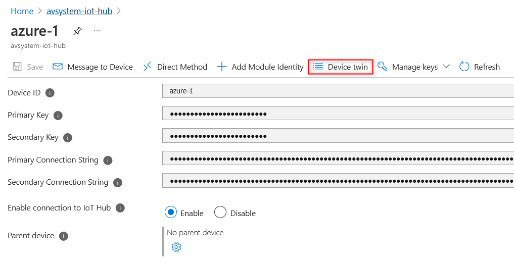

# Set an Observation in Azure IoT Hub

This section describes how to set an Observation in your Azure IoT Hub.

Setting an Observation lets your devices know what value changes and for what particular resources they need to notify you about. An Observation can be set for any or all the components of the [data model](https://iotdevzone.avsystem.com/docs/Azure_IoT_Integration_Guide/Concepts/LwM2M_mappings/): objects, objects instances, and resources. Whenever there is a change in values, a device will send a Notify message to Coiote DM, which in turn will transfer it to Azure IoT Hub.

In this section, you learn how to:

  * Set an Observation on objects and resources
  * Define Observation attributes
  * See value changes for the observed objects and resources

## Prerequisites

1. An active Azure IoT Hub with hub owner access permissions.
2. A Coiote DM user account with permissions to use the integration extension.
3. A device group created in Coiote DM.
4. [A configured extension between Coiote DM and Azure Iot Hub](https://iotdevzone.avsystem.com/docs/Azure_IoT_Integration_Guide/Azure_IoT_Hub_integration/Configuring_Azure_IoT_Hub_integration_extension/).
5. [A configured integration template in Coiote DM](https://iotdevzone.avsystem.com/docs/Azure_IoT_Integration_Guide/Configure_integration_templates/Azure_integration_templates/).
5. [A connected device](https://iotdevzone.avsystem.com/docs/Azure_IoT_Integration_Guide/Azure_IoT_Hub_integration/Device_operations/Overview/).

## Set an Observation and define its attributes

Let’s set two Observations: one on the whole object with ID **1/1 (1 LwM2M Server, 1 Lifetime)** and on the resource with ID **3/0/13** (3 Device, 13 Current time). Both of them are Properties.

In Azure IoT Hub, value changes for both Telemetry and Property are stored in **Device twin**, because Observation is a Property in itself and it does not keep track of historical changes in values. To set an Observation, do the following:

1. In your Azure IoT Hub account, go to **Devices** from the left pane.

2. Click on the device and then go to **Device twin**.

    

3. Find the **desired** property in the JSON snippet. This is where you define what needs to be observed.

4. To set an Observation on object **1/1 (Lifetime)** and resource **3/0/13 (Current time)**, add the following fragment starting from `lwm2m`:

```
        "properties": {
         "desired": {
            "lwm2m": {
                "1": {
                    "1": {
                        "observed": true,
                        "attributes": {
                            "pmin": 60
                        }
                    }
                },
                "3": {
                    "0": {
                        "13": {
                            "observed": true,
                            "attributes": {
                                "pmin": 5
                            }
                        }
                    }
                }
            },
```

The line with `“observed”: true` sets an Observation. The line with `“attributes”` specifies the conditions under which notifications will be sent: `“pmin”: 5` means that notifications will never be sent more often than once every 5 seconds. Read more about other possible attributes in our [Brief description of OMA LwM2M](https://avsystem.github.io/Anjay-doc/LwM2M.html#attributes).

Click **Save**.


## See how it works

### In Azure IoT Hub

The value changes for the observed object and resource are displayed in the same JSON snippet where you set an Observation. Scroll down to the **Reported** property. You will see how the value of `pmin` is growing. If you don’t see any changes, click **Refresh**.

### In Coiote DM

This step is optional. If you want to make sure the Observation has been correctly set in Coiote DM, do the following:

1. In Coiote, go to **Device inventory --> Objects**.
2. For the Observation set on the whole **object (1/1)**, click the vertical Ellipse button next the search field and then click **Refresh**. If the Observation has been set correctly, the checkboxes will be filled in green.

    

3. For the Observation set on the specific **resource (3/0/13)**, find this resource in the list and click the **Refresh** button to the left from the Value tracking. You will see that checkboxes next to **Value tracking** and **Attributes** are now filled in green.

    

4. Click **Value tracking**. You will see `pmin` set to 5, which is the same as you defined in the JSON in Azure IoT Hub.

You have successfully set an Observation on LwM2M object and resource. To add another Observation, add the lines in the same JSON snippet, as described in [Step 4](/#Set_an_Observation_and_define_its_attributes).

## Delete an Observation

To stop observing an object or resource, do the following:

1. In Azure IoT Hub, click on the device and then go to **Device twin**.
2. In the JSON snippet, change `"observed"` from `true` to `false`.

    

3. In Coiote, you can now go to **Device inventory --> Objects** and see how **Value tracking** and **Attributes** boxes are now unchecked.

## Next steps
[Air quality monitoring - tutorial](https://iotdevzone.avsystem.com/docs/Azure_IoT_Integration_Guide/Tutorials/Air_quality_monitoring_tutorial/)
