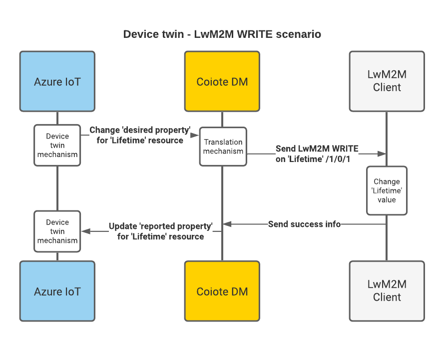

# LwM2M mappings

In this section you'll get to know how the mappings are arranged between the LwM2M protocol as used in Coiote DM and the data retrieval and processing mechanisms of the Azure IoT Hub and Azure IoT Central.

There's the following correspondence between the processing mechanisms in Azure IoT Hub and Azure IoT Central:

 | IoT Hub         | IoT Central |                 
 | -----------       | -----------    |
 | Device twins        | Properties        |
 | Direct Method  | Command        |
 | Device-to-cloud messaging  | Telemetry        |

## Introduction

The LwM2M protocol data model is organized as a three-level tree that has the following structure:

 - **object** (e.g. a 'temperature sensor')
    - **object instance** (e.g. 'temperature sensor #1', 'temperature sensor #2' etc.)
        - **resource** (e.g. 'current temperature value')

In terms of operations that can be performed on an LwM2M Client, an LwM2M Server can READ all of the data model entities, and, depending on their characteristics, may also WRITE to some of them, and EXECUTE some of them. Additionally, an LwM2M Server can also OBSERVE selected resources.

!!! info
    If you would like to dive deeper into the details of the Lightweight M2M protocol, please refer to [our brief introduction to LwM2M](https://avsystem.github.io/Anjay-doc/LwM2M.html).

This division into readable, writable, executable and observable data model entities is the basis for the mapping of LwM2M resources (as interpreted by Coiote DM) into Azure IoT Hub and Azure IoT Central data processing mechanisms.  

## LwM2M readable and writable resources

Within the **Coiote DM - Azure IoT Hub** integration, readable and writable resources are usually interpreted as part of Azure Device twin data structure.

!!! note
    To learn more about Device twins, go to the [Understand and use Device twins](https://docs.microsoft.com/en-us/azure/iot-hub/iot-hub-devguide-device-twins) section of the Azure IoT Hub documentation.

For instance, the sample JSON snippet below is a tree with nested resources to represent a fragment of the LwM2M data model with path **/3/1/1**:

```
{
  "deviceId": "airquality-0",
   ...
  "properties": {
    "reported": {
      "lwm2m": {
        "1": {
          "0": {
            "0": {},
            "1": {
              "value": 90
            },
            "4": {},
            "6": {},
            "7": {},
            "8": {}
          }
        },
        "3": {
          "1": {
            "1": {
              "value": "airquality-0-Valparaiso"
            }
          }
        },
   ...
```
 Within the **Coiote DM - Azure IoT Central integration**, readable and writable resources are interpreted as Properties. While in Azure IoT Hub the data structure is nested, in Azure IoT Central it is represented in one line where objects, object instances, and resources are separated by `n`. For example: `n1n1n1`.

In Azure IoT Central, Properties as well as other device capabilities (Telemetry and Command, read more on them below) are defined in a model which is part of the [device template](https://docs.microsoft.com/en-us/azure/iot-central/core/concepts-device-templates). The device template defines the characteristics of the device that is connected to your IoT Central application.

### READ - Communication flow

Data model resources that are read-only, such as `Manufacturer` (with ID **3/0/0**) will be mapped into the Device twin as a reported property both in Azure IoT Hub and Azure IoT Central.


**NOTE TO MICHAŁ: in white square on the left, the text `Device twin mechanism` should be changed to `Device twin mechanism / Properties`.**

### WRITE - Communication flow

On the other hand, a writable resource, such as `Lifetime` (with ID **1/0/1**), apart from being represented as a reported property, can be additionally mapped as a desired property. This enables you to synchronize the device data model and configuration between Azure and Coiote DM.



**NOTE TO MICHAŁ: in two white squares on the left, the text `Device twin mechanism` should be changed to `Device twin mechanism / Properties`.**

In **Azure IoT Hub**, changing the value of a writable resource involves creating a properly formatted JSON snippet in the desired property field within the Device twin that introduces a value change:
```
...
      "properties": {
        "desired": {
          "lwm2m": {
            "1": {
              "0": {
                "0": {},
                "1": {
                  "value": 30
                }
              }
            }
          },
...
```
After JSON is saved, Azure notifies Coiote DM of the desired change which is then transferred to the device in form of a WRITE command. Once the value is changed on the device, Coiote DM reports back to Azure that the value of the corresponding reported property should be updated in the Device twin JSON structure.

In **Azure IoT Central**, changing the value of a writable resource is done in the [Device templates](https://docs.microsoft.com/en-us/azure/iot-central/core/howto-use-properties).

## LwM2M executable resources

As a rule, LwM2M resources that can be executable translate into Direct methods in Azure IoT Hub and as Command in Azure IoT Central. This means that by invoking a direct method or Command from Azure, you can trigger an EXECUTE operation on a chosen resource available for your device and the request will be transferred immediately by the LwM2M Server to the device.

!!! note
    To learn more about Direct methods, go to the [Understand Direct methods](https://docs.microsoft.com/en-us/azure/iot-hub/iot-hub-devguide-direct-methods) section of the Azure IoT Hub documentation. To learn about Commands, read the respective subsection in the [Message payloads](https://docs.microsoft.com/en-us/azure/iot-central/core/concepts-telemetry-properties-commands#commands) section.


In **Azure IoT Hub**, an executable LwM2M resource ID is mapped to a direct method in the following way:

```
    method name: execute
    {
       path: "object.objectInstance.resource",
       [args: "optional arguments to execute"]
    }
```  

Thus, for instance, to execute a factory reset on a device, you need to invoke a direct method with the **execute** name and the following payload:

```
    {
       path: "3.0.5"
    }
```

In **Azure IoT Central**, select a device from the **Devices** page and click the **Commands** tab. Click **Run** to run a necessary command.


### EXECUTE - Communication flow

Invoking a direct method from Azure IoT Hub or Azure IoT Central and handling it by Coiote DM in the form of an EXECUTE operation passed to the device has the following flow:


**NOTE TO MICHAŁ: in two white squares on the left, the text `Direct method interface` should be changed to `Direct method interface/ Command`.**

## LwM2M observable resources

In Coiote DM, some of the resources within the device data model can be observed for changes in value. These are generally resources related to telemetry data or other measurements. Their value changes can be monitored by Coiote DM and reported to the Azure IoT Hub Device-to-cloud mechanism, and to Azure IoT Central with help of Telemetry device capability.

!!! note
    To learn more about the Azure Device-to-cloud, go to [sending device-to-cloud messages](https://docs.microsoft.com/en-us/azure/iot-hub/iot-hub-devguide-messages-d2c) section of the Azure IoT Hub documentation. To learn more about Telemetry, go to the [respective subsection](https://docs.microsoft.com/en-us/azure/iot-central/core/concepts-telemetry-properties-commands#telemetry) of the Azure IoT Central documentation.

### Observe - Communication flow

Setting an Observe operation on a resource in Coiote DM, for instance a temperature reading, will result in a Notify message sent by the device upon value change that Coiote DM will transfer to the Device-to-cloud mechanism of **Azure IoT Hub**.


What is more, you can set observations on LwM2M resources from the Azure IoT Hub level by adding appropriate attributes to the resource as a Device twin desired property. For instance, an Observe operation on resource ID **3303/1/5700** is set in the following way:

```
...
   "properties": {
     "desired": {
       "lwm2m": {
         "3303": {
          "1": {
           "5700": {
            "observed": true,
            "attributes": {
             "pmin": 60
            }
           }
          }
         }
        }
...
```

After JSON is saved, Azure notifies Coiote DM of the desired attribute setting which is then transferred to the device in form of an Observe operation. Once Coiote DM is notified of a value change, it is reported to the Azure Device-to-cloud mechanism.

To set an Observe operation in **Azure IoT Central**, you should add a [Job](Azure_IoT_Integration_Guide/Azure_IoT_Central_integration/Set_an_Observation.html#set-up-an-observation) in the IoT Central application. As you can see in **Devices > Raw data**, an Observation is represented in the following format:

```
“n1n1n1”: 20,
“n1n1n1_attributes”: “(\”observed\”:true,\”pmin\”:20}”
```

**Next steps**
* [Configure integration templates](https://iotdevzone.avsystem.com/docs/Azure_IoT_Integration_Guide/Configure_integration_templates/Azure_integration_templates/)
