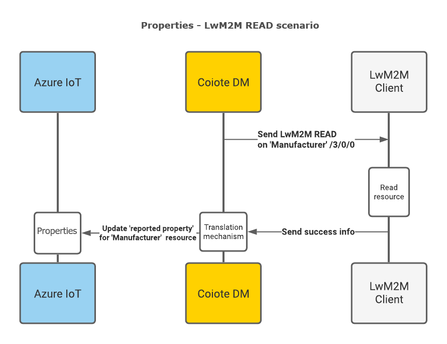
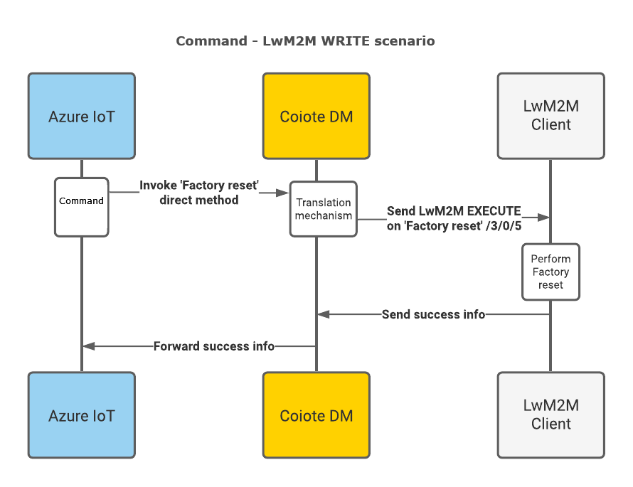
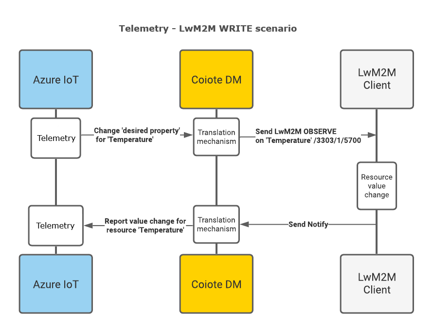

# LwM2M mappings - Azure IoT Central

In this section you'll get to know how the mappings are arranged between the LwM2M protocol as used in Coiote DM and the data retrieval and processing mechanisms of Azure IoT Central.

These processing mechanisms of Azure IoT Central have the same names as data formats in Coiote DM: Properties, Command, and Telemetry. Properties describe the actual value, Command executes commands, and Telemetry observes changes in values over time.

## Introduction

The LwM2M protocol data model is organized as a three-level tree that has the following structure:

 - **object** (e.g. a 'temperature sensor')
    - **object instance** (e.g. 'temperature sensor #1', 'temperature sensor #2' etc.)
        - **resource** (e.g. 'current temperature value')

In terms of operations that can be performed on an LwM2M Client, an LwM2M Server can READ all of the data model entities, and, depending on their characteristics, may also WRITE to some of them, and execute some of them (COMMAND). Additionally, an LwM2M Server can also OBSERVE selected resources.

!!! info
    If you would like to dive deeper into the details of the Lightweight M2M protocol, please refer to [our brief introduction to LwM2M](https://avsystem.github.io/Anjay-doc/LwM2M.html).

This division into readable, writable, executable and observable data model entities is the basis for the mapping of LwM2M resources (as interpreted by Coiote DM) into the Azure IoT Central data processing mechanisms.

## LwM2M readable and writable resources

Within the **Coiote DM - Azure IoT Central integration**, readable and writable resources are interpreted as Properties. The data structure is represented in one line where objects, object instances, and resources are separated by `n`. For example: `n1n0n3`, where 1 is object, 0 is object instance, and 3 is resource.

In Azure IoT Central, Properties as well as other device capabilities (Telemetry and Command, read more on them below) are defined in a model which is part of the [device template](https://docs.microsoft.com/en-us/azure/iot-central/core/concepts-device-templates). The device template defines the characteristics of the device that is connected to your IoT Central application.

### READ - Communication flow

Data model resources that are read-only, such as `Manufacturer` (with ID **3/0/0**) will be mapped to Azure IoT Central as a reported property.



### WRITE - Communication flow

On the other hand, a writable resource, such as `Lifetime` (with ID **1/0/1**), apart from being represented as a reported property, can be additionally mapped as a desired property. This enables you to synchronize the device data model and configuration between Azure and Coiote DM.


In Azure IoT Central, changing the value of a writable resource is done by [running a job](https://docs.microsoft.com/en-us/azure/iot-central/core/howto-manage-devices-in-bulk).

## LwM2M executable resources

As a rule, LwM2M resources that can be executable translate into Commands in Azure IoT Central. This means that by invoking Command from Azure, you can trigger a COMMAND operation on a chosen resource available for your device and the request will be transferred immediately by the LwM2M Server to the device.

!!! note
    To learn about Commands, read the respective subsection in the [Message payloads](https://docs.microsoft.com/en-us/azure/iot-central/core/concepts-telemetry-properties-commands#commands) section.

To do so, select a device from the **Devices** page in Azure IoT Central and click the **Commands** tab. Click **Run** to run a necessary command.


### COMMAND - Communication flow

Invoking Command from Azure IoT Central and handling it by Coiote DM in the form of a COMMAND operation passed to the device has the following flow:



## LwM2M observable resources

In Coiote DM, some of the resources within the device data model can be observed for changes in value. These are generally resources related to telemetry data or other measurements. Their value changes can be monitored by Coiote DM and reported to Azure IoT Central with help of Telemetry device capability.

!!! note
    To learn more about Telemetry, go to the [respective subsection](https://docs.microsoft.com/en-us/azure/iot-central/core/concepts-telemetry-properties-commands#telemetry) of the Azure IoT Central documentation.

### Observe - Communication flow

Setting an Observe operation on a resource in Coiote DM, for instance a temperature reading, will result in a Notify message sent by the device upon value change. Then Coiote DM transfers this message to Azure IoT Central using Telemetry.



To set an Observe operation in Azure IoT Central, you need to add a [Job](/Azure_IoT_Integration_Guide/Azure_IoT_Central_integration/Set_an_Observation/) in the IoT Central application. As you can see in the **Devices > Raw data** tab, an Observation is represented in the following format:

```
“n1n1n1_attributes”: “(\”observed\”:true,\”pmin\”:20}”
```

**Next steps**

* [Configure integration templates](https://iotdevzone.avsystem.com/docs/Azure_IoT_Integration_Guide/Configure_integration_templates/Azure_integration_templates/)
