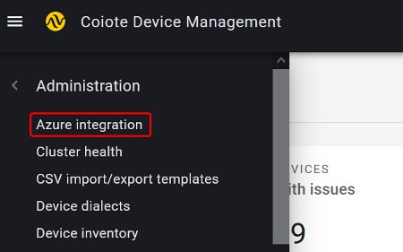
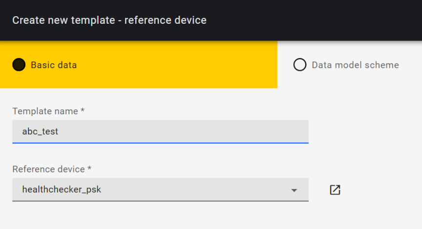
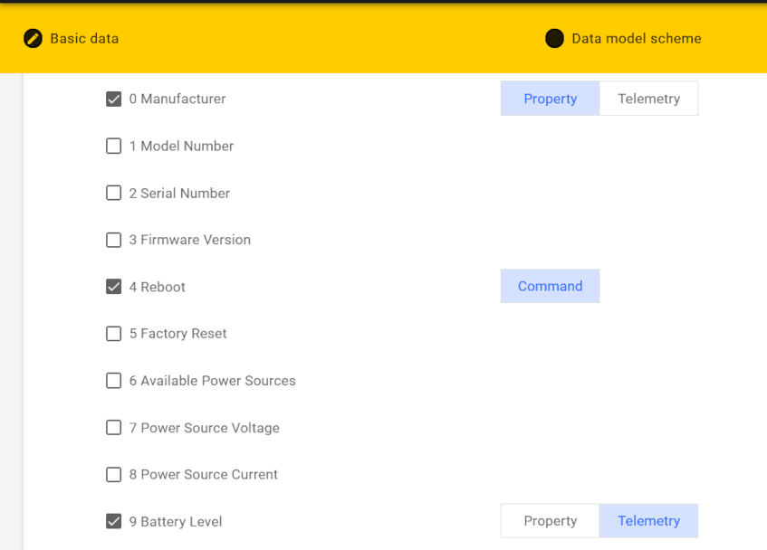
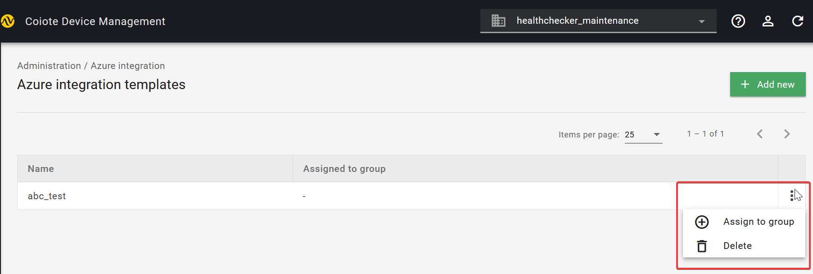
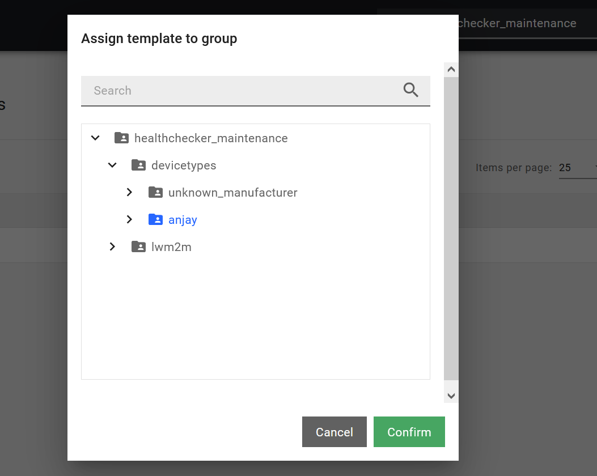
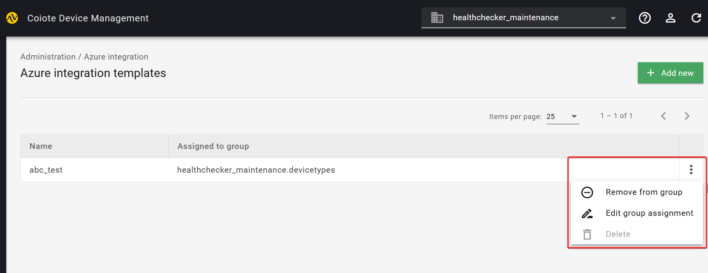

# Configure integration templates

Integration templates define the format in which the data is exchanged between devices and Azure. The data can be either a property or a telemetry. Property describes the actual value — e.g., at 1:00 PM a thermometer shows 5 C, and only this value is sent. Telemetry is used to observe changes in values — e.g., it was 5 C at 1:00 PM, and one hour later it’s 6 C. In other words, you need to decide whether you want to send and receive historical data or not.

Follow the instruction below to learn how to create integration templates and then assign them to [device groups](https://lwm2m-test.avsystem.io/doc/user/User_Guide/Device_management/Managing_device_groups_toctree.html). You can edit or remove the group assignment at any time.

## Prerequisites
1. An active Azure IoT Central, IoT Hub, or DPS with hub owner access permissions.
2. A Coiote DM user account with permissions to use the integration extension.
3. A device group created in Coiote DM.

## Create a new template

1. In your Coiote DM user account, go to **Administration —> Azure integration**.

    {: .center }

2. You will see the page with existing templates. Click **Add new** in the top-right corner.
3. In the **Create new template** wizard that appears, provide the Basic data:
    * **Template name**
    * **Reference device**. Note that the device must be connected at least once so that Coiote DM can use its data model. (Read more about data models in the [brief description of OMA LwM2M](https://avsystem.github.io/Anjay-doc/LwM2M.html).)

        {: .center }

    Click **Next step**.

4. The **Data model scheme** page displays the list of all LwM2M objects that are available on your reference device.

    * To choose the objects and resources that you want to report to Azure, unfold the lists and check the respective boxes.
    * Select the format for each resource that needs to be reported: Telemetry, Property, or Command.

    {: .center }

Let’s consider an example.  Manufacturer is unlikely to change over time, so it is a **Property**. Reboot is an executable **Command**. Battery Level is more ambiguous: it can be a property if we just want to have the actual value. But because we want to have its historical values, it is a **Telemetry**.

!!! info
    If you select the Property option, then Coiote DM reports data to Azure using Device Twins. For the Telemetry data it uses Azure IoT Hub Device-to-cloud mechanism. Read more about these key concepts in the [LwM2M mappings](https://iotdevzone.avsystem.com/docs/Azure_IoT_Integration_Guide/Concepts/LwM2M_mappings/) section.

Click **Next step**.

Check the Summary and click **Save template**.

## Assign a template to a group

Now that you have a template, you need to assign it to a group. Learn more about how to create groups in Coiote DM.

1. Go to **Administration —> Azure integration** and see the list of Azure integration templates that exist in your domain.
2. To assign a template to a specific group, click on the context menu next to the template name and select **Assign to group**.

{: .center }

A pop-up window will appear asking you to specify the group that needs to be assigned to this template. Select and click Confirm.

{: .center }

!!! note
    One template can be assigned to more than one group.

Now the devices in the **group ‘anjay’** will report data to Azure according to the way defined in the **template ‘abc_test’**.

## Edit the assignment

1. Go to **Administration —> Azure integration** and see the list of Azure integration templates that exist in your domain.
2. To assign the template to another group, click on the context menu next to the template name and select **Edit group assignment**.
3. A pop-up window will appear asking you to specify a new group that needs to assigned to this template. Select and click **Confirm**.

{: .center }

## Remove the assignment
1. Go to **Administration —> Azure integration** and see the list of Azure integration templates that exist in your domain.
2. To unassign the template from the group, click on the context menu next to the template and select **Remove from group**. To confirm, click **Remove** in the pop-up window.

## Next steps
 - [Air quality monitoring - tutorial](https://iotdevzone.avsystem.com/docs/Azure_IoT_Integration_Guide/Tutorials/Air_quality_monitoring_tutorial/)
