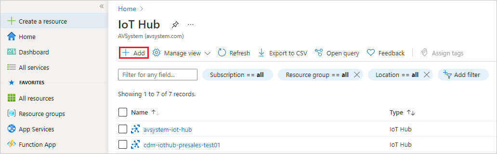
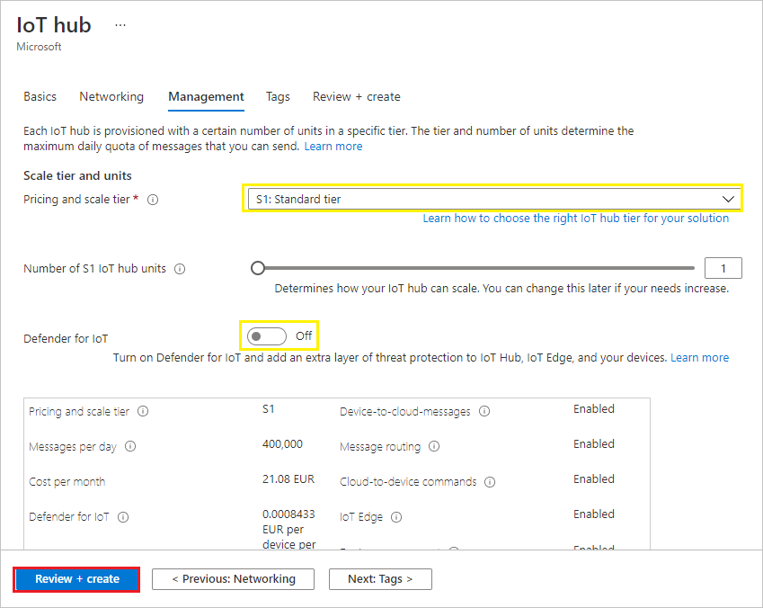
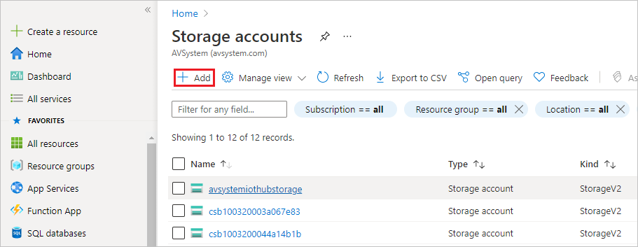
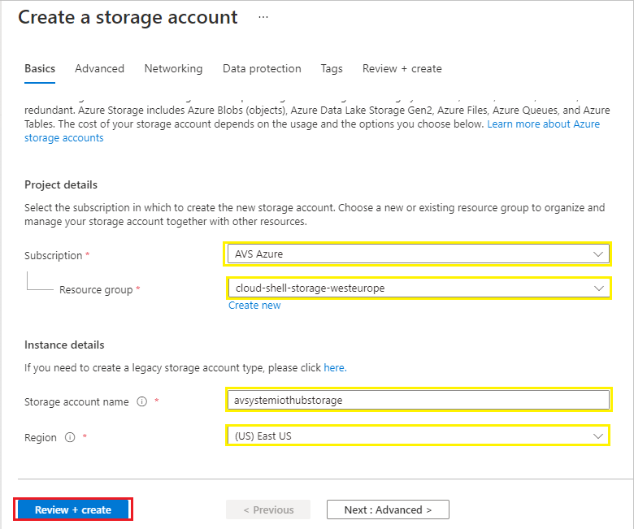
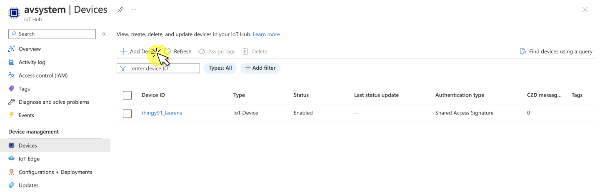
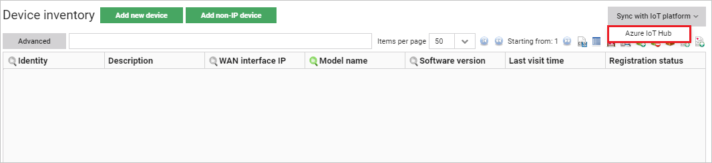
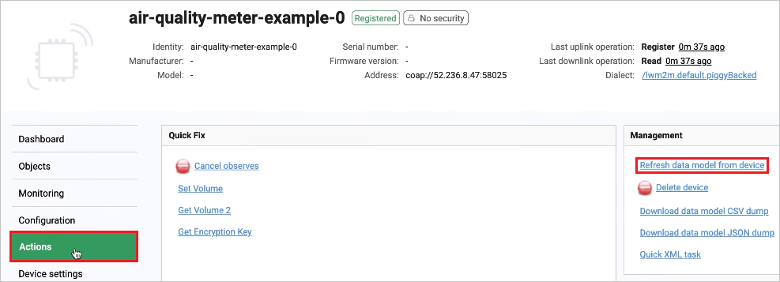
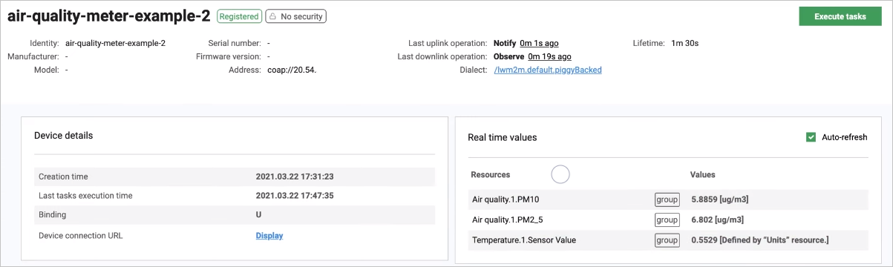

# Air quality monitoring - tutorial

The Coiote DM and Azure IoT Hub integration lets you create custom use cases with data visualization. See the video and have a sneak peek at the possibilities that the Coiote DM - Azure IoT Hub integration offers you. In the tutorial, you will see how to leverage the integration to create an air quality monitoring in just a few steps.

<figure class="video_container">
  <iframe width="640" height="480"  src="https://www.youtube.com/embed/Ck0WJp4grb0" frameborder="0" allowfullscreen="true"> </iframe>
</figure>

The text version of the tutorial, complete with the necessary steps and code snippets, is available below:

## Prerequisites

- An active Azure subscription.
- An active Coiote DM account. Please refer to [Coiote DM home page](https://www.avsystem.com/products/coiote-iot-device-management-platform/) for details on how to get it.
- An active Microsoft Power BI account.
- An OpenWeatherMap account with a free API token.
- An active and configured Azure CLI - please refer to the [Azure CLI installation guide](https://docs.microsoft.com/en-us/cli/azure/install-azure-cli) for details.

## Creating and configuring an Azure IoT hub and storage account

First you need to add a new IoT hub and a storage account in Azure. Here's how to do it:

### Creating an IoT hub

1. In your Azure portal home view, go to **IoT Hub** and select **Add**.

    - In the **Basics** tab:
        - select your subscription and resource group,
        - pick your region,
        - provide a name for your IoT hub.

    - In the **Management** tab:
        - in **Pricing and scale tier** select,
        - optionally, turn off **Defender for IoT**.
    - In the **Review + create** tab, click **Create**.


### Creating a storage account

While your new IoT hub is deploying, you can add a new storage account:

1. In the Azure portal, go to **Storage accounts** and select **Add**.

   - In the **Basics** tab:
       - select your subscription and resource group,
       - provide a name for your storage account,
       - pick your location.

   - In the **Review + create** tab, click **Create**.

## Configuring the Azure IoT Hub integration extension

Once the deployments are complete, go to Coiote DM to set up the Azure IoT Hub extension.
If you haven't done this yet, please follow the [instruction for the Azure IoT Hub integration configuration](/Azure_IoT_Hub_integration/Configuring_Azure_IoT_Hub_integration_extension).

## Adding and connecting LwM2M air quality meter simulators to Coiote DM and Azure IoT Hub
1. Go to your Azure IoT Hub and add new devices:
    - Under **Device management**, select **Devices** and click **+ Add Device**.
    

    - Provide the name for your first device: ``air-quality-meter-example-0``.
    - Click **Save**.
         
    - Repeat the procedure for the other 5 devices (increase the number included in the device name).
2. Go to Coiote DM and sync the previously added devices:
    - In **Device inventory**, select **Sync with IoT platform -> Azure IoT Hub**.
    
    - In the pop-up, click **Sync devices**.
    
    - Devices should then be visible in **Device inventory**   
3. Go to your command line and register the device simulators:
    - Paste and run the following command to create a container group:
        ```
         az container create -g coiote-dm-experiments --name air-quality-meter-example-0 --image avsystemcom/air-quality-meter-example --environment-variables DEVICEID=air-quality-meter-example-0 SERVER_ADDRESS=eu.iot.avsystem.cloud OPEN_WEATHER_API_TOKEN=exampletoken

        ```

        !!! note
            Remember to change the command parameters accordingly so that they are in line with your naming and credentials.

     - once the command is executed, you should see a JSON payload that describes the content of the container instance.


4. Go back to Coiote DM and in **Device inventory**, check if the devices have registered to the platform and if their data model has been updated.

    - Click the **Refresh data** icon if needed.
    - Click on a device and in the **Device Management Center**, select the **Actions** panel.
    - Select the **Refresh data model from device** link and confirm by clicking **Yes, execute task now**.
    
    - Go to the **Objects** panel to see if the data model for the device has been updated. You should be able to see objects such as ``3 Device`` (along with the ``Model number`` resource which shows the name of the city of the temperature reading), ``3303 Temperature``, and ``3428 Air quality``.
    
## Bidirectional communication using Device Twin

### From Coiote DM to Azure IoT Hub

1. In your Coiote DM account, go to **Device inventory**, select a device.
2. In the **Device Management Center**, go to the **Objects** panel.
3. In the ``1 LwM2M Server`` object, find the ``Lifetime`` resource.
4. Click the **pen** icon next to it, change the lifetime value and click the **Apply** link.
5. Go to your Azure IoT hub, select **IoT devices**, click your device and select the **Device Twin** panel.
6. Click **Refresh** and check in the JSON payload if the reported property for the ``1/0/1`` (Lifetime) resource has changed.   

### From Azure IoT Hub to Coiote DM

!!! note
    To read more about how the Device Twins work in the Coiote DM - Azure IoT Hub integration, please refer to [the LwM2M Mappings section](/Concepts/LwM2M_mappings/#lwm2m-readable-and-writable-resources).

1. In your Azure IoT hub, select **IoT devices**, click one of your added devices and select the **Device Twin** panel.
2. To change the ``Lifetime`` resource in Coiote DM, you need to modify the relevant Device Twin desired property.

    - under the ``properties`` tag in the Device Twin JSON payload, paste the following nested structure:

      ```
       "reported": {
         "lwm2m": {
           "1": {
             "0": {
               "0": {},
               "1": {
                 "value": 45
               }
             }
           }
         }
       },
      ```  
      - Click **Save** and **Refresh**.

3. The value of the resource should now be changed in the Device Twin reported properties as well as in the Coiote DM Objects panel, in the ``Lifetime`` resource of the ``1 LwM2M Server`` object.

## Passing telemetry to Azure IoT Hub

### Setting group value tracking on resources in Coiote DM

1. In Coiote DM, go to **Device inventory** and use the search option to display your air quality meter devices. Then, click the **Add to group** icon.
2. In the pop-up, click **Add to new group**, provide a name for your group (following the pattern root.iothubexample.airqualitymeter), click **Confirm** and **Yes**.
3. Go to the **Group management** panel, select your group and click **Devices** to see if all of your devices are added to the group.
4. Go to the **Value tracking** panel and click **Add new**. In the pop-up:
      - Add value tracking for the Temperature resource:
          - Provide the resource path: ``Temperature.1.Sensor Value``.
          - In the **Notification frequency** section, provide the following values:
              - **At least once every** - set it to 10 seconds.
              - **Not more often than once every** - set it to 5 seconds.
          - Click **Add new**.
      - Add value tracking for the Air quality PM10 resource:
          - Provide the resource path: ``Air quality.1.PM10``.
          - In the **Notification frequency** section, provide the following values:
              - **At least once every** - set it to 10 seconds.
              - **Not more often than once every** - set it to 5 seconds.
          - Click **Add new**.
      - Add value tracking for the Air quality PM2.5 resource:
          - Provide the resource path: ``Air quality.1.PM2_5``.
          - In the **Notification frequency** section, provide the following values:
              - **At least once every** - set it to 10 seconds.
              - **Not more often than once every** - set it to 5 seconds.
          - Click **Add new**.
5. Go back to **Device inventory** and select a device of your group. In the **Dashboard view**, you should be able to see the value tracking parameters as in the picture below:


### Configuring message routing for sending telemetry data in Azure IoT Hub

1. Go to your Azure IoT hub and add message routing:
      - Under **Hub settings**, select **Message routing** and click **+ Add**.
      - Provide a name for your event, for example ``EventRoute``.
      - From the **Endpoint** drop-down list, select **events**.
      - In the **Routing query**, paste the following:
          ```
          IS_DEFINED($body.lwm2m.3303.1.5700.value) OR IS_DEFINED($body.lwm2m.3428.1.1.value) OR IS_DEFINED($body.lwm2m.3428.1.3.value)
          ```
      - Click **Save**.
2. While in the **Message routing** panel, go to the **Enrich messages** tab to set up location tracking:
      - For latitude:
          - Name - type ``lat``
          - Value - copy and paste ``$twin.properties.reported.lwm2m.6.1.0.value``
          - Endpoint(s) - select ``events``
      - For longitude:
          - Name - type ``lon``
          - Value - copy and paste ``$twin.properties.reported.lwm2m.6.1.1.value``
          - Endpoint(s) - select ``events``
      - For longitude:
          - Name - type ``deviceId``
          - Value - copy and paste ``$twin.properties.reported.lwm2m.3.1.1.value``
          - Endpoint(s) - select ``events``
3. Use search to go to **Stream analytics jobs** and create a job for transferring the gathered data to Power BI.
      - Click **+ Create** and provide the following:
          - Resource group - pick your resource group.
          - Name - e.g. ``avsystem-iot-hub-to-powerbi``.
          - Click **Review + Create**.
      - Once your deployment is complete, click **Go to resource**.
4. While in your Stream Analytics job panel, add a stream input and output and write a query:
      - Under **Job topology**, select **Inputs**.
          - From the **+ Add stream input** drop-down list, select **Iot Hub** and provide the following:
              - Input alias - e.g. ``avsystem-iot-hub-input``.
              - Consumer group - pick the ``$Default`` group.
              - Click **Save**.
      - Under **Job topology**, select **Outputs**.
          - From the **+ Add** drop-down list, select **Power BI** and click **Authorize**.
          - Log in to Power BI using your Azure account.
          - In the **Power BI** right-hand side panel, provide the following:
              - Output alias - e.g. ``avsystem-iot-hub-output``
              - Dataset name - e.g. ``AVSystemIoTHubDataSet``
              - Table name - e.g. ``Data``
          - Click **Save**.
       - Under **Job topology**, select **Query**.
           - Paste the following query into the query input field (remember to adjust your naming inside the query if needed):
           ```
           SELECT
               CAST(lwm2m."3303."1"."5700".value as float) as temperature,
               CAST(lwm2m."3428."1"."1".value as float) as pm10,
               CAST(lwm2m."3428."1"."3".value as float) as pm25,
               GetMetadataPropertyValue("avsystem-iot-hub-input", '[User].[lat]') as lat,
               GetMetadataPropertyValue("avsystem-iot-hub-input", '[User],[lon]') as lon,
               GetMetadataPropertyValue("avsystem-iot-hub-input", '[User],[deviceId]') as deviceId2,
               EventProcessedUtcTime as processedTimestamp,
               IoTHub.EnqueuedTime as iotHubTimestamp,
               IoTHub.ConnectionDeviceId as deviceId
           INTO
               "avsystem-iot-hub-output"
           FROM
               "avsystem-iot-hub-input"
           ```
           - Click **Save query**.
       - In your Stream analytics job, go to **Overview** and click **Start** and confirm by clicking **Start** in the **Start job** window to run the created query.

## Data visualization using Power BI

Once the query is finished, you can go to Power BI to create a visualization for the data you have gathered.

1. Go to <https://powerbi.microsoft.com/> and sign in to your account.
2. Go to **My workspace** and find your recently created dataset.
3. Click the **more options** icon and select **Create report**
      - From the **Visualizations** menu, select the **table** icon and drag and drop it to the work space.
           - From the **Fields** menu, select the ``deviceId2``, ``temperature``, ``pm10`` and ``pm25`` parameters.
           - In the **Values** submenu, expand the drop-down list for the ``temperature``, ``pm10`` and ``pm25`` parameters and select **Average** for each.   
4. Create a map with air quality indicators:
      - From the **Visualizations** menu, click the **get more visuals** icon and select **Get more visuals**.
      - Use search to find the **Heatmap** and click **Add**.
      - From the **Visualizations** menu, click the **Heatmap** icon.
      - Add the relevant parameters to the map data fields:
           - To the **Latitude** data field, drag and drop the ``lat`` parameter from the **Fields** menu.
           - To the **Longitude** data field, drag and drop the ``lon`` parameter from the **Fields** menu.
           - To the **Value** data field, drag and drop the ``pm10`` parameter from the **Fields** menu.
               - In the **Value** data field, expand the drop-down list and select **Average**.
       - To refresh the displayed data, click the **Refresh** button located in the upper navigation bar.


