# Configure AWS integration

Follow this section to integrate your AWS services with {{ coiote_short_name }}.

## Prerequisites

- An active AWS subscription with access to IoT Core, CloudFormation, CloudWatch, Lambda and Secrets Manager in supported regions.
- Installed [AWS CLI](https://docs.aws.amazon.com/cli/latest/userguide/getting-started-install.html).
- A {{ coiote_short_name }} user account with the **awsiottenant** role.

    !!! important
        It's recommended to create a {{ coiote_short_name }} user account dedicated exclusively for the integration. Note that the integration will work correctly only until the user with the **awsiottenant** role exists in {{ coiote_short_name }} and the AWS CloudFormation stack is appropriately configured.

## Supported regions

- eu-central-1
- eu-north-1
- eu-west-1
- eu-west-2
- eu-west-3
- us-east-1
- us-east-2
- us-west-1
- us-west-2

If you cannot find your region, please create a GitHub issue or contact AVSystem.

## Create a {{ coiote_short_name }} REST user

To start integrating AWS with {{ coiote_short_name }}, you first need to create a user account that will be used to authorize and authenticate API calls from AWS in {{ coiote_short_name }}. To do that:

1. Go to your {{ coiote_short_name }} account and from the **Administration** menu, select **Users management**.
2. Select **Add user** and fill in the form:
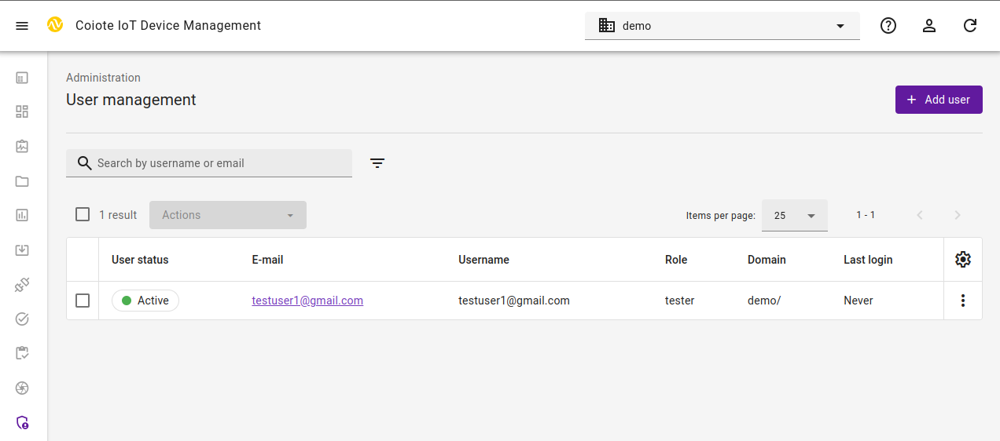
    - Provide **Email** for new user (which will be its username) and select your domain from the **Domain path** drop-down list.
    - Remember to switch off the **Require e-mail verification after first login** and switch on 
      **Activate user account after creation** toggle buttons.
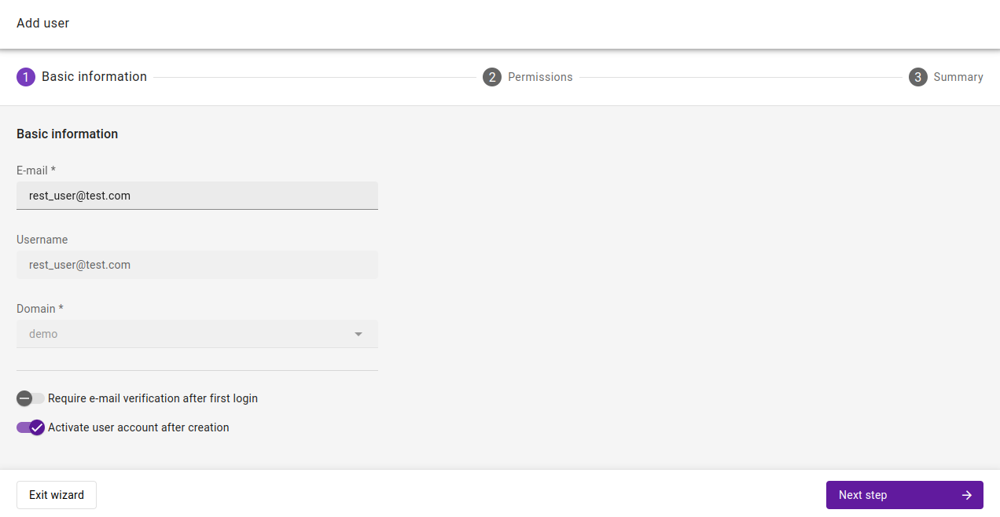
    - Click **Next step**
    - In the "Permissions" step select **awsiottenant** role
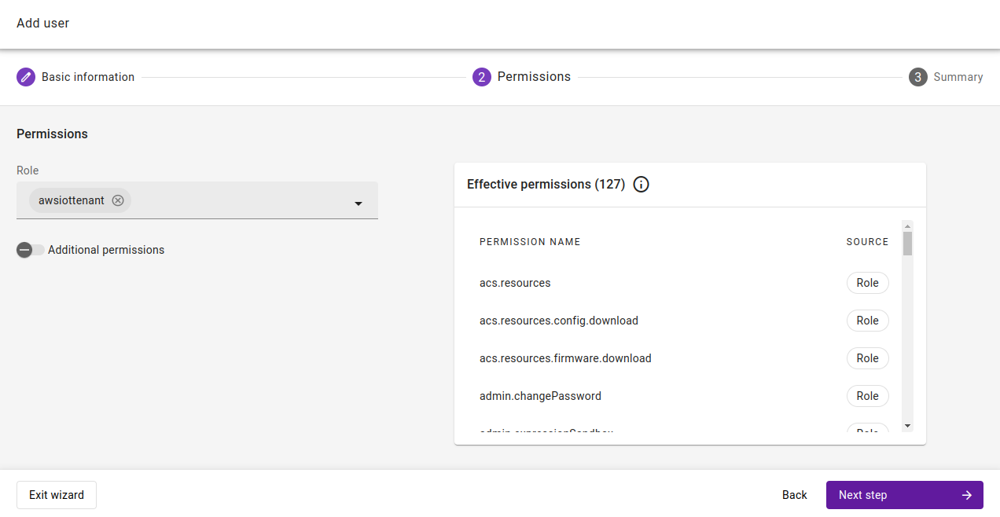
    - Click **Next step**, review data and click **Add user**
    - Go to the **User account** details view
    - change a password if needed (remember to switch off **Require user to change password on next login**)
    - remove **Accept Terms of Service** from the Next login actions
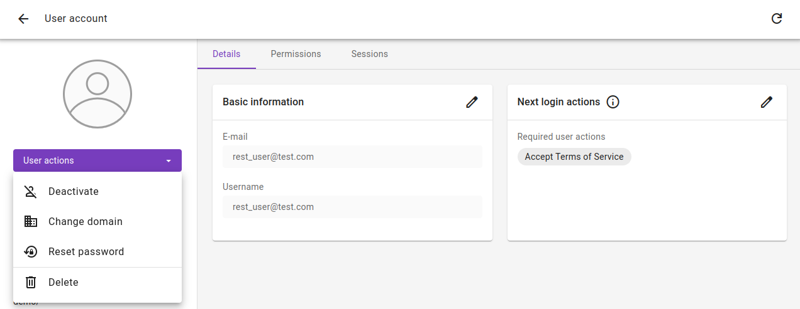

## Set up the **AWS** integration
1. Get the AWS Data Plane Endpoint Address
    - Open your command line and run the following command:
      ```
      aws iot describe-endpoint --endpoint-type iot:Data-ATS --region <desired-region-for-the-integration>
      ```
    - Copy the returned result.<br>
      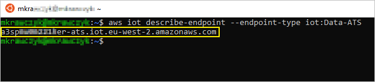
2. In your {{ coiote_short_name }} user account, go to **Integrations** → **AWS Integration**
   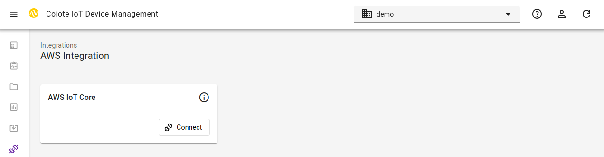
3. On the **AWS IoT Core** tile click **Connect**
4. In the dialog window, paste the previously copied **AWS Data Plane Endpoint Address** into the relevant field. Remember to append **:8443** port to the pasted value<br>
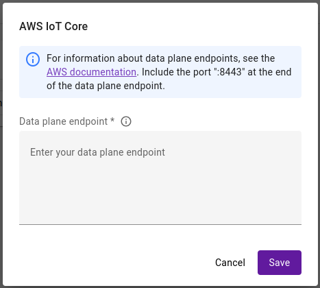
<!-- end of the list -->
* After those steps in the **Device groups** panel a new group **AWSIotCoreIntegration** should be created.
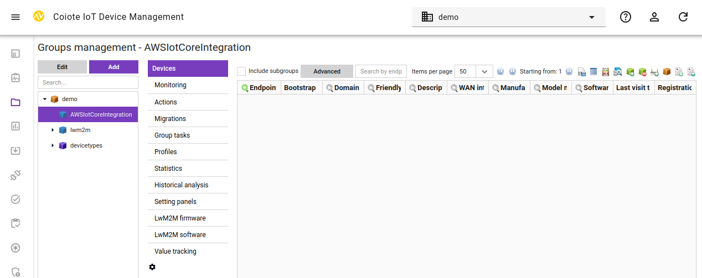

Once the setup is completed you may add your LwM2M devices to the **AWSIotCoreIntegration** group to synchronize them with AWS IoT Core.

## Add AWS resources using the integration repository

!!! important
    To complete this step, make sure you have the appropriate AWS permissions to enter the CloudFormation service and create a stack ([for details, see the AWS CloudFormation User Guide](https://docs.aws.amazon.com/AWSCloudFormation/latest/UserGuide/using-iam-template.html#using-iam-template-actions)).

To add the resources needed for the integration to your AWS services:

0. Go to the AWS Console page (<https://console.aws.amazon.com/console/home>) and sign in. Make sure that you are in the right region. From the list of services, select **CloudFormation** .
0. Create a new stack. Use the template of Amazon S3 URL from below and change placeholders `[REGION-NAME]` to the one you use and is [supported](#supported-regions).
```
https://coiote-aws-int-[REGION-NAME].s3.[REGION-NAME].amazonaws.com/coiote-aws-integration-cf-template.json
```
   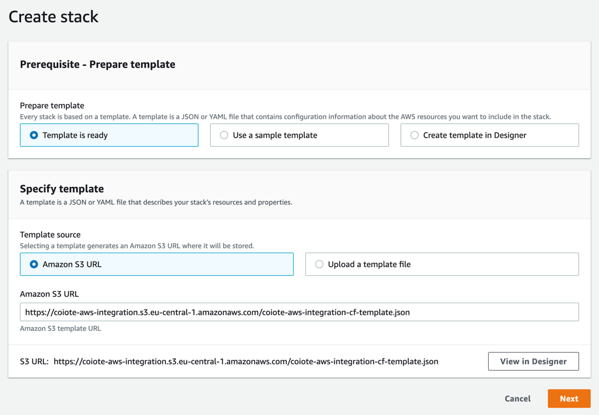
0. Choose a name for the stack and provide the parameters:

    !!! important
        The credentials you provide at this point should belong to the user with access to the {{ coiote_short_name }} group which stores the AWS configuration set in a previous step.

    - **coioteDMrestUsername** - username of the created {{ coiote_short_name }} account.
    - **coioteDMrestPassword** - password of the created {{ coiote_short_name }} account.
    - **coioteDMrestUri** - URL address and port of your {{ coiote_short_name }} installation. The port should always be `8088` to enable proper mTLS-based authentication.

        !!! note
            For some installations, port is not required. If you don't know what port to choose, contact our support.

        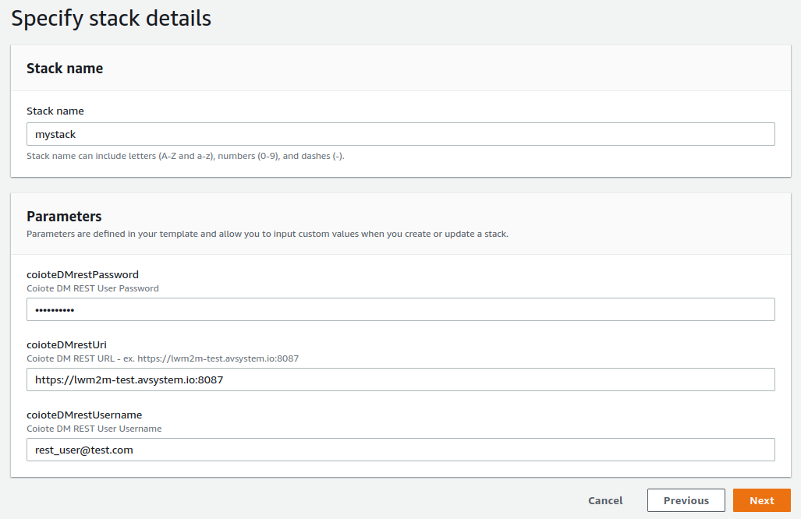

0. Finalize configuring the stack and wait for its creation to finish.
0. Once the stack is created successfully, the devices in your integration group will be automatically migrated to the AWS IoT Core.
0. To check if your integration works correctly, go to AWS IoT Core, and from the menu, select **Manage** > **Things**, then see if your devices are listed as in here:
    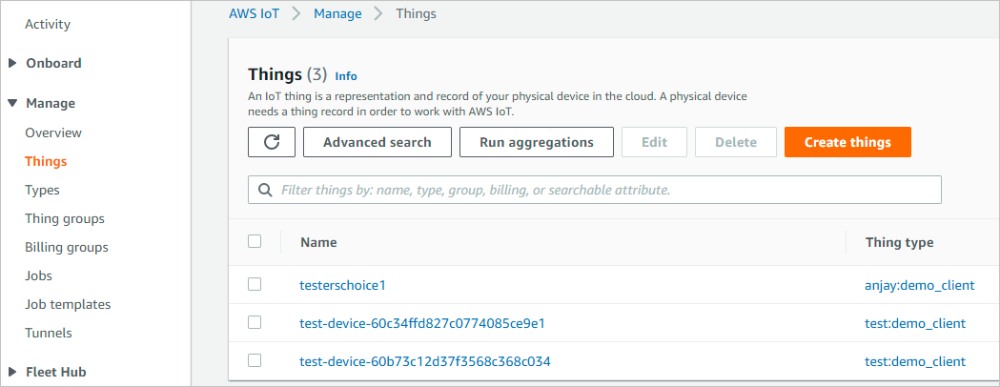

## Next steps

To learn how to perform operations on your devices, please see the [Performing LwM2M operations](https://iotdevzone.avsystem.com/docs/Cloud_integrations/AWS_IoT_Core/Device_operations/Operation_types/) chapter.

## Removing the integration

To remove the integration of AWS and {{ coiote_short_name }}, follow the following steps:

1. In **{{ coiote_short_name }}** remove all the devices from the **AWSiotCoreCertAuth** group.
2. Go to the **CloudFormation** service in **AWS** and select the stack that was created while setting up the integration.
3. Delete the stack.
   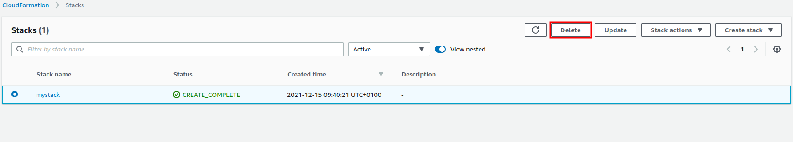
4. Go to the **S3** service in **AWS** and select the bucket with the lambda code files.
5. Delete the files.
   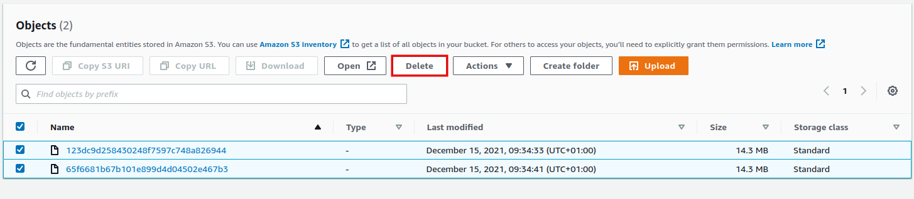
