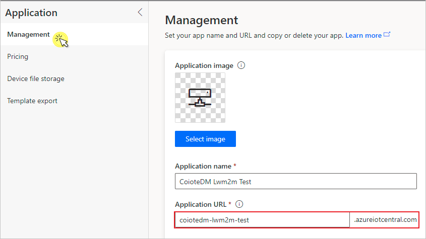
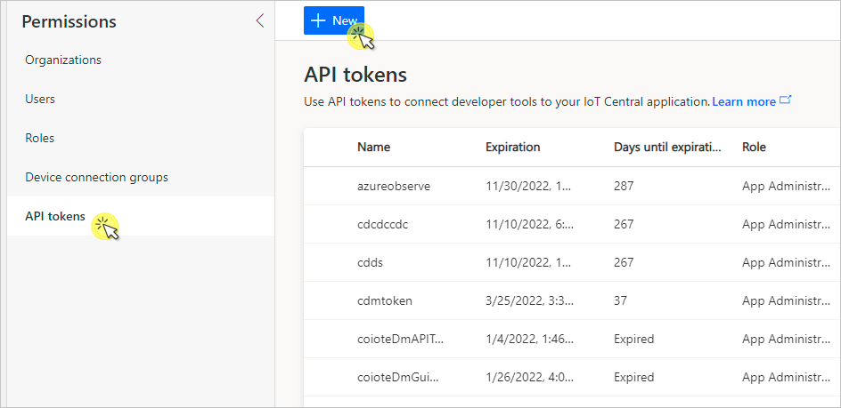
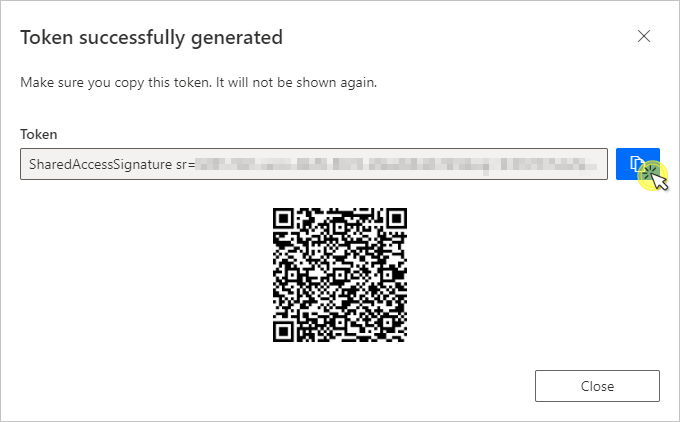
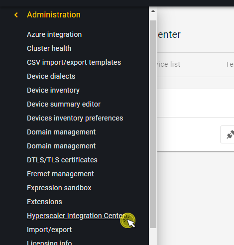
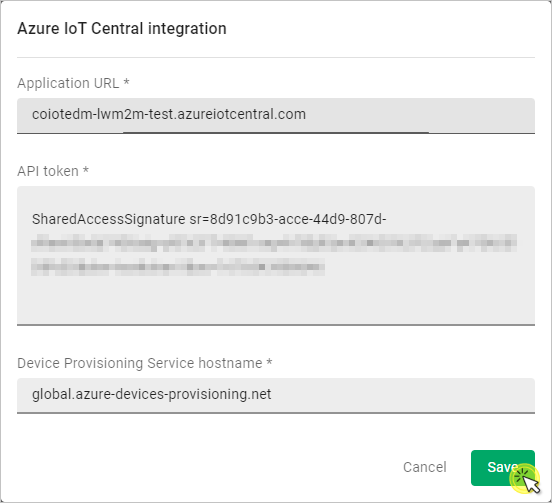

# Connect integration

To enable communication and data flow between the Azure IoT Central and {{ short_name }} platforms, you first need to integrate them using the Hyperscaler Integration Center in {{ short_name }}. Follow the instruction below to learn how to do it.

## Prerequisites:

   - An active IoT Central with hub owner access permissions.
   - A {{ short_name }} user account with permissions to use the Hyperscaler Integration Center.
_______________
## Get the Azure IoT Central integration credentials

0. In your Azure IoT Central account view, from the left menu, select **Application**.
0. Under **Management**, copy the full *Application URL* (along with '.azureiotcentral.com') into Notepad or other place to keep it for later.
      

0. From the left menu, click **Permissions**, select **API tokens** and click **+New** .
    

0. In the dialog window, provide a name for the token and select **App Administrator** as the role, then click the copy icon for the newly generated token.
     {:style="float: left;margin-right: 1177px;margin-top: 17px;"}

  Now you need to use the obtained credentials in the {{ short_name }} platform.

## Set up the **Azure IoT Central** integration

Use the obtained credentials to establish the integration between {{ short_name }} and your Azure IoT Central application:

0. In your {{ short_name }} user account, go to **Administration --> Hyperscaler Integration Center**
    
0. In the **Integration** tab, find the **Azure IoT Central** tile and click **Connect**.
0. In the dialog window, paste the previously copied **Application URL** and **API token** into the relevant fields.
  {:style="float: left;margin-right: 1177px;margin-top: 17px;"}
      - click **Save** to keep the setting.

Your integration should now be established. To get the integration up and running, try [synchronizing devices with Azure IoT Central](Device_operations/Synchronize_devices_with_Azure_IoT_Central.md)
