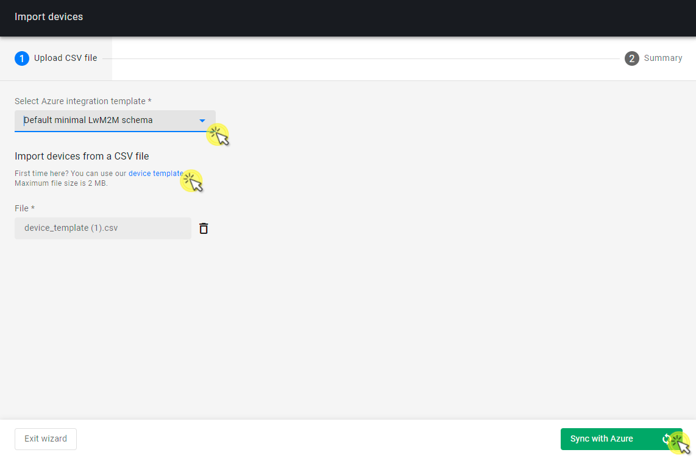
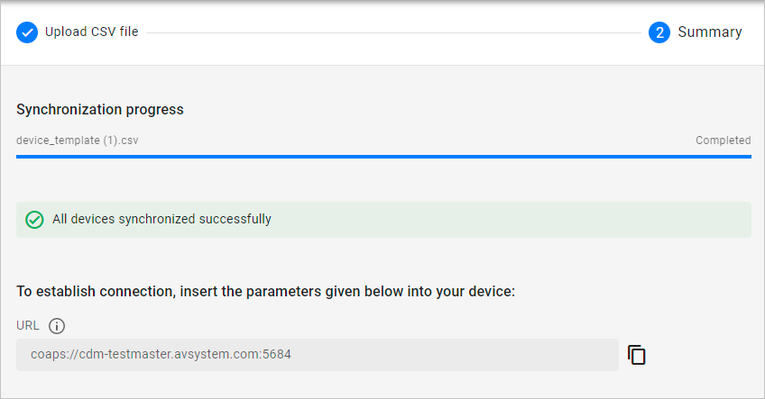
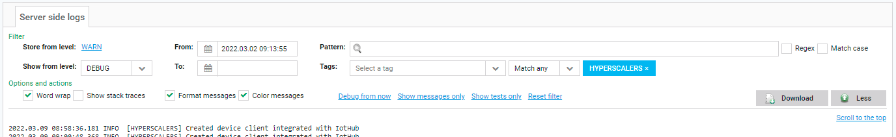

# Synchronize devices with Azure IoT Central

Importing devices to {{ coiote_short_name }} and synchronizing them with Azure IoT Central is a quick way to start using your {{ coiote_short_name }} - Azure IoT Central integration. The import operation will do two basic operations automatically:

- Create device entities in {{ coiote_short_name }} with the credentials that you specified,
- create the devices' "counterparts" within Azure IoT Central and synchronize them with {{ coiote_short_name }}.

## Prerequisites

 - A [connected Azure IoT Central integration](/Azure_IoT_Integration_Guide/Azure_IoT_Central_integration/Configure_Azure_IoT_Central_integration/) in the Hyperscaler Integration Center.
 ____________________

## Synchronize devices with Azure IoT Hub (option 1)

When a device is already added to {{ coiote_short_name }}'s Device inventory, you can simply synchronize the specifc device by clicking the three dots and select **Connect to Azure**.

## Import devices from CSV using a default integration template (option 2)

In the import process, you will need a list of devices that you want to import along with an integration template to be used by Azure IoT Central. To learn more about Azure integration templates, see the [Configure integration templates](/Azure_IoT_Integration_Guide/Configure_integration_templates/Azure_integration_templates/) section.

0. In {{ coiote_short_name }}, go to **Administration** -> **Hyperscaler Integration Center**.
0. Make sure you have an integration connected in the **Integration** tab.
0. Go to the **Device list** tab and click **Import devices**.
0. In the **Import devices** wizard:
    - From the **Select template** field, select one of two default integration templates:
        - Default minimal LwM2M schema - a pre-defined template implementing a basic device data model.
        - Default rich LwM2M schema - a pre-defined template implementing an extended device data model.
    !!! note
        Integration templates are crucial in the device import process. Optionally, you can create your custom device template and use it in importing. Check the instructions in the [Configure integration templates](/Azure_IoT_Integration_Guide/Configure_integration_templates/Azure_integration_templates/) section.
    - In the **Import devices from a CSV file** section:
        
        - If you already have a CSV file with devices for import, click **Browse** and select the file.
        - If you don't have a CSV with devices for import yet, click the **device template** link to download an empty template that you can fill in with your data:
            - **EndpointName** - provide endpoint name of your device.
            - **PSK_Identity_Key** - provide a unique plain-text PSK identity key used for secure communication between the device and {{ coiote_short_name }}.
            - **PSK_Key** -  provide a unique HEX-encoded PSK key used for secure communication between the device and {{ coiote_short_name }}.
            - Save the template and upload it using the **Browse** button and dialog window.
    -  Click **Sync with Azure**.
0. After a moment, the import operation should finish successfully.

0. Now you can connect your physical devices to {{ coiote_short_name }} using their credentials and the dedicated URL displayed after the successful device import.

### What the import operation does

Once the devices from the CSV template are imported into {{ coiote_short_name }}, the following actions are performed:

- In {{ coiote_short_name }}, device entities are created based on the credentials provided in the template. All such entities are visible in the **Device list** tab:
- In {{ coiote_short_name }}, a dedicated integration group is automatically created (with name built up by the `hyperscalercenter` prefix and the template ID, e.g. `618238c8bcafcb43b2911261`).
- In your Azure IoT Central, devices are created and ready for operation.

### Check device error logs

Logs may come helpful for diagnosing and troubleshooting issues with the communication between the three actors in the integration: the device, {{ coiote_short_name }}, and Azure IoT Central.

To see logs for your integrated devices:

0. Go to the single device view and from the left menu, select the **Logs** tile.
0. In the **Logs** panel, expand the view by clicking on **More** and configure the following:
    - **Store from level** - select **Use custom** and set log level to **DEBUG** for 1 hour.
    - **Tags** - select **HYPERSCALERS**

The communication logs will be displayed, allowing you to check, diagnose, or debug any issues.
