# Set an Observation

This section describes how to set an Observation in your Azure IoT Central application.

Setting an Observation lets your devices know what value changes and for what particular resources they need to notify you about. An Observation can be set for any or all the components of the [data model](../Concepts/LwM2M_mappings_Central.md ): objects, objects instances, and resources. Whenever there is a change in values, a device will send a Notify message to {{ coiote_short_name }}, which in turn will transfer it to Azure IoT Central.

In this section, you learn how to:

* Assign a device template that acts as a translator between {{ coiote_short_name }} and Azure IoT Central.
* Create a device group in Azure IoT Central, because an Observation is set at the group level.
* Run Jobs to add, edit or delete Observations.
* See value changes for the observed resources.

## Prerequisites

1. An active Azure IoT Central with hub owner access permissions.
2. A {{ coiote_short_name }} user account with permissions to use the Azure IoT Central integration.
3. A device group created in {{ coiote_short_name }}.
4. [A configured integration between {{ coiote_short_name }} and Azure Iot Central]( Configure_Azure_IoT_Central_integration.md).
5. [A configured integration template in {{ coiote_short_name }}, assigned to the device group](../Configure_integration_templates/Azure_integration_templates.md).
5. A connected device in {{ coiote_short_name }} that has been [exported to](./Configure_Azure_IoT_Central_integration.md) or [imported from](./Configure_Azure_IoT_Central_integration.md) Azure IoT Central.

## Assign a device template

To enable correct communication between {{ coiote_short_name }} and Azure IoT Central, you need two templates. The first template configures the {{ coiote_short_name }} integration with Azure. ([Follow the instruction](../Configure_integration_templates/Azure_integration_templates.md) to learn how to configure it.) The second template builds on the first one and allows to provide information that is used only in Azure IoT Central. For example: a given resource is temperature and is measured in Celsius.

### Download LwM2M template in {{ coiote_short_name }}

1. In {{ coiote_short_name }}, go to **Administration → Hyperscaler Integration Center** and select the **Templates** tab.
2. In the list of templates, find the one from which you want to generate the IoT Central template.

    !!! attention
        The template must contain the objects that you want to observe. For example, the `Velocity` object is contained in the **Default rich LwM2M schema** template that we use in this tutorial.

3. Click **Generate Azure IoT Central template** to download the template as a JSON file.

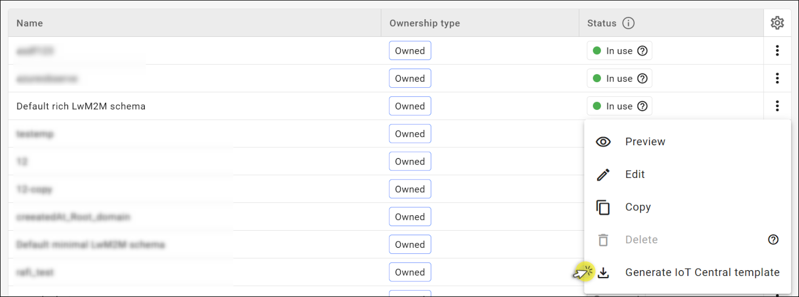

!!! info
     **Default minimal LwM2M schema** and **Default rich LwM2M schema** are the default Azure integration templates that you can use to generate a template for Azure IoT Central. **Default minimal LwM2M schema** contains only two objects: `LwM2M Server` and `Device` that are necessary to connect a device to a LwM2M server. **Default rich LwM2M schema** contains some additional objects that describe the current state of a device. You can use these default templates to test your integration or for some basic operations. If your device contains other LwM2M objects, then you need to create a new template or copy and edit on of the default templates.

### Create a device template in Azure IoT Central
1. From the **Overview** tab of your Azure IoT Central account, go to **IoT Central Application URL**.

    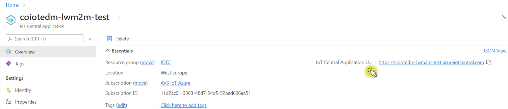

2. To add a new device template, go to **Device templates** from the left pane and then click **+ New**.

    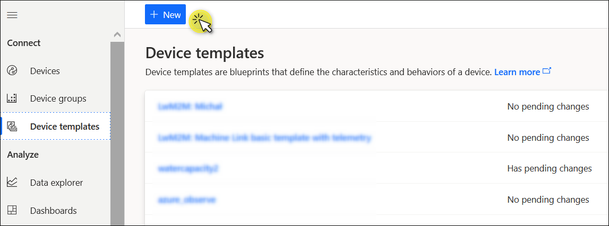

3. On the **Select type** page, select the **IoT device** tile and click **Next: Customize**.

    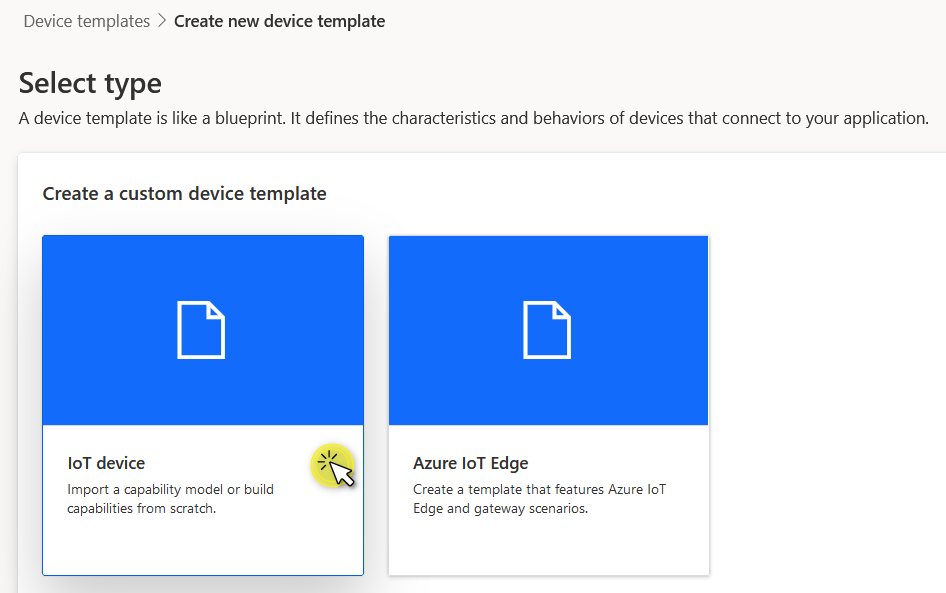

4. Enter a name for your device template and click **Next: Review**. Leave the checkbox unticked. In this example, our device template is called `template_test_name`.

    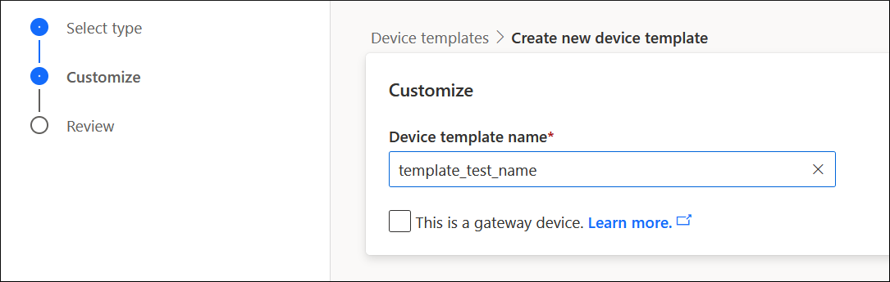

5. On the **Review** page, click **Create**.

6. Now you'll be prompted to create a model for your template. Select the **Import a model** tile. This is where you import the .JSON file you exported from {{ coiote_short_name }}.

    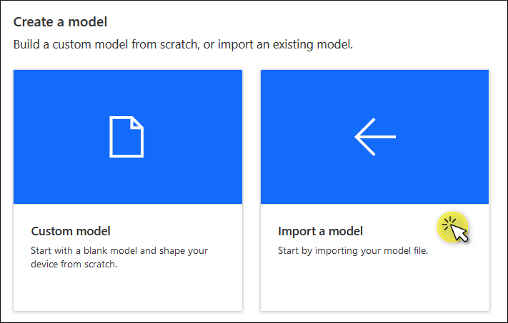

7. To publish this device template to the application, click **Publish** on the **Model** page.

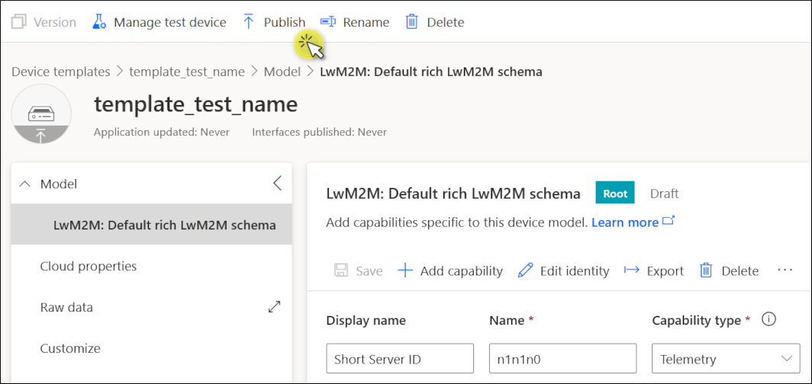

### Assign a device template in Azure IoT Central
1. To assign the published template to a device, go to **Devices** from the left pane and click on the device you want to observe. In our case, the device is called `soilquality`.

2. Click **Manage templates** and choose **Assign template**.

    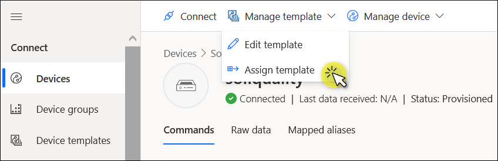

3. In the dialog that appears, find the template you have previously created in Azure (in our case, this is `template_test_name`) and click **Assign template**.

## Create a group

Now that you have a device with a template assigned to it, you need to add this device to a group. To create a group:

1. In Azure IoT Central, go to **Device groups** from the left pane and click **+ New**.

    !!! note
        A device group can only contain devices from a single device template.

2. Fill in the following information:
    * **Group name** and an optional description. In our case, the group is called `device_group_test`.
    * **Device group access**: skip, because LwM2M test application doesn’t use organizations.
    * **Create a device query**: from the **Value** drop-down menu, select the name of the device template you created in the previous step (`template_test_name`). Click **Run query**.

After running a query, you'll see the list of devices that are associated with this template. In our case it’s the device called `soilquality`. Click **Save**.

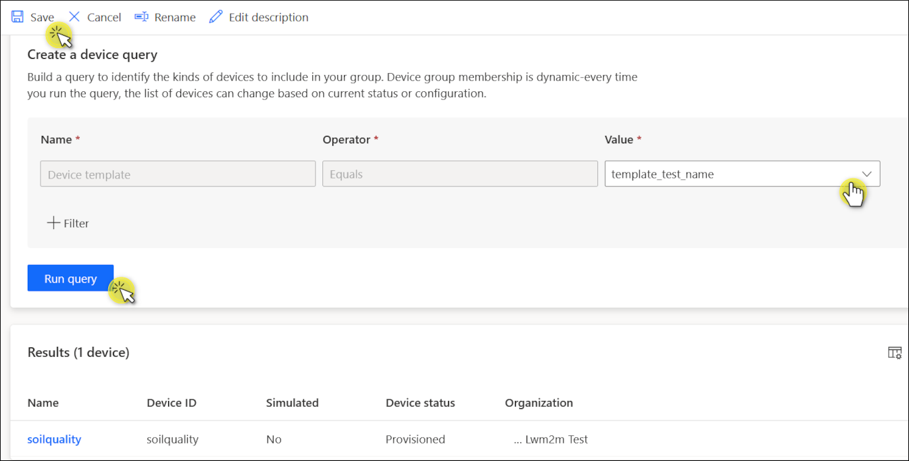

## Set up an Observation

Let’s set an Observation operation on resource ID **6/0/4**. This is Velocity, and the data is sent as Telemetry.

To add an Observation, you need to use the **Jobs** tab.

1. In Azure IoT Central, go to **Jobs** from the left pane and click **+ New job**.

    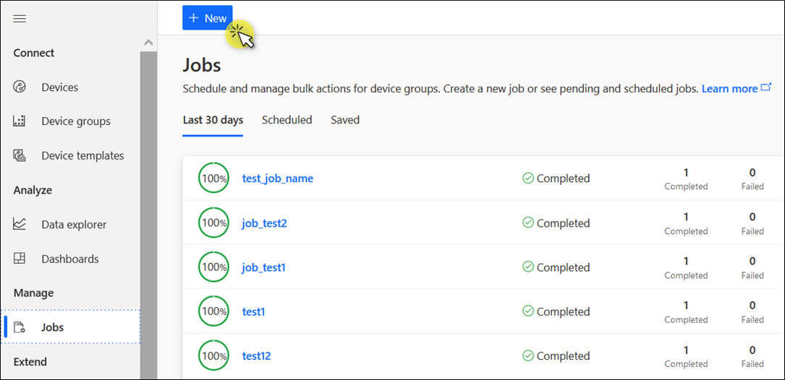

2. Now configure your job:

    * **Name ***: Provide a name and an optional description of the job.
    * **Access**: skip, because LwM2M test application doesn’t use organizations.
    * **Target devices**: select the **device group** this job will run on. In our case this is `device_group_test`.
    * **Job properties**:
        * Set **Job type** as `Property`.
        * Under the **Name** field, select `Velocity attribute / Observed` and turn the toggle to **True**.
        * Add the attributes to this observation. Click **+ Add** and select `Velocity attributes / Observation attributes / <name>` from the drop-down menu.
        * In the dialog that appears, specify the name of the attribute: `pmin`. Close the dialog.
        * Enter a value of `Velocity attributes / Observation attributes / pmin`. In this tutorial the value is set at **1**, which means that notifications will be sent every second.
        * Click **Next**.

      

    !!! info
        * **pmin** - the minimum time in seconds between two notifications.
        * **pmax** - the maximum time in seconds between two notifications. The notification is sent even if the value didn't change.

        Read more about other attributes in our [Brief description of OMA LwM2M](https://avsystem.github.io/Anjay-doc/LwM2M.html#attributes).

3. In **Delivery options**, click **Next**.
4. In **Schedule**, click **Next**.
5. Review the job:
    * `n6n0n4` stands for Velocity. Note that objects, object instances, and resources are separated by `n` in Azure IoT Central.
    * `observed` is set at `true`
    * The attribute `pmin` is set at 1 second.

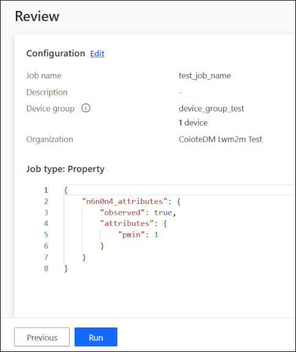

Click **Run**.

## See the value changes in Azure IoT Central

1. In Azure IoT Central, go to **Devices** from the left pane and click on the device you're observing. You'll see the list of messages that notify about any changes in the desired and reported properties for this device.

2. In the **Raw data** tab, unfold one of the recent messages. Note that this tab contains *all* the messages received from your device, and some of them might relate to other objects. Look for a recent message where the JSON snippet contains the information that the Observation has been set for the telemetry resource `n6n0n4` (Velocity).

    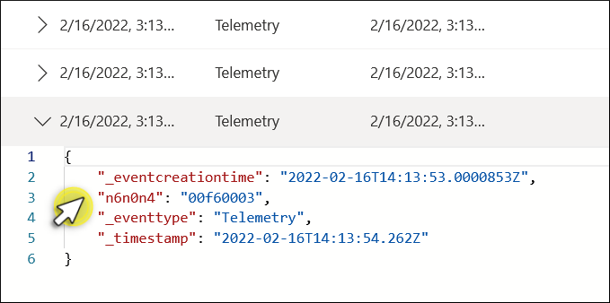

3. To see the data received about the value changes, scroll right until you see the **Velocity** column.

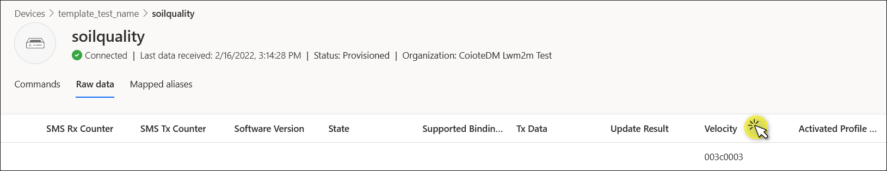

!!! Tip
    If you don’t see any value in the relevant column (e.g., Velocity), scroll all the way right to the very last column **Unmodeled data**. If it contains an entry similar to ``{"n6n0n4":"1634741504000"}``, it means there is a mismatch between {{ coiote_short_name }} and the Azure IoT Central templates. Velocity is a Telemetry resource, but apparently it's set as Property in Azure. To fix this error, go to **Device templates** in Azure IoT Central, select the relevant template and find the resource you want to edit. In the **Capability type** column, select `Telemetry` from the drop-down menu so that it’s consistent with what you have in {{ coiote_short_name }}. Click **Save**. Go back to **Devices** and refresh the page to see the changes.

## Edit or delete an Observation
To edit or delete an Observation, you need to create a new job.

* In Azure IoT Central, go to **Jobs** from the left pane and click **+ New job**.
* Alternatively, you can copy an existing job:
    1. Select the job and then click **Copy job**.
    2. To edit the **Observation attributes**, change the value in the text box. To change the **map keys** (e.g., pmax to pmin), click on the Ellipse button.
    3. To delete an Observation, turn off the toggle to **False**.

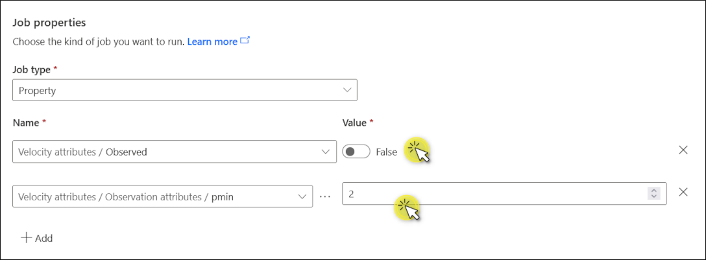

## Check an Observation in {{ coiote_short_name }}
This step is optional. If you want to make sure that the Observation has been set in {{ coiote_short_name }} as well, do the following:

1. In {{ coiote_short_name }}, go to **Device inventory** and click on the observed device.
2. From the left pane of the device panel, go to **Objects**.
2. Find the resource you want to check. In our example, this is `4 Velocity` resource in the `6 Location` object.
3. Click the refresh button to the left from the **Value tracking**.
You'll see that checkboxes next to **Value tracking** and **Attributes** are now filled in green.

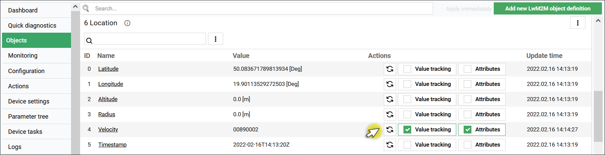

## Next steps
[Air quality monitoring - tutorial](../../../Demo_Projects/Air_quality_monitoring_tutorial.md)
