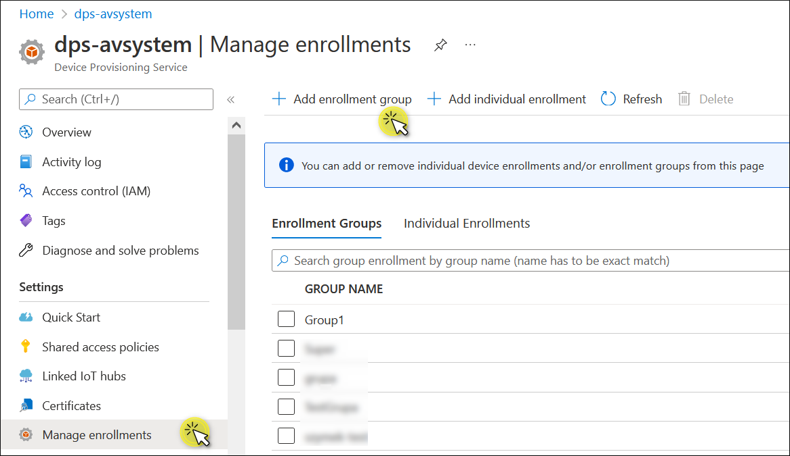
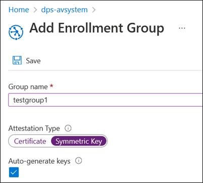
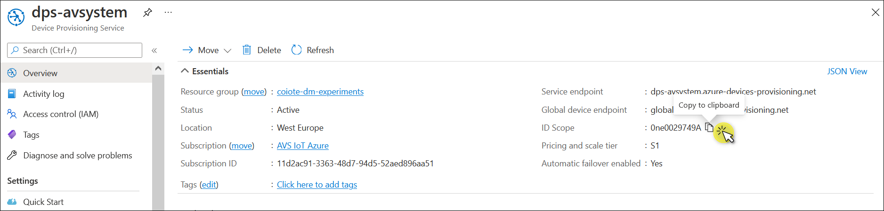
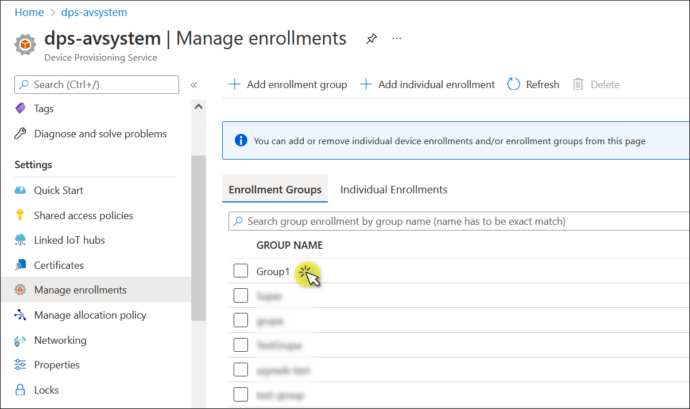
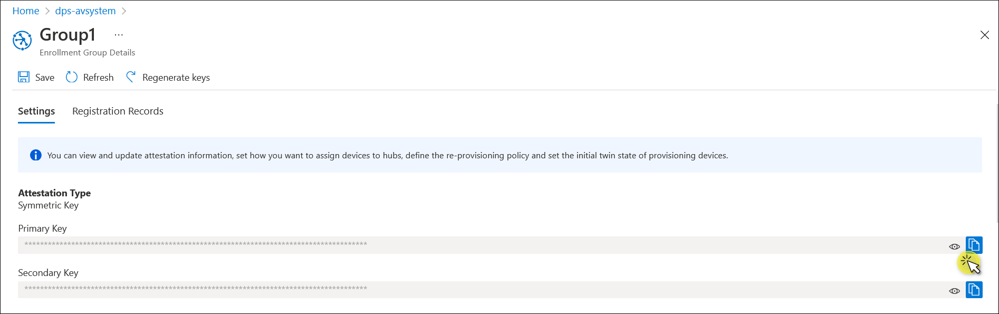
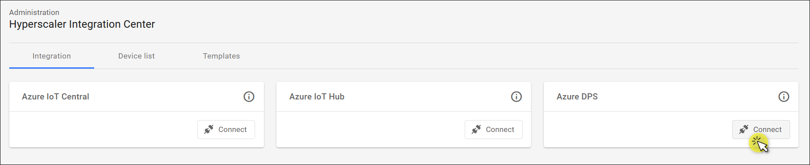
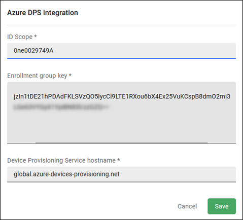
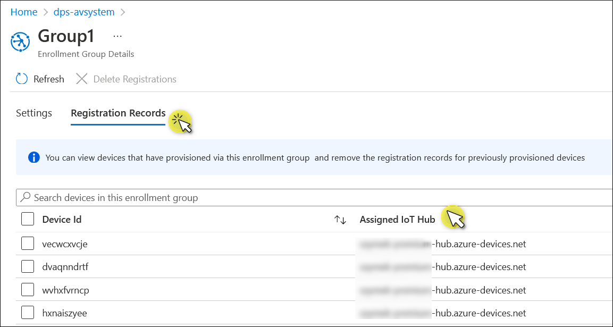

# Connect integration

Azure IoT Hub Device Provisioning Service (DPS) is a helper service for Azure IoT Hub that enables zero-touch provisioning of IoT devices at scale. Azure DPS ensures high availability by providing load balancing across multiple hubs and supporting reprovisioning based on a change in the device. For more information about Azure DPS, refer to the [official documentation](https://docs.microsoft.com/en-us/azure/iot-dps/about-iot-dps).

{{ coiote_short_name }} communicates with Azure DPS to add a device to the right IoT hub and then receives the credentials to connect to the selected hub. To enable communication between Azure DPS and {{ coiote_short_name }}, you first need to connect them using the Hyperscaler Integration Center in {{ coiote_short_name }}. Follow the instruction below to learn how to do it.

## Prerequisites

* An active DPS [with linked IoT hubs](https://docs.microsoft.com/en-us/azure/iot-dps/quick-setup-auto-provision#create-a-new-iot-hub-device-provisioning-service).
* An active IoT Hub with hub owner access permissions. [Read here](https://docs.microsoft.com/en-us/azure/iot-hub/iot-hub-create-through-portal) how to create a hub.
* A {{ coiote_short_name }} user account with permissions to use the Azure DPS integration.

## Create an Enrollment group

This step describes how to create an Enrollment group. If you already have one, proceed to the [Get the credentials](#get-the-credentials) section.

A device can be enrolled in Azure DPS either [individually or as a group of devices](https://docs.microsoft.com/en-us/azure/iot-dps/tutorial-provision-device-to-hub#enroll-the-device) that share a specific attestation mechanism. Currently, {{ coiote_short_name }} doesn't support Individual Enrollments, so you need to choose the Enrollment group option.

To create an Enrollment group:

1. Log in to the [Azure portal](https://portal.azure.com) and click on your **Device Provisioning Service**.
2. Go to **Manage enrollments** from the left pane.
3. Click **+ Add enrollment group**.

    

4. Provide the group name and select the **Symmetric key** option from the Attestation Type. Make sure that the **Auto-generate keys** checkbox is ticked. Click **Save**.

You’ve just created your enrollment group. The generated Symmetric Key will be used in the next step.

!!! info
    On the Enrollment Group Details page, you can also select to which hub the enrollment group will be assigned. The list of hubs that are connected to this DPS is displayed in the drop-down menu under **Select the IoT hubs this group can be assigned to**. To add more hubs to this list, click **Link a new IoT hub** or go to the Linked IoT hubs page from the left pane.

    You can also define how devices should be assigned to hubs. From the **Select how you want to assign devices to hubs** drop-down menu, the following options are available: Lowest latency, Evenly weighted distribution, Static configuration, or Custom. For more information, refer to the [official Azure DPS documentation](https://docs.microsoft.com/en-us/azure/iot-dps/how-to-reprovision#configure-the-enrollment-allocation-policy).

## Get the credentials

This step explains where you can get the credentials for setting up the Azure DPS integration in {{ coiote_short_name }}.

### ID Scope

The ID Scope is used to identify the specific provisioning service for the device registration. The ID Scope is automatically generated and unique.

1. Log in to the [Azure portal](https://portal.azure.com) and click on your **Device Provisioning Service**.
2. On the Overview page, locate the **ID Scope** under the Essentials section. Paste it into Notepad or another place to keep it for later.

### Enrollment group key

1. Select **Manage enrollments** from the left pane of your Azure DPS.
2. Under the **Enrollment Groups** tab, click on the group that you want to use.

    

3. In the **Settings** tab, under Attestation Type, copy **Primary Key.**

## Set up the Azure DPS integration

1. In your {{ coiote_short_name }} account, go to **Administration —> Hyperscaler Integration Center**.
2. In the **Integration** tab, locate the Azure DPS tale and click **Connect**.

    

3. In the dialog that appears, provide the credentials for your Azure DPS integration:
    * **ID Scope**: paste the ID Scope copied from the Overview page.
    * **Enrollment group key:** paste the Primary Key copied from the Enrollment group.
    * **Device Provisioning Service hostname:** API HTTP host. It can be left as it is: `global.azure-devices-provisioning.net`

## What happens next

After you set up Azure DPS and connect your Azure DPS integration in {{ coiote_short_name }}, device provisioning and reprovisioning to the proper IoT hub are automated. You aren’t required to make any changes in {{ coiote_short_name }}.

Importing and exporting devices, upgrading device firmware, and setting observations—all these operations happen at the level of individual hubs. The detailed instructions are provided in our [Azure IoT Hub documentation](../Azure_IoT_Hub/Configure_Azure_IoT_Hub_integration.md).

To see to which hub a device has been assigned:

1. Go to **Manage enrollments** from the left pane.
2. Under the **Enrollment Groups** tab, click on the group.
3. Select the **Registration Records** tab and see the **Assigned IoT Hub** column.

## Next steps

* [Device operations on Azure IoT Hub](../Azure_IoT_Hub/Device_operations/Overview.md)
* [Azure DPS documentation](https://docs.microsoft.com/en-us/azure/iot-dps/)

## Removing devices

When a device is removed from {{ coiote_short_name }} then it is not removed from DPS enrollment group and corresponding IoT Hub
