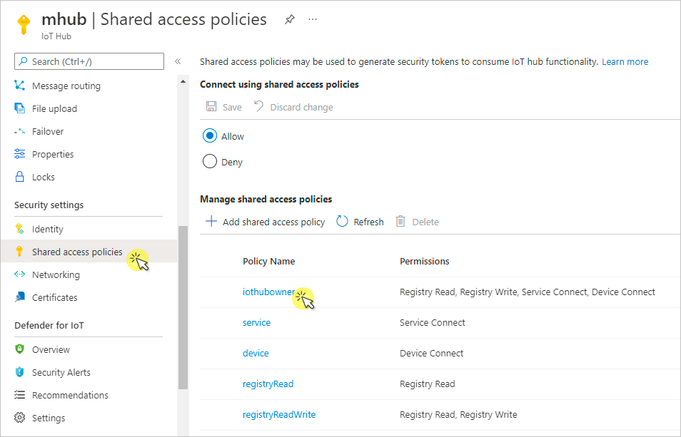
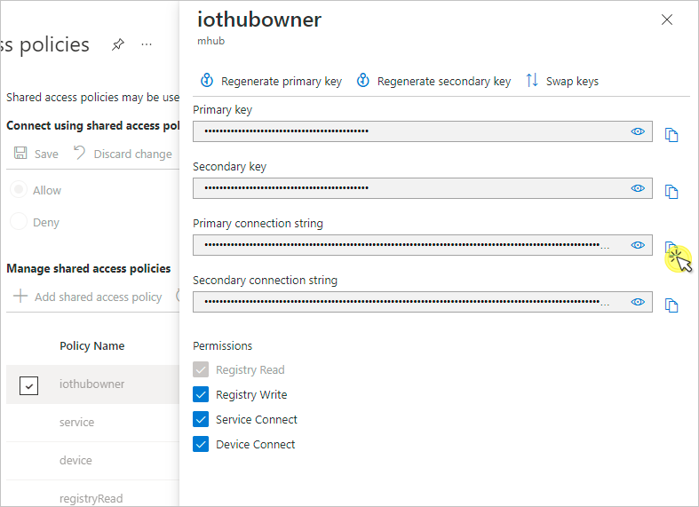
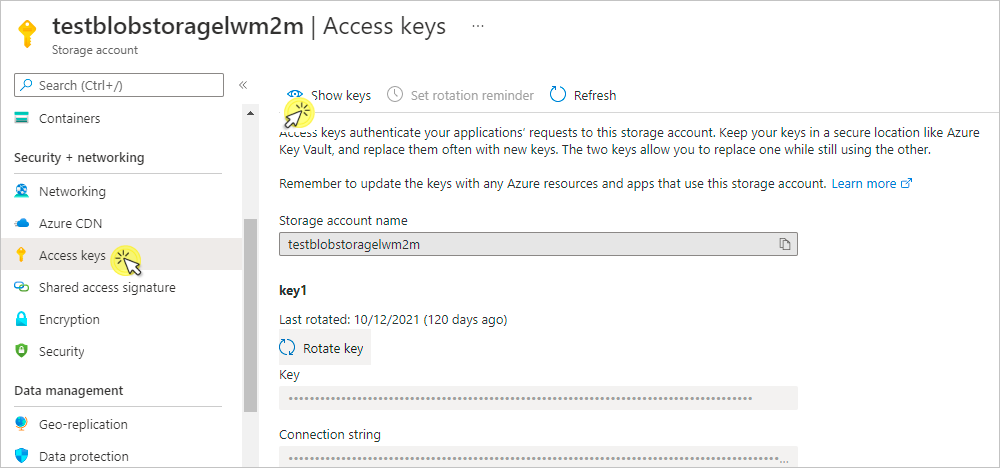
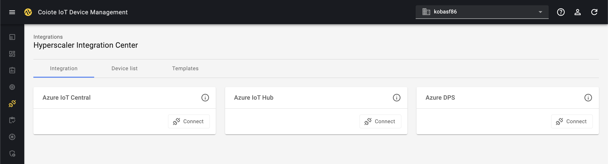
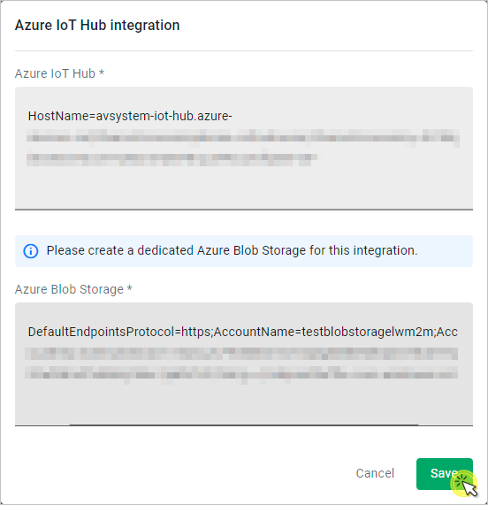

# Connect integration

To enable communication and data flow between the Azure IoT Hub and {{ coiote_short_name }} platforms, you first need to integrate them using the Hyperscaler Integration Center in {{ coiote_short_name }}. Follow the instructions below to learn how to do it.

## Prerequisites

  - An active IoT Hub with hub owner access permissions. [Check here](https://docs.microsoft.com/en-us/azure/iot-hub/iot-hub-create-through-portal) how to create a hub.
  - A {{ coiote_short_name }} user account with permissions to use the Hyperscaler Integration Center.
  - An active Azure Blob Storage account (creating a new dedicated account for the integration is required).

## Configuring Azure resources via GUI

This section guides you through the process of configuring Azure resources using the intuitive Graphical User Interface (GUI) provided by Azure.

### Get the IoT Hub connection string

The Azure IoT Hub connection string is required in the integration process. Here is how to obtain it:

1. In your IoT Hub general view, go to **Shared access policies**:

       

2. From the list of policies, click the `iothubowner` policy.
3. From the keys section, click the copy icon for the *Primary connection string* and paste it into Notepad or any other safe place to keep it for later.

       

    !!! info
        For detailed information about the IoT Hub permissions, please visit the [Control access to IoT Hub](https://docs.microsoft.com/en-us/azure/iot-hub/iot-hub-devguide-security#access-control-and-permissions) section of the Azure IoT Hub documentation.

### Get the Azure Blob storage connection string

!!! important
    For the integration to work properly, it is required to have an empty Azure Blob storage account dedicated exclusively for the integration.

An Azure Blob storage connection string is required in the integration process. Here is how to obtain it:

0. In your Azure Blob storage account, go to **Access keys**.
   
0. Click **Show keys**, click the copy icon next to the **connection string** and paste it into Notepad or any other safe place to keep it for later.

### Set up the **Azure IoT Hub integration**

Use the obtained credentials to establish the integration between {{ coiote_short_name }} and your Azure IoT hub:

0. In your {{ coiote_short_name }} user account, go to **Integrations** → **Hyperscaler Integration Center**
  
0. In the **Integrations** tab, find the **Azure IoT Hub** tile and click **Connect**.
0. In the dialog window, paste the previously copied IoT Hub connection string and Azure Blob storage connection string into the relevant fields.
  {:style="float: left;margin-right: 1177px;margin-top: 17px;"}
      - click **Save** to keep the setting.

Your integration should now be established. To get the integration up and running, try [synchronizing devices with Azure IoT Hub](Device_operations/Synchronize_devices_with_Azure_IoT_Hub.md)


## Configuring Azure resources via CLI

This section illustrates the configuration of Azure resources through the Command-Line Interface (CLI), offering a streamlined and scriptable approach to resource management. It is assumed that you have completed the following prerequisites:

1. **Installed Azure CLI:**
   Ensure that Azure CLI is installed on your system. If not, refer to the [official installation guide](https://learn.microsoft.com/en-us/cli/azure/install-azure-cli) for detailed instructions.

2. **Authenticated to Azure CLI:**
   Authenticate your Azure CLI by following the steps outlined in [this guide](https://learn.microsoft.com/en-us/cli/azure/authenticate-azure-cli-interactively).

3. **Created Resource Group e.g. `coiote-dm-experiments`:**
   Execute the following command to create the required resource group:
   ```bash
   # Adjust the group name as needed
   az group create --name coiote-dm-experiments
   ```

### Resources creation and connection string retrieval

Using this script, you can automate the creation of Azure resources. The script sanitizes and normalizes the username and then proceeds to create and configure a storage account and an IoT hub. Additionally, it retrieves and displays the connection strings associated with these resources, enabling a streamlined process for setting up essential Azure components.

```bash
# Sanitize and normalize the current user's username for Azure purposes
export USER=$(echo $USER | sed 's/[^[:alnum:]]//g' | tr '[:upper:]' '[:lower:]')
export GROUP=coiote-dm-experiments

# Create and configure a storage account
az storage account create -n ${USER}hub -g $GROUP
az storage account show-connection-string -n ${USER}hub -g $GROUP

# Create and configure an IoT hub
az iot hub create -n $USER-hub -g $GROUP
az iot hub connection-string show -n $USER-hub -g $GROUP
```

### Clean up resources

To delete previously created Azure resources, including the specified storage account and IoT hub, execute this script:

!!! Warning
    Removal of these resources will cause the integration with {{ coiote_short_name }} to stop working.

```bash
# Delete the storage account
az storage account delete -n ${USER}hub --yes

# Delete the IoT hub
az iot hub delete -n $USER-hub
```
