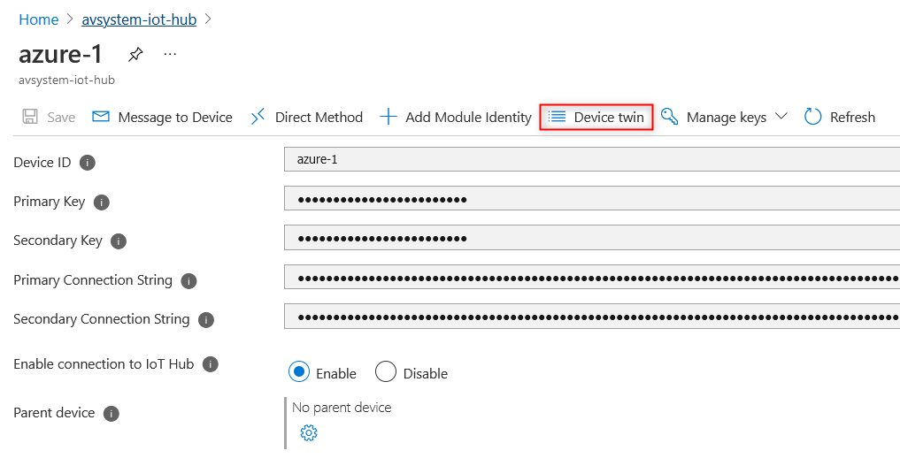
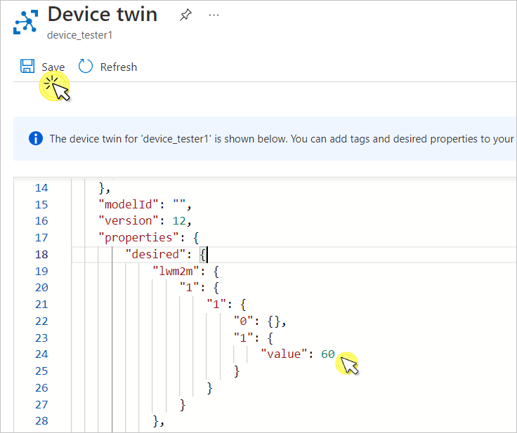
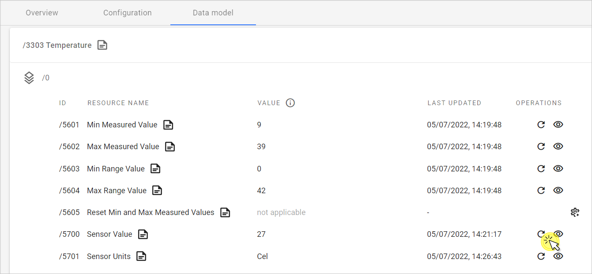
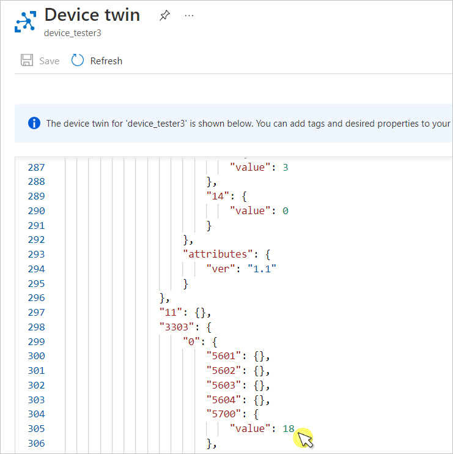

# Perform LwM2M Read and Write

This section describes how to perform a LwM2M WRITE and READ operations in your Azure IoT Hub and {{ short_name }}.

A WRITE operation lets you change the current value on the given [data model](https://iotdevzone.avsystem.com/docs/Azure_IoT_Integration_Guide/Concepts/LwM2M_mappings_Hub/) component: object, object instance, and resource. The READ enables you to see the updated value of an object, object instance, or resource.

In this section, you learn how to:

  * Perform WRITE on resources
  * Check for the reported value changes in resources
  * Perform READ on resources

## Prerequisites

1. An active Azure IoT Hub with hub owner access permissions.
2. A {{ short_name }} user account with permissions to use the integration extension.
3. A device group created in {{ short_name }}.
4. [A configured extension between {{ short_name }} and Azure Iot Hub](https://https://iotdevzone.avsystem.com/docs/Azure_IoT_Integration_Guide/Azure_IoT_Hub_integration/Configure_Azure_IoT_Hub_integration/).
5. [A configured integration template in {{ short_name }}, assigned to the device group](https://iotdevzone.avsystem.com/docs/Azure_IoT_Integration_Guide/Configure_integration_templates/Azure_integration_templates/).
5. [A connected device](https://iotdevzone.avsystem.com/docs/Coiote_DM_Device_Onboarding/Quick_start/).

## Perform WRITE

Let’s perform a WRITE operation on the **Lifetime** resource with ID **1/1/1**. From the Azure IoT integration standpoint, **Lifetime** it is interpreted as a *Property*.

In Azure IoT Hub, value changes for both *Telemetry* and *Property* are stored in the [Device twin](https://https://iotdevzone.avsystem.com/docs/Azure_IoT_Integration_Guide/Concepts/LwM2M_mappings_Hub/#lwm2m-readable-and-writable-resources). To perform a WRITE operation, do the following:

1. In your Azure IoT Hub account, go to **Devices** from the left pane.

2. Click on the device and then go to **Device twin**.

    

3. Find the **desired** property in the JSON snippet. This is where you define what needs to be observed.
4. To the **1/1/1 (Lifetime)** resource, add the following snippet under the `"desired": {` property and click **Save**:

      ```
      "lwm2m": {
         "1": {
             "1": {
                 "0": {},
                 "1": {
                     "value": 60
                 },
             }
         },
      },
      ```

    !!! note
        The exact LwM2M path of the Lifetime resource depends on the LwM2M client used and may vary slightly, e.g. in the object instance number: **1/0/1**. For the purpose of this tutorial, the Anjay LwM2M Client is used. If needed, modify the snippet according to your case.



After you click **Save**, the line with `value: 60` will trigger the WRITE operation.

## See value changes

### In Azure IoT Hub

The value change for the resource is displayed in the same Device Twin JSON snippet. Scroll down to the **Reported** property and find the `value` line for the **1/1/1** resource.

```
"reported": {
    "lwm2m": {
        "1": {
            "1": {
                "0": {},
                "1": {
                    "value": 60
                },
```


If you don’t see any changes, click **Refresh**. If it doesn’t help, you can check whether the WRITE operation has been performed in {{ short_name }} as well.

### In {{ short_name }}

This step is optional. If you want to make sure the WRITE has been correctly performed in {{ short_name }}, do the following:

1. In {{ short_name }}, go to your device and select the **Data model** tab.
2. Expand the **LwM2M Server** object, find the **Lifetime (1/1/1)** resource in the list. If there is no change in data, use the **Refresh** icon in the top right corner of the screen.

      

You have successfully performed a LwM2M WRITE on a resource.

## Perform READ

Let’s perform a READ operation on the **Temperature** object's **Sensor Value** resource with ID **3303/0/5700** defined as a *Property* in the [integration template in {{ short_name }}](https://iotdevzone.avsystem.com/docs/Azure_IoT_Integration_Guide/Configure_integration_templates/Azure_integration_templates/).

To learn more about reading value changes for both *Telemetry* and *Property*, refer to [LwM2M mappings for Azure IoT Hub](https://iotdevzone.avsystem.com/docs/Azure_IoT_Integration_Guide/Concepts/LwM2M_mappings_Hub/#lwm2m-readable-and-writable-resources). To perform a READ operation, do the following:

1. In {{ short_name }}, go to your device and select the **Data model** tab.
2. Expand the **Temperature** object, and find the **Sensor Value (3303/0/5700)** resource in the list.
3. Click the **Read resource** icon located under the **OPERATIONS** column.
      
4. The READ is scheduled - if there is any value change, it should be displayed in a few moments (depending on device settings, like the **Lifetime** resource).

### See value change in Azure IoT Hub

The value change for the resource is displayed in the Device Twin JSON snippet. Scroll down to the **Reported** property and find the `value` line for the **3303/0/5700** resource.

```
"reported": {
    "lwm2m": {
      "3303": {
          "0": {
              "5601": {},
              "5602": {},
              "5603": {},
              "5604": {},
              "5700": {
                  "value": 18
                },
```



If you don’t see any changes, click **Refresh**. If it doesn’t help, you can check whether the READ operation has been performed in {{ short_name }} as well.

## Next steps
[Air quality monitoring - tutorial](https://iotdevzone.avsystem.com/docs/Azure_IoT_Integration_Guide/Tutorials/Air_quality_monitoring_tutorial/)
