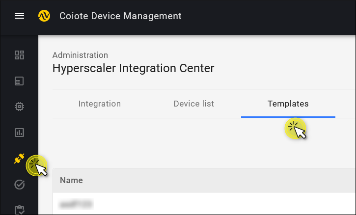
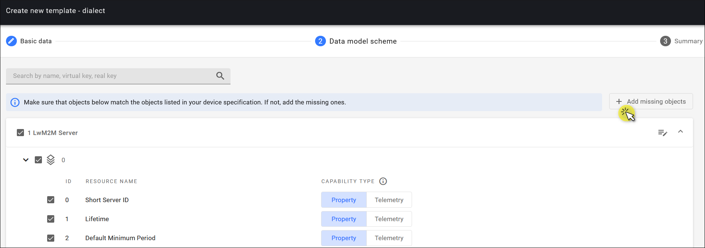

# Configure integration templates

Integration templates define the format in which the data is exchanged between devices and Azure. The data can be either a property or a telemetry. Property describes the actual value. For example: at 1:00 PM a thermometer shows 5°C, and only this value is sent. Telemetry is used to observe changes in values. For example: it was 5°C at 1:00 PM, and one hour later it’s 6°C. In other words, you need to decide whether you want to send and receive historical data or not.

If you select the Property option, then {{ coiote_short_name }} reports data to Azure using Device Twins. For the Telemetry data it uses Azure IoT Hub Device-to-cloud mechanism. Read more about these key concepts in the [LwM2M mappings](/docs/Azure_IoT_Integration_Guide/Concepts/LwM2M_mappings_Hub/) section.

Follow the instruction below to create integration templates and learn how they work.

## Prerequisites
1. An active Azure IoT Central, IoT Hub, or DPS with hub owner access permissions.
2. A {{ coiote_short_name }} user account with permissions to use Hyperscaler Integration Center.

## Create a new template

1. In your {{ coiote_short_name }} user account, go to **Hyperscaler Integration Center** and select the **Templates** tab.

    

2. Click **Add new** in the top-right corner.
3. In the **Create new template** wizard that appears, provide the Basic data:
    * **Template name**
    * **Azure IoT Central template model ID**. This step is optional. If it's enabled, copy and paste the model ID of a device template from the Azure [public model repository](https://github.com/Azure/iot-plugandplay-models). This model ID will be used as DPS payload while the device is connected to Azure IoT Central. In this case, {{ coiote_short_name }} won’t generate the template for Azure IoT Central. Note that the assigned model ID can’t be changed.

    Click **Next step**.

4. The **Data model scheme** page displays the list of all LwM2M objects that are available to you.

    !!! info
        If you don't specify the **Azure IoT Central template model ID**, the Data model scheme by default will contain only two objects: `LwM2M Server` and `Device` that are necessary to connect a device to a LwM2M server. You can use this default template to test your integration or for some basic operations. If you have a more complex case (for example, your device contains other LwM2M objects), then you need to add missing objects.

    * To choose the objects and resources that you want to report to Azure, expand the lists and check the respective boxes. To add more objects or resources, click **Add missing objects**.
    * Select the type of data that needs to be reported (Capability type): Telemetry, Property, or Command.

    

    !!! Example
        `Manufacturer` is unlikely to change over time, so it is a **Property**. `Reboot` is an executable **Command**. `Battery Level` is more ambiguous: it can be a property if we just want to have the actual value. But because we want to have its historical values, it is a **Telemetry**.

5. Click **Next step**.

6. Check the **Summary** and click **Save template**.

### How integration templates work

As you now know, the Azure integration template is based on a data model which consists of the objects and resources. {{ coiote_short_name }} sends data to Azure every time a device data model is changed, provided that you have set an Observation on the objects and resources in this data model. (Read about setting an Observation in [Azure IoT Hub](/docs/Azure_IoT_Integration_Guide/Azure_IoT_Hub_integration/Set_an_Observation/) and [Azure IoT Central](/docs/Azure_IoT_Integration_Guide/Azure_IoT_Central_integration/Set_an_Observation/).)

Let’s illustrate the process with two examples. In the first case, the change in the data model is triggered by the device. `Battery level` is defined as a property. When the value of the `Battery level` resource changes, the device sends **Send** or **Notify** messages via LwM2M. The device information in {{ coiote_short_name }} is then updated and translated to Device Twin JSON, which in turn is sent to Azure.

!!! info
    When `Battery level` is defined as a telemetry, then Device-to-cloud messages are used.

In the second example, the change in the data model is triggered by {{ coiote_short_name }}. When you set an Observation on the `Battery level`, this information is sent to Azure in the Device Twin JSON. To check whether the values of the `Battery level` resource on the device and {{ coiote_short_name }} are the same, {{ coiote_short_name }} performs a **READ** operation on this resource. If the value is different, a **WRITE** operation is performed to change the value in {{ coiote_short_name }}. Then the Device Twin JSON is updated and sent to Azure.

## Next steps
 - [Air quality monitoring - tutorial](https://iotdevzone.avsystem.com/docs/Azure_IoT_Integration_Guide/Tutorials/Air_quality_monitoring_tutorial/)
