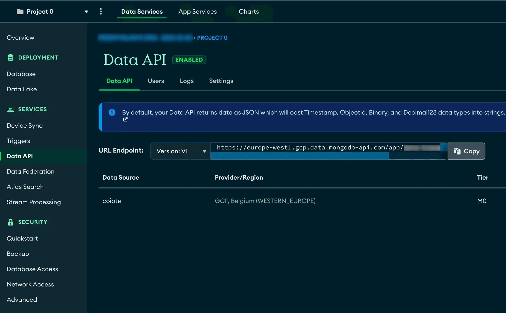
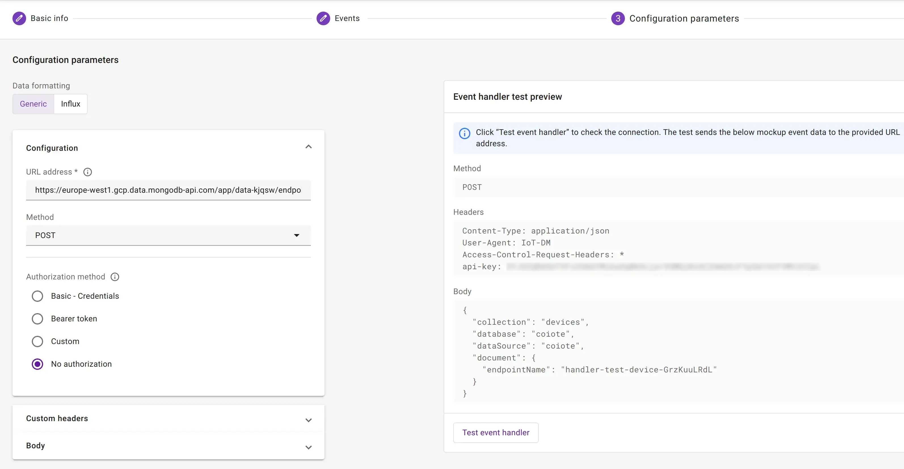

# Atlas

To send data to MongoDB Atlas using its API, you can utilize **Data Integration Center**.

## Prerequisites

- MongoDB Atlas [Account](https://account.mongodb.com/account/login)
- MongoDB Atlas cluster

## Setup atlas

1. Enable [Data API](https://www.mongodb.com/docs/atlas/app-services/data-api/generated-endpoints/) access.
2. In the User tab, create a user and copy the API key.
3. Copy `URL Endpoint`.

!!! Info

    It's worth reading [the official mongodb website](https://www.mongodb.com/developer/products/atlas/atlas-data-api-introduction/).



## Create webhook

1. From the previous section, get the API url and append `action/insertOne` to it. Example:

    ```text
    https://europe-west1.gcp.data.mongodb-api.com/app/data-kjqsw/endpoint/data/v1/action/insertOne
    ```

2. As a headers, set:

    - `api-key: <api-key-from-previous-section>`
    - `Access-Control-Request-Headers: *`

3. As a body template, set e.g:

    ```json
    {
      "collection":"devices",
      "database":"coiote",
      "dataSource":"coiote",
      "document": {
        "endpointName": "$endpointName"
      }
    }
    ```

    You can adjust the payload according to your needs.



## Investigate database

Now, go to **Collections** and verify if there is a new entity.


