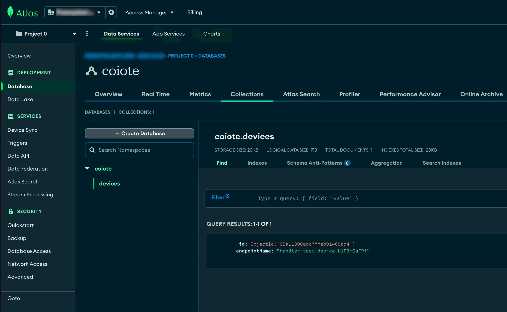

# Atlas

To send data to MongoDB Atlas using its API, you can utilize *Data Integration Center*.

## Prerequisites

- MongoDB Atlas [Account](https://account.mongodb.com/account/login)
- MongoDB Atlas cluster

## Setup atlas

1. Enable [Data API](https://www.mongodb.com/docs/atlas/app-services/data-api/generated-endpoints/) Access. 
2. Create user (In `User` tab) `coiote-integration` and copy API key.
3. Copy `URL Endpoint`


## Create webhook

Get API url from previous section, and append `action/insertOne` e.g. 
`https://europe-west1.gcp.data.mongodb-api.com/app/data-kjqsw/endpoint/data/v1/action/insertOne`

As a header set:

- `api-key: <api-key-from-previous-section>`
- `Access-Control-Request-Headers: *`

And as a body template set

```json
{
  "collection":"devices",
  "database":"coiote",
  "dataSource":"coiote",
  "document": {
    "endpointName": "$endpointName"
  }
}
```

You can adjust payload to your needs.


## Investigate database

Now go to collections and see if there is new entity.


