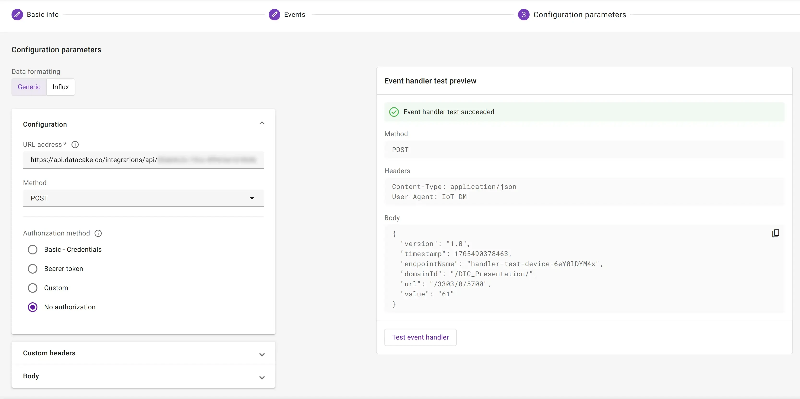

# Datacake

You can easily integrate with [Datacake](https://datacake.co/) using webhooks and a custom payload decoder. See the [Datacake docs](https://docs.datacake.de/integrations/webhook) covering this type of integrations.

## Prerequisites

* A user with access to the {{ coiote_long_name }} and appropriate permissions
* A LwM2M device
* A Datacake account (you can create a free [Datacake account](https://app.datacake.de/signup))


## Setup Datacake

1. Open your Datacake account.
2. Create a new workspace or select an existing one.
3. Create a new API Device representing your device by going to: **Devices** > **Add device**.
    
4. Select or create a [Product](https://docs.datacake.de/device/product) that will be used as a template for your device. Products aggregate devices sharing similar configurations, you will later use an endpoint dedicated to your Product to ingest data for your device.
    
5. Create a dedicated product for the demo device to use in this tutorial.
6. Name your device and enter its endpoint name as the device serial number.
    
7. Pick a plan for billing your integration and complete the process. You can add up to 5 devices in the free plan of your workspace.
    

### Configure fields for your device

1. From the devices list, select the device and open its details by clicking on its name.
2. To configure the data model of your device, in the **Configuration** tab, find the **Fields** of the device and add new field representing the temperature measured by your device. You can add fields of different types as Datacake field types cover all LwM2M resource types.
    
3. For the temperature measurements, pick the **Float** type and name it `TEMPERATURE`.
    

### Configure payload decoder

Follow to the **HTTP Payload Decoder** section to configure the decoder for JSON values that will arrive from {{ coiote_short_name }}. To parse the incoming Webhook data from {{ coiote_short_name }}, you will need a decoder similar to the following one:

```javascript
function Decoder(request) {

    // Parse JSON into Object
    var payload = JSON.parse(request.body);

    var endpointName = payload.endpointName;
    var temperatureUrl = "/3303/0/5700";
    if (payload.url == temperatureUrl) {
   		var temperature = parseFloat(payload.value);
   		var time = payload.timestamp;
   		return [{
   			device: endpointName,
   			field: "TEMPERATURE",
   			value: temperature,
   			timestamp: time / 1000
   		}];
    } else {
    	return [];
    }
}
```

This decoder does several things required to ingest device data into the Datacake database:

- it selects the `endpointName` field used for identification of the device in the platform,
- it accepts only changes from LwM2M URL `/3303/0/5700` which represents the Temperature/Sensor value resource,
- it parses the value and timestamp from the payload of the event.


**Save the configuration** and copy the `HTTP Endpoint URL`, which will be used as webhook target for {{ coiote_short_name }} event handler.

## Create webhook in {{ coiote_long_name }}

1. Go back to your domain in {{ coiote_long_name }}.
2. Go to **Integrations > Data Integration Center** and create a Webhook event handler that will forward device telemetry.


### Configure Datacake webhook parameters

1. Apply the filter and go to the connection configuration step to configure the fields as follows:
    - set the formatting to `Generic`,
    - set the URL to the `HTTP Endpoint URL` you copied before from the Datacake configuration view. It should look like this: `https://api.datacake.co/integrations/api/aaaaaaaa-bbbb-cccc-dddd-eeeeffffggg/`,
    - set the Authorization to `No authorization`, as Datacake treats the endpoint URL as a token itself.
2. To confirm that you entered your data correctly, test the event handler.
3. To create the event handler, click **Next step** and **Add event handler**.



## Monitor events in Datacake

After activating the event handler, go to your Datacake account and open the Dashboard of your device. If you have already [set an observation on the Temperature object](../../../Coiote_IoT_DM/Device_Center.md), you should see that the **Last update** field of your device in Datacake changed to the time when Datacake received last information from {{ coiote_short_name }}.


Let's set up a Datacake dashboard to display the received Temperature data.

### Create widget in Datacake

1. Enter the edit mode by clicking the toggle on the right side of the dashboard.

2. Click **Add Widget** and pick **Chart** type.
    

3. In the configuration view, go to **Data** tab and select the previously created `TEMPERATURE` field as the source of data for your chart.
    

4. To see better the incoming data, go to **Timeframe** tab and select **Custom**.
    

5. Change the **Resolution** to `1 minute`.

6. Save the chart and resize it on the dashboard according to your taste. You can read more about Datacake's device dashboards [in their docs](https://docs.datacake.de/dashboards/public-dashboard).
    
