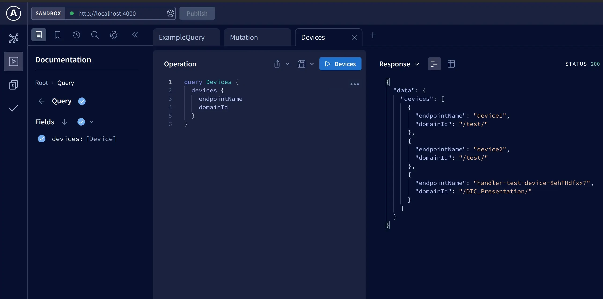

# GraphQL

GraphQL is a powerful query language for APIs that enables clients to request only the data they need. 
*Data Integration Center* allows to send a GraphQL mutation to a server.

## Prerequisites

- Working GraphQL server e.g. [Apollo Server](https://www.apollographql.com/docs/apollo-server/v2/getting-started/)
- GraphQL client e.g. [Sandbox](https://studio.apollographql.com/sandbox/explorer)

## Create webhook

Adjust body template to send query with mutation. Mutation must be compatible with your schema, so for:

```gql
type Mutation {
  devices(endpointName: String, domainId: String): Device
}
```

it would be

```json
{
  "query": "mutation AddDevice { devices(endpointName: \"$endpointName\", domainId: \"$domainId\") { endpointName domainId } }" 
}
```

Host URL must point to your server.


## Monitor GraphQL

Query devices to check if there are new entities.


