# InfluxDB

To simplify the integration with [InfluxDB](https://www.influxdata.com/), webhooks can be formatted to align with
Influx’s data API requirements.

## Prerequisites

* A user with access to the {{ coiote_long_name }} and appropriate permissions
* A LwM2M device
* An InfluxDB account (you can create a free [InfluxDB Cloud account](https://www.influxdata.com/get-influxdb/))

## Setup InfluxDB

1. Open your InfluxDB account.

2. Create a new Bucket for storing the time series data by going to: **↑** > **Buckets**.

    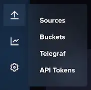

3. Name the Bucket.

    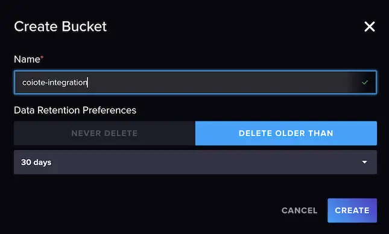

4. Copy the Bucket ID and save it to use later.

    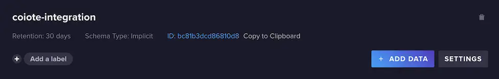

### Create API Token

Go to the **API Tokens** tab.

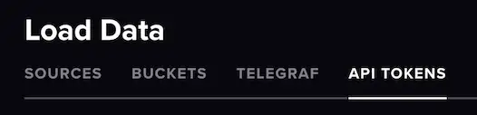

**Create a new API token**

!!! Info "Create a **custom API Token**"

     Preferably, create a **custom API Token** which has only access to the specific Bucket you just created. Make sure to
     select *Read* and *Write* rights.

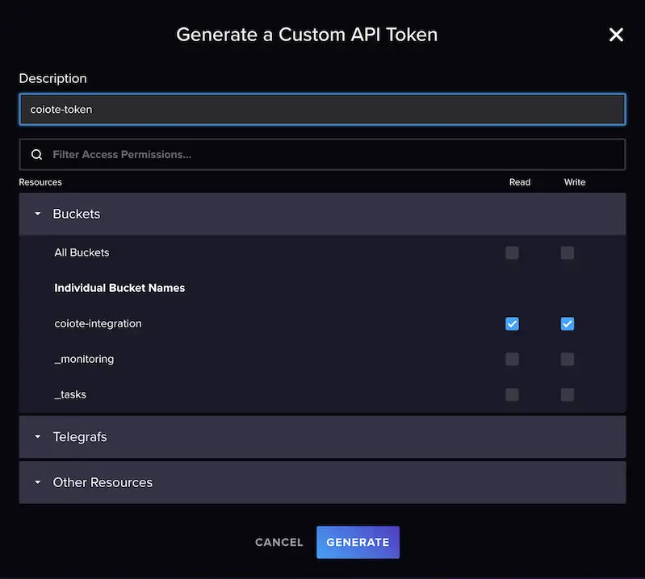

**Copy the API Token** and save it for later.

## Create webhook in {{ coiote_short_name }}

1. In your {{ coiote_short_name }}, select: **Integrations > Data Integration Center.**

    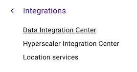

2. Click **Add event handler** and select **Webhook**.

    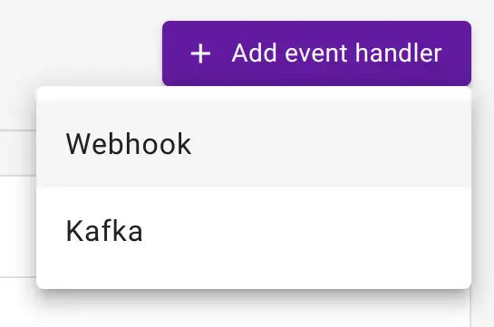{ width=25% }

3. Provide **Basic information** such as the name and description. Also, you can activate the event handler after creation.

    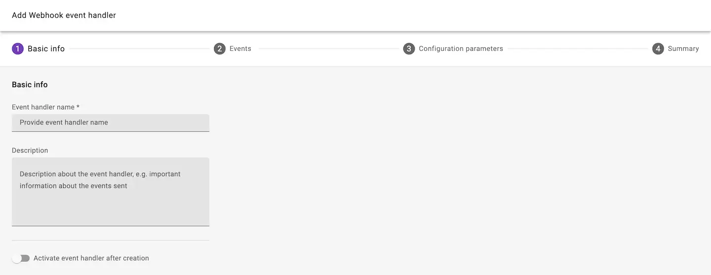

4. **Select the events** which will trigger the HTTP(S) requests.

    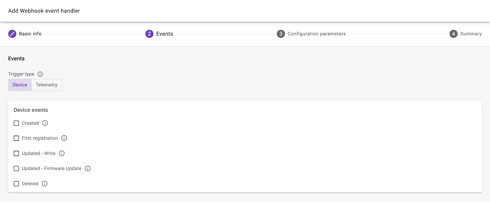

### Configure parameters

1. Select the **Influx data formatting** option.

    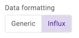

2. Set the URL address. The URL address is composed of the following parts:

    * The **Influx URL** e.g.: `https://eu-central-1-1.aws.cloud2.influxdata.com`. You can find the URL in the address bar
     of your browser when using InfluxDB Cloud.
    * The **InfluxDB API**: `/api/v2/write`
    * The **precision** parameter indicating our data is ingested with millisecond precision: `?precision=ms`
    * The **Bucket ID**, starting with `&bucket=`

    When combined, the URL address looks as follows:
   
    ```text
    https://eu-central-1-1.aws.cloud2.influxdata.com/api/v2/write?precision=ms&bucket=bc123456789ABCDE
    ```

    !!! Info
       
        For more information about the Influx API, visit Influx's [API documentation](https://docs.influxdata.com/influxdb/v2.7/api/).

3. Add the API token which you previously created in your InfluxDB account.

    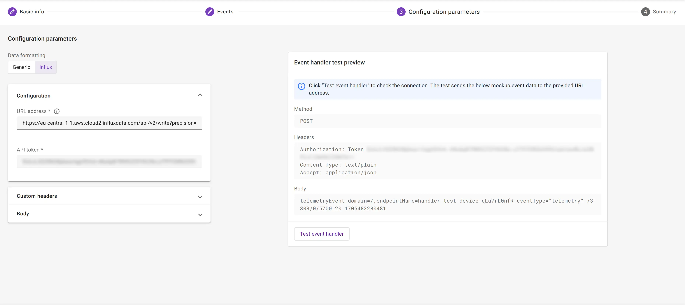

4. To create the event handler, click **Next step** and **Add event handler**.

!!! Tip

    You can use the **Test event handler** option to validate the configuration of the HTTP request before creating the
    event handler. When performing such test, an event should arrive in your Influx bucket.

    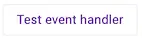

### Configure body template

Influx uses custom protocol named [line protocol](https://docs.influxdata.com/influxdb/v2/reference/syntax/line-protocol).
It consists of four components: measurement name, tags, fields and timestamp. You can adjust each one according to your
needs by editing the body template.

```text
<measurement>[,<tag_key>=<tag_value>] <field_key>=<field_value> [<timestamp>]
```

!!! Note "You should first define the body template"

     When influx creates a measurement table, columns types are defined and all requests that don't match the type are
     rejected. It implies that any further changes are impossible and you will need to setup a proper body template before sending data.

!!! Warning "Telemetry with string type resources"

    For influx to work with string value resources, you should add extra quotes around `$value`. This will cause all 
    value resources to be of string type. Therefore to create e.g. diagrams, you need [casting](https://docs.influxdata.com/influxdb/cloud-serverless/query-data/sql/cast-types/).
    
    ```text
    telemetryEvent,domain=$domainId,endpointName=$endpointName,eventType="telemetry" $url="$value" $timestamp
    ```

## Monitor events in InfluxDB

1. After activating the event handler, in your InfluxDB account, open your Bucket.

2. Add the following query:

    === "Telemetry events"
 
         ```
         SELECT *
         FROM "telemetryEvent"
         WHERE
         time >= now() - interval '1 hour'
         ```
    === "Device events"
 
         ```
         SELECT *
         FROM "deviceEvent"
         WHERE
         time >= now() - interval '1 hour'
         ```

3. To run the script, press: :octicons-triangle-right-24:**RUN**.

If the integration is set up correctly, the device events are visible in the table.

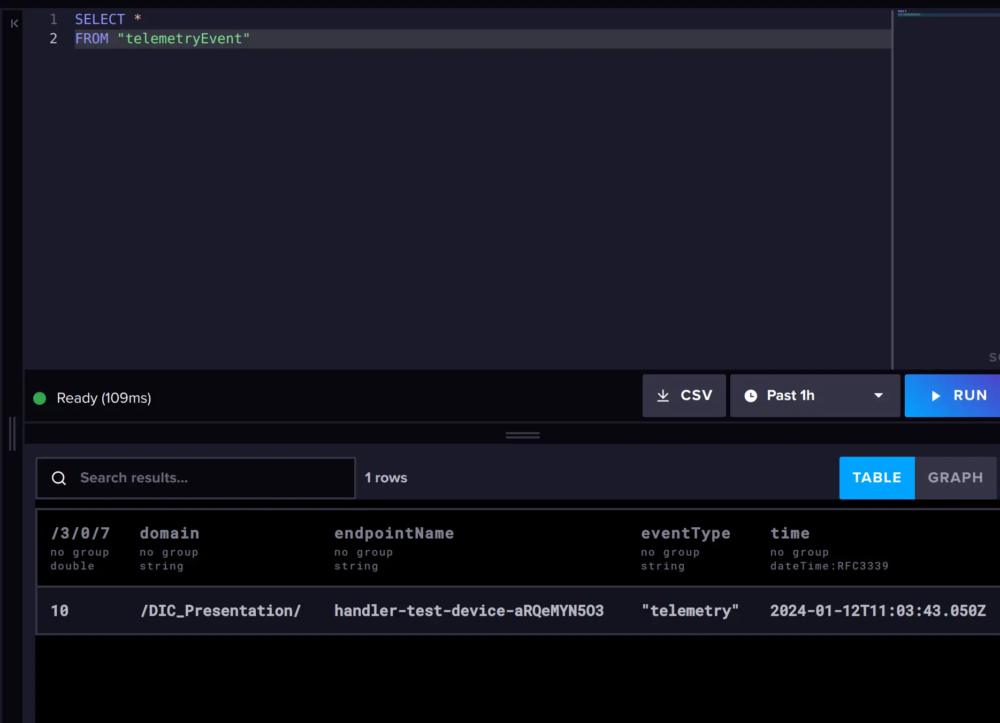{ width=80% }
