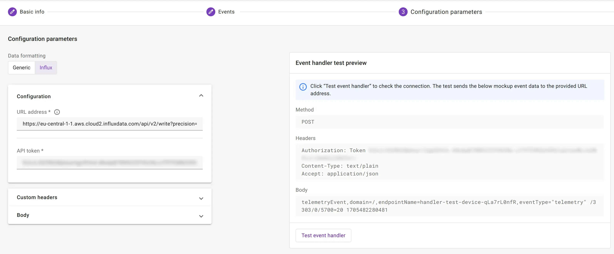

# InfluxDB

To simplify the integration with [InfluxDB](https://www.influxdata.com/), webhooks can be formatted to align with
Influx’s data API requirements.

## Prerequisites

* A user with access to the {{ coiote_long_name }} and appropriate permissions
* A LwM2M device
* An InfluxDB account *(you can create a free [InfluxDB Cloud account](https://www.influxdata.com/get-influxdb/))*

## Setup InfluxDB

Open your InfluxDB account.

**Create a new Bucket** for storing the time series data by going to: **↑** > **Buckets**.


Give the Bucket a name.


**Copy the Bucket ID** and save it to use later.


### Create API Token

Go to the API Tokens tab.


**Create a new API token**

!!! info "Create a **custom API Token**"
Preferably, create a **custom API Token** which has only access to the specific Bucket you just created. Make sure to
select *Read* and *Write* rights.


**Copy the API Token** and save it for later.

## Create webhook in {{ coiote_short_name }}

In your {{ coiote_short_name }}, select: **Integrations** > **Data Integration Center**.


Click **Add event handler** and select **webhook**.

{ width=25% }

Provide **basic information** such as the name and description, optionally enabling the option to activate the event
handler after creation.


**Select the events** which will trigger the HTTP(S) requests.


### Configure parameters

Select the **Influx data formatting** option.


**The URL address** is composed of the following parts:

1. The **Influx URL** e.g.: `https://eu-central-1-1.aws.cloud2.influxdata.com`

   *You can find the URL in the address bar of your browser when using InfluxDB Cloud.*

2. The **InfluxDB API**: `/api/v2/write`
3. The **precision** parameter indicading our data is ingested with millisecond precision: `?precision=ms`
4. The **Bucket ID**, starting with `&bucket=`

When combined, the URL address looks something like:

```
https://eu-central-1-1.aws.cloud2.influxdata.com/api/v2/write?precision=ms&bucket=bc123456789ABCDE
```

!!! Info
    For more information about the Influx API, visit
    Influx's [API documentation](https://docs.influxdata.com/influxdb/v2.7/api/).

**Add the API token** which you previously created in your InfluxDB account.



!!! Tip
    Use the **Test event handler**-option to validate the configuration of the HTTP request before creating the event
    handler. When performing such test, an event should arrive in your Influx bucket.

    

Click **Next step** and **Add event handler** to create the event handler.

### Configure body template

Influx uses custom protocol
named [line protocol](https://docs.influxdata.com/influxdb/v2/reference/syntax/line-protocol).
It basically consists of 4 components: measurement name, tags, fields and timestamp. You can adjust each fo these for
your needs, by editing the body template.

!!! Note
    When influx creates measurement table, columns types are defined and all requests don't matching type will be rejected.
    So any further changes will be impossible, you will need to setup proper body template before sending data. 

```text
<measurement>[,<tag_key>=<tag_value>] <field_key>=<field_value> [<timestamp>]
```

!!! Warning "Telemetry with resources which values are of string type"
 
    For influx to work with string value resources, you will need to add extra quotes around `$value`. This will cause 
    all value resources to be of type string, so you will probalby need [casting](https://docs.influxdata.com/influxdb/cloud-serverless/query-data/sql/cast-types/)
    to create some diagrams etc.
    
    ```text
    telemetryEvent,domain=$domainId,endpointName=$endpointName,eventType="telemetry" $url="$value" $timestamp
    ```

## Monitor events in InfluxDB

After activating the event handler, go to your InfluxDB account and open your Bucket.

Add the following script:

=== "Telemetry events"
    ```
    SELECT *
    FROM "telemetryEvent"
    WHERE
    time >= now() - interval '1 hour'
    ```
=== "Device events"
    ```
    SELECT *
    FROM "deviceEvent"
    WHERE
    time >= now() - interval '1 hour'
    ```

Press: "**► RUN**" to run the script.

If the integration is setup correct, the device events are shown in the table.

{ width=80% }
