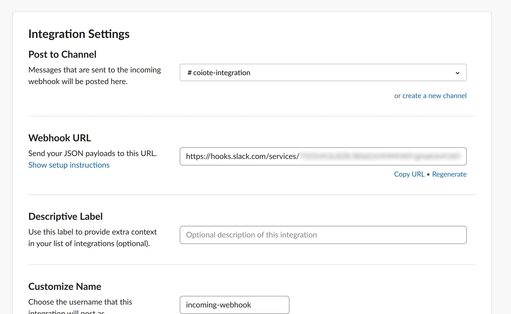
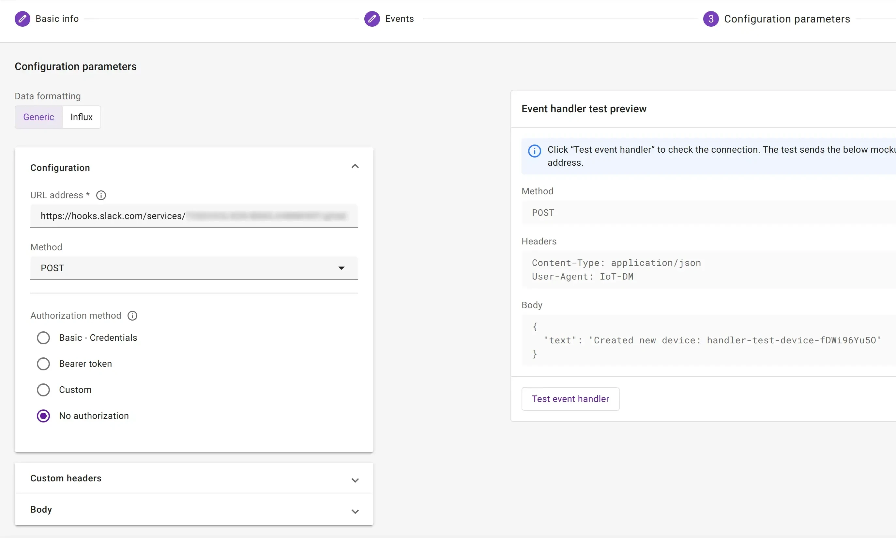
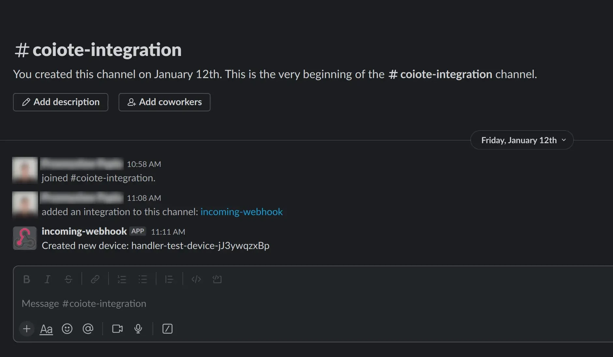

# Slack

*Data Integration Center* allows you to send messages to a Slack channel using the Slack API.

## Prerequisites

* Slack account with appropriate permissions
* Chosen Slack channel

## Setup Slack

In order to send messages to slack:

* Install [Incoming Webhooks](https://slack.com/apps/A0F7XDUAZ-incoming-webhooks)
* Configure it by choosing channel
* Copy `Webhook URL`



## Create webhook

Create webhook according to your needs. As url paste `Webhook URL from previous step and as a body template set e.g:

```json
{
  "text": "Created new device: $endpointName"
}
```



Make sure to replace 'YOUR_TOKEN' with the actual token you obtained and 'your_channel_id' with the ID of the channel
you want to post the message to.

Remember that using the Slack API requires proper error handling, and you should refer to the Slack API documentation
for more details and options, especially if you plan to perform more advanced actions or use additional features.

## Follow chat

Now go to `coiote-integration` channel to see if our webhook is working.


