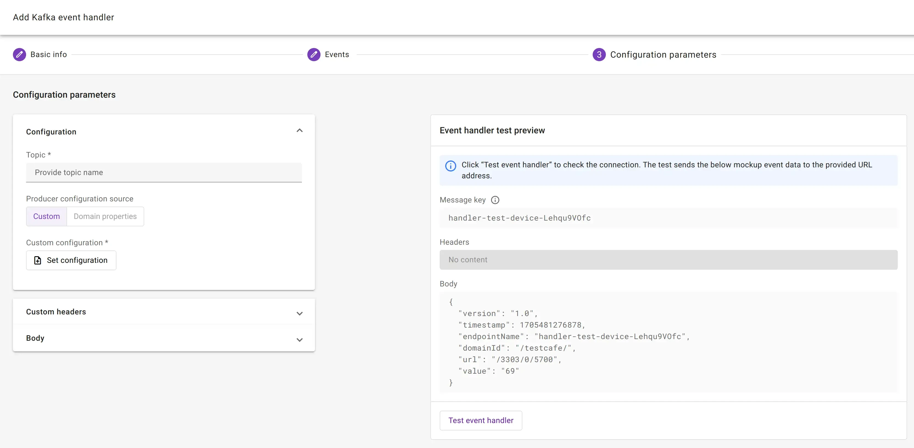

# Kafka or Azure Event Hub

Connect {{ coiote_long_name }} to your **Kafka cluster** or **Azure Event Hub** by creating a Kafka event handler.

## Prerequisites

* A user with access to the {{ coiote_long_name }} and appropriate permissions
* A LwM2M device
* Access to a Kafka cluster or Azure Event Hub

## Create a Kafka handler

To create a new event handler, select: **Integrations** > **Data Integration Center**.

Click **Add event handler** and select **Kafka**.

{ width=25% }

Provide **basic information** such as the name and description, optionally enabling the option to activate the event handler after creation.  


**Select the events** which will trigger the HTTP(S) requests.

!!! Info "Event types"
    **Device events** include:

    - Device created
    - First registration
    - {{ coiote_short_name }} writes a value to a device
    - Device successfully executes a firmware update
    - Device deleted

    **Telemetry events** include data which is generated by the device. Events can originate from Objects, Object Instance, Resources or Resource Instances.


## Configure Kafka parameters

Specify the **Topic** and **Producer configuration** to set up the connection with a Kafka cluster or Azure Event Hub.



### Topic

Determine where the data will be stored in your Kafka cluster.
    
!!! note "Azure Event Hub"
        When using Azure Event Hub, the topic determines which Event Hub will receive the data.


### Producer configuration

Configure the security credentials and connection details. 

!!! note
        {{ coiote_short_name }} might override some of these settings to ensure secure delivery of your data.

The most basic configuration includes:

* Server address
* Security protocol used for communication
* Security credentials

**Example configuration**

```
# Required connection configs for Kafka producer, consumer, and admin
bootstrap.servers=pkc-66666.europe-west2.gcp.confluent.cloud:9092
security.protocol=SASL_SSL
sasl.jaas.config=org.apache.kafka.common.security.plain.PlainLoginModule required username='<enter username>' password='<enter password>';
sasl.mechanism=PLAIN
```


=== "Confluent’s Kafka"
    When using **Confluent’s Kafka**, copy the connection settings from your topic configuration view. We recommend copying only the basic configuration settings mentioned above. (See highlighted part in the visual below.)

     

    !!! warning "Troubleshooting"
        Make sure to put the username and password between quotation marks: **`'`**

    ---

=== "Azure Event Hub"
    When using the **Azure Event Hub**, the configuration requires a *Shared Access Key* to be placed it in the password field of the configuration. Additionally, you must use at least a *Standard tier* of your service bus to enable ingesting data using Kafka producer.

    Azure Event Hub configuration example:
    ```
    bootstrap.servers=<service bus namespace>.servicebus.windows.net:9093
    security.protocol=SASL_SSL
    sasl.mechanism=PLAIN
    sasl.jaas.config=org.apache.kafka.common.security.plain.PlainLoginModule required username="$ConnectionString" password="Endpoint=sb://<service bus namespace>.servicebus.windows.net/;SharedAccessKeyName=XXXXXX;SharedAccessKey=XXXXXX";
    ```

    ---


!!! Tip
    Use the **Test event handler**-option to validate the configuration of the Kafka integration before creating the event handler.

    

Click **Next step** and **Add event handler** to create the event handler.


If the integration is setup correct, the device events are received in your Kafka cluster or Azure Event Hub.
 

*Example of an event received by a Kafka topic in Confluent*